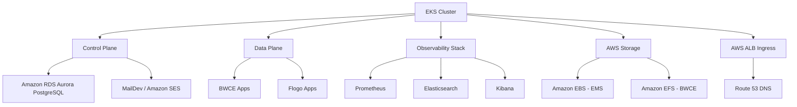
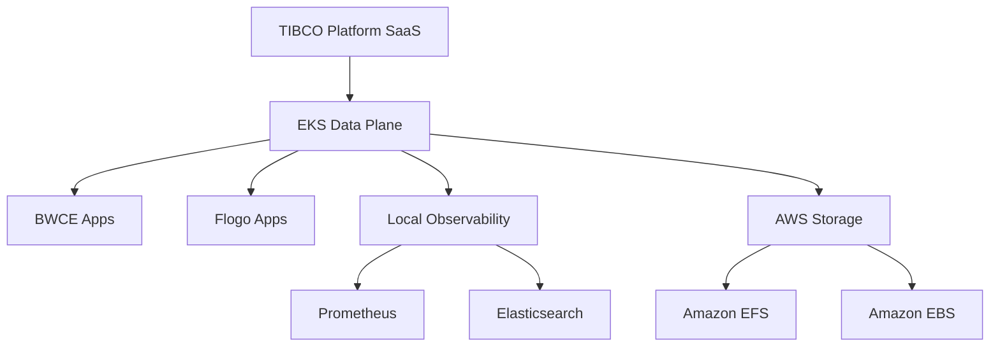
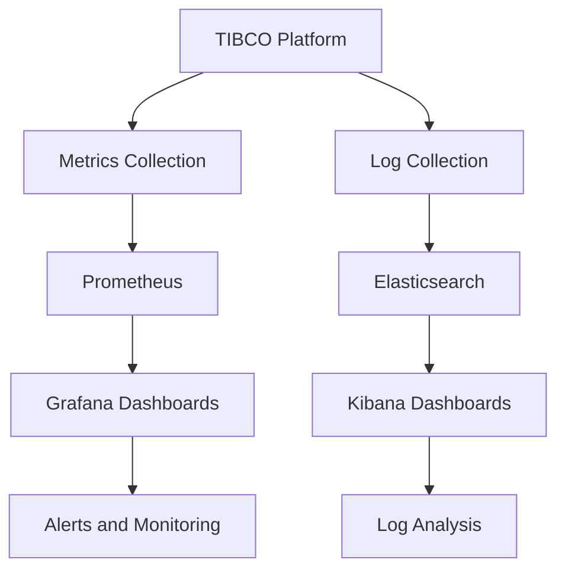

# TIBCO Platform on Amazon Elastic Kubernetes Service (EKS) Workshop

> **Current Release:** [v1.16.0](./releases/v1.16.0) | **TIBCO Platform CP Version:** 1.16.0  
> 📋 **Release History:** See `releases` folder for all versions  
> 🔄 **Upgrading from 1.15.0?** See the [1.16.0 Release Notes](./releases/v1.16.0#upgrade-path-from-v1150)

This repository provides comprehensive guides and resources for deploying **TIBCO Platform** on **Amazon Elastic Kubernetes Service (EKS)** clusters. It covers multiple deployment scenarios from basic EKS cluster setup to full Control Plane and Data Plane deployments with observability.

## 🎯 Version Selection

**⚠️ Important:** Choose the appropriate documentation version for your deployment:

### 🌟 Version 1.16.0 (Current - Recommended for New Deployments)
- ✅ **License Management**: View details and receive expiration notifications (90/30/7 days)
- ✅ **BW6 AI Plugin 6.0.0**: RAG (Retrieval-Augmented Generation) capabilities (Preview)
- ✅ **Enhanced Monitoring**: Historical logs, audit history, and metrics charts for BW5
- ✅ **Flogo Init/Sidecar**: Support for init and sidecar containers in deployments
- ✅ **Developer Hub URL**: Update Developer Hub URL through UI with ingress flexibility
- 📘 [Setup Guide: CP + DP (v1.16)](./howto/how-to-cp-and-dp-eks-setup-guide)
- 📘 [Quick Reference (v1.16)](./howto/v1.16/QUICK-REFERENCE)
- 📋 [Release Notes (v1.16.0)](./releases/v1.16.0)

---

## 🎯 What This Repository Helps You Setup

### 1. **TIBCO Platform Control Plane (CP) + Data Plane (DP) on Same EKS Cluster**
Deploy a complete TIBCO Platform environment with both Control Plane and Data Plane on a single EKS cluster for evaluation and workshop purposes.

### 2. **TIBCO Platform SaaS Control Plane + EKS Data Plane**
Connect an EKS-based Data Plane to an existing TIBCO Platform SaaS Control Plane for hybrid cloud deployments.

### 3. **Observability Setup for CP/DP**
Configure comprehensive monitoring and logging using Prometheus and Elastic Stack (ECK) for both Control Plane and Data Plane deployments.

## 📚 Documentation Structure

### 🏗️ Version-Specific Setup Guides

#### Version 1.16.0 (Current Release)

**[📖 How to Set Up EKS Cluster with Control Plane and Data Plane (v1.16)](./howto/how-to-cp-and-dp-eks-setup-guide)**
- 🎯 **Scope**: Complete TIBCO Platform 1.16.0 deployment on EKS including cluster creation
- 🔧 **New Features**: eksctl-based cluster setup, AWS EFS/RDS provisioning, ALB ingress, Crossplane support
- ⏱️ **Duration**: 3-5 hours (including EKS cluster creation ~30 min)

**[📖 Quick Reference Guide (v1.16)](./howto/v1.16/QUICK-REFERENCE)**
- 🎯 **Scope**: Quick reference for v1.16.0 configuration and commands on EKS
- 🔧 **Features**: Essential commands, URLs, troubleshooting tips
- ⏱️ **Duration**: Quick lookup

### 🔍 Shared Documentation (Compatible with Both Scenarios)

**[📖 How to Set Up EKS Cluster for Data Plane Only](./howto/how-to-dp-eks-setup-guide)**
- 🎯 **Scope**: Data Plane deployment on EKS connecting to SaaS or self-hosted Control Plane
- 🔧 **Features**: EFS storage, ingress controllers (Nginx, Traefik, Kong), observability
- ⏱️ **Duration**: 1-2 hours

#### [📖 How to Install Observability for Data Plane](./howto/how-to-dp-eks-observability)
**Complete observability stack setup for TIBCO Platform**
- 🎯 **Scope**: Elastic ECK + Prometheus + Grafana for monitoring and logging
- 🔧 **Features**:
  - Elastic Cloud on Kubernetes (ECK) operator installation
  - Elasticsearch, Kibana, and APM Server configuration
  - Prometheus and Grafana deployment
  - TIBCO Platform metrics and logs integration
  - Performance monitoring and alerting
- 📋 **Use Case**: Production monitoring, troubleshooting, performance analysis
- ⏱️ **Duration**: 1-2 hours

### 🔧 Post-Deployment Capability Configuration

#### [📖 How to Upload Driver Supplements to BW6 Capability](./howto/how-to-upload-bw6-driver-supplements)
**Supplementing Oracle and EMS drivers for TIBCO BusinessWorks 6 (Containers)**
- 🎯 **Scope**: Upload Oracle Database and EMS client library drivers to BW6 capability
- 🔧 **Features**:
  - Oracle Database driver preparation and packaging
  - EMS client libraries preparation and packaging
  - Step-by-step upload process via Control Plane UI
  - Troubleshooting common upload issues
  - Verification and testing procedures
- 📋 **Use Case**: Oracle database integration, EMS messaging integration, driver supplementation
- ⏱️ **Duration**: 15-30 minutes per driver
- 🎁 **Benefits**: Enables Oracle and EMS connectivity for BW6 applications

### 🌐 DNS and Networking

#### [📖 How to Add DNS Records for EKS in AWS Route 53](./howto/how-to-add-dns-records-eks-aws)
**DNS management for TIBCO Platform services on AWS**
- 🎯 **Scope**: Route 53 configuration for EKS ingress routing
- 🔧 **Features**:
  - Wildcard DNS strategy for TIBCO Platform
  - AWS CLI and Console methods for DNS record creation
  - External DNS automation setup with Route 53
  - AWS Certificate Manager (ACM) integration
  - Certificate and DNS alignment best practices
- 📋 **Use Case**: Custom domain setup, SSL certificate management, service discovery
- ⏱️ **Duration**: 30-60 minutes

### 📋 Prerequisites and Planning

#### [📖 Customer Prerequisites Checklist](./howto/prerequisites-checklist-for-customer)
**Comprehensive pre-installation requirements checklist**
- 🎯 **Scope**: Complete prerequisites for Control Plane and Data Plane installation on EKS
- 🔧 **Features**:
  - EKS cluster requirements and IAM policies
  - Amazon RDS Aurora PostgreSQL 16 specifications
  - AWS storage requirements (EBS gp3 and EFS)
  - Networking and DNS requirements (Route 53, ACM)
  - IAM roles and IRSA configuration
  - Ingress controller compatibility matrix
  - Browser requirements and supported versions
  - Kubernetes secrets requirements
  - Naming conventions and restrictions
- 📋 **Use Case**: Pre-installation planning, customer readiness assessment, infrastructure preparation
- ⏱️ **Preparation Time**: 3-5 business days
- 🎁 **Benefits**: Reduces deployment delays, ensures all requirements met before installation day

#### [📖 Firewall Requirements and Network Connectivity for EKS](./docs/firewall-requirements-eks)
**Complete firewall and network requirements for TIBCO Platform on Amazon EKS**
- 🎯 **Scope**: All external endpoints required for TIBCO Platform on EKS
- 🔧 **Features**:
  - AWS-specific endpoints (EKS, ECR, EC2, STS, IAM)
  - VPC endpoints for cost optimization
  - AWS Security Group configurations
  - Container registry and Helm repository endpoints
  - Proxy configuration for enterprise environments
  - TIBCO Flogo Go Module Proxy requirements
  - Troubleshooting and validation commands
- 📋 **Use Case**: AWS deployments, hybrid cloud setups, VPC-isolated environments
- ⏱️ **Review Time**: 30-60 minutes
- 🎁 **Benefits**: Comprehensive AWS firewall guide, VPC endpoint recommendations

### ⚙️ Configuration and Scripts

#### [📄 Environment Variables Script](./howto/eks-env-variables.sh)
**Centralized environment configuration**
- 🎯 **Scope**: All required environment variables for TIBCO Platform deployment on EKS
- 🔧 **Features**:
  - AWS region and EKS cluster variables
  - TIBCO Platform specific configurations
  - DNS and certificate settings (Route 53, ACM)
  - Container registry and Helm chart configurations
  - Network and storage configurations (EFS, EBS)
- 📋 **Use Case**: Quick environment setup, variable standardization, deployment automation

## 🎯 Deployment Scenarios

### Scenario 1: Complete TIBCO Platform on EKS


**Use this for:**
- ✅ Workshop and evaluation environments
- ✅ Complete standalone TIBCO Platform deployments
- ✅ Development and testing environments
- ✅ Proof of concepts and demos

**Follow:** [Complete Setup Guide](./howto/how-to-cp-and-dp-eks-setup-guide)

### Scenario 2: EKS Data Plane Connected to SaaS Control Plane


**Use this for:**
- ✅ Hybrid cloud deployments
- ✅ Edge computing scenarios
- ✅ Regional data plane deployments
- ✅ Connecting to existing SaaS Control Plane

**Follow:** [Data Plane Only Guide](./howto/how-to-dp-eks-setup-guide)

### Scenario 3: Enhanced Observability Setup


**Use this for:**
- ✅ Production monitoring requirements
- ✅ Troubleshooting and debugging
- ✅ Performance optimization
- ✅ Compliance and audit logging

**Follow:** [Observability Setup Guide](./howto/how-to-dp-eks-observability)

## 🚀 Quick Start

### Prerequisites
Before you begin, ensure you have:
- AWS account with appropriate IAM permissions
- AWS CLI installed and configured (aws-cli/2.27.0+)
- eksctl installed (0.210.0+)
- kubectl installed (latest stable)
- helm 3.13.0+ installed
- jq, yq, envsubst installed
- Access to TIBCO container registry

### Step 1: Choose Your Scenario
1. **Full Platform Deployment**: Follow the [Complete Setup Guide](./howto/how-to-cp-and-dp-eks-setup-guide)
2. **Data Plane Only**: Follow the [Data Plane Guide](./howto/how-to-dp-eks-setup-guide)

### Step 2: Review Prerequisites
Review the [Prerequisites Checklist](./howto/prerequisites-checklist-for-customer) to ensure all requirements are met.

### Step 3: Configure Environment
Use the [Environment Variables Script](./howto/eks-env-variables.sh) to set up your environment variables.

### Step 4: Deploy
Follow the chosen guide step-by-step for deployment.

## 📦 Repository Contents

```
workshop-tp-eks/
├── README.md                                    # This file
├── LICENSE                                      # MIT License
├── .gitignore                                   # Git ignore rules
├── howto/                                       # How-to guides
│   ├── how-to-cp-and-dp-eks-setup-guide.md     # CP + DP full setup guide
│   ├── how-to-dp-eks-setup-guide.md            # Data Plane only guide
│   ├── how-to-dp-eks-observability.md          # Observability setup
│   ├── how-to-add-dns-records-eks-aws.md       # Route 53 DNS configuration
│   ├── how-to-upload-bw6-driver-supplements.md # BW6 driver upload guide
│   ├── prerequisites-checklist-for-customer.md # Pre-installation checklist
│   ├── eks-env-variables.sh                    # Environment variables script
│   └── v1.16/
│       └── QUICK-REFERENCE.md                  # Quick reference for v1.16
├── scripts/                                     # Utility scripts
│   └── connectivity-test-job.yaml              # Network connectivity test
├── docs/                                        # Additional documentation
│   └── firewall-requirements-eks.md            # AWS/EKS firewall requirements
└── releases/                                    # Release notes
    └── v1.16.0.md                              # v1.16.0 release notes
```

## 🔑 Key Features

### AWS-Specific Optimizations
- **Amazon EBS Storage**: gp3 for EMS workloads
- **Amazon EFS Storage**: For BWCE shared storage and artifact manager
- **Route 53 Integration**: Automated DNS record management via External DNS
- **AWS ALB**: Application Load Balancer with ACM certificate integration
- **IAM Roles for Service Accounts (IRSA)**: Secure AWS resource access from pods
- **Crossplane Support**: Optional infrastructure-as-code for AWS resources

### Ingress Controllers
- **Nginx** (Recommended for Data Plane): Main ingress for capabilities
- **Traefik** (Alternative): Cloud-native ingress controller
- **Kong** (Optional): For user app endpoints (BWCE and Flogo only)
- **AWS ALB**: Main ingress controller integrating with Route 53 and ACM

### Security Features
- TLS/SSL certificate management via AWS Certificate Manager (ACM)
- Kubernetes secrets for sensitive data
- Network policies via VPC CNI with enableNetworkPolicy
- RBAC configurations
- IAM Roles for Service Accounts (IRSA)

## 🛠️ Tools and Technologies

### Required Tools
- **AWS CLI**: aws-cli/2.27.0+
- **eksctl**: 0.210.0+
- **kubectl**: Latest stable version
- **helm**: 3.13.0+
- **jq**: 1.8.0+ (JSON processing)
- **yq**: v4.45.4+ (YAML processing)
- **envsubst**: Part of homebrew gettext (0.24.1+)

### TIBCO Platform Components
- **Control Plane**: v1.16.0
- **Data Plane**: Compatible with CP version
- **PostgreSQL**: v16 (Amazon RDS Aurora PostgreSQL recommended)
- **Capabilities**: BWCE, Flogo, EMS, Developer Hub

## 📊 Platform Requirements

### Minimum EKS Cluster Specifications

#### Control Plane Cluster
- **Node Count**: 3+ worker nodes
- **Instance Type**: m5a.xlarge or higher
- **Kubernetes Version**: 1.33+ (CNCF certified)
- **Storage**: Amazon EFS + Amazon EBS (gp3)
- **Database**: Amazon RDS Aurora PostgreSQL 16

#### Data Plane Cluster
- **Node Count**: 2+ worker nodes (3+ recommended)
- **Instance Type**: m5a.xlarge or higher
- **Kubernetes Version**: 1.33+ (CNCF certified)
- **Storage**: Amazon EFS + Amazon EBS (gp3)

## 🎓 Learning Path

### Beginner Path (Evaluation/Workshop)
1. Review [Prerequisites Checklist](./howto/prerequisites-checklist-for-customer)
2. Follow [Complete Setup Guide](./howto/how-to-cp-and-dp-eks-setup-guide)
3. Deploy sample applications
4. Explore Control Plane UI

### Intermediate Path (Development)
1. Review prerequisites
2. Set up separate EKS clusters for CP and DP
3. Configure [Observability](./howto/how-to-dp-eks-observability)
4. Implement [DNS automation](./howto/how-to-add-dns-records-eks-aws)

### Advanced Path (Production)
1. Design multi-region architecture with Route 53 failover
2. Implement high availability with Multi-AZ RDS Aurora
3. Set up disaster recovery
4. Configure advanced monitoring and alerting
5. Implement CI/CD pipelines

## 🆘 Troubleshooting

### Common Issues and Solutions

#### EKS Cluster Issues
- **Node not ready**: Check node groups and Auto Scaling settings
- **Insufficient resources**: Scale up node groups or use larger instance types
- **Network connectivity**: Verify VPC configuration and security group rules

#### Storage Issues
- **EFS mount failures**: Check security group allows NFS (port 2049) from node CIDR
- **EBS PVC pending**: Verify EBS CSI driver and IAM role permissions
- **Performance issues**: Use gp3 volumes with tuned IOPS and throughput settings

#### Ingress Issues
- **DNS not resolving**: Verify Route 53 records and External DNS annotations
- **SSL certificate errors**: Check ACM certificate ARN in ALB annotations
- **Load balancer not created**: Verify AWS Load Balancer Controller and IAM role

### Getting Help
1. Check the [Official TIBCO Documentation](https://docs.tibco.com/pub/platform-cp/1.17.0/doc/html/Default.htm#Installation/setting-up-cluster-for-control-plane.htm)
2. Review the [EKS Workshop in tp-helm-charts](https://github.com/TIBCOSoftware/tp-helm-charts/tree/main/docs/workshop/eks)
3. Review GitHub issues in [tp-helm-charts repository](https://github.com/TIBCOSoftware/tp-helm-charts)
4. Contact TIBCO Support for production issues

## 🤝 Contributing

Contributions are welcome! Please:
1. Fork the repository
2. Create a feature branch
3. Make your changes
4. Submit a pull request

## 🔗 Additional Resources

### Official Documentation
- [TIBCO Platform Control Plane Documentation](https://docs.tibco.com/pub/platform-cp/1.17.0/doc/html/Default.htm#Installation/setting-up-cluster-for-control-plane.htm)
- [TIBCO Helm Charts Repository](https://github.com/TIBCOSoftware/tp-helm-charts)
- [EKS Workshop in tp-helm-charts](https://github.com/TIBCOSoftware/tp-helm-charts/tree/main/docs/workshop/eks)

### AWS Resources
- [Amazon Elastic Kubernetes Service Documentation](https://docs.aws.amazon.com/eks/)
- [Amazon Route 53 Documentation](https://docs.aws.amazon.com/route53/)
- [Amazon EFS Documentation](https://docs.aws.amazon.com/efs/)
- [Amazon RDS Aurora Documentation](https://docs.aws.amazon.com/AmazonRDS/latest/AuroraUserGuide/)
- [AWS Certificate Manager Documentation](https://docs.aws.amazon.com/acm/)
- [eksctl Documentation](https://eksctl.io/)

### Related Workshop Repositories
- [TIBCO Platform on AKS Workshop](https://github.com/tibco-bnl/workshop-tp-aks) - Azure Kubernetes Service deployment guides
  - [AKS Firewall Requirements](https://tibco-bnl.github.io/workshop-tp-aks/docs/firewall-requirements-aks.html)
- [TIBCO Platform on ARO Workshop](https://github.com/tibco-bnl/workshop-tp-aro) - Azure Red Hat OpenShift deployment guides

## 📝 License

This project is licensed under the MIT License - see the [LICENSE](LICENSE) file for details.

## ⚠️ Disclaimer

> **Important**: This workshop is intended for evaluation, development, and workshop purposes only. For production deployments, please contact TIBCO Support, TIBCO SI Partners, or your TIBCO ATS (Account Technical Specialist) for guidance, and follow the official TIBCO Platform deployment guidelines and documentation.

## 📅 Version History

- **v1.0.0** (May 2026): Initial release
  - Complete EKS deployment guides based on tp-helm-charts EKS workshop
  - Prerequisites checklist
  - Observability setup
  - DNS configuration guides

---

**Maintained by**: TIBCO-BNL Team

**Last Updated**: May 7, 2026
