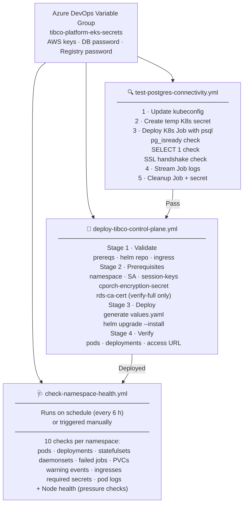
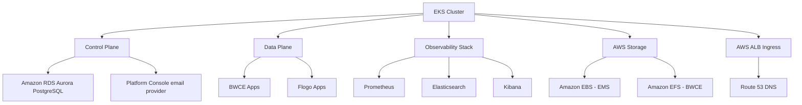
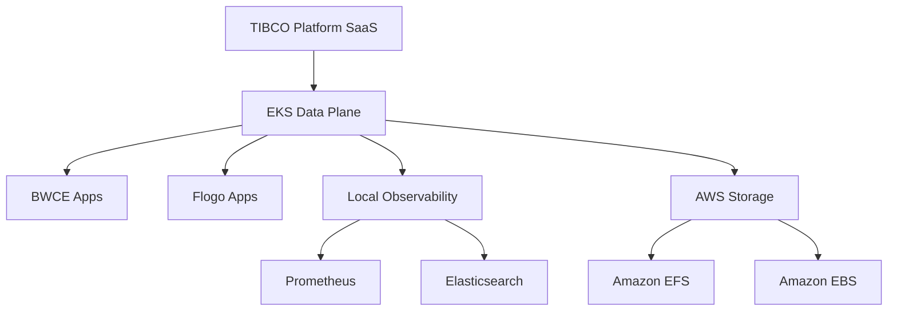
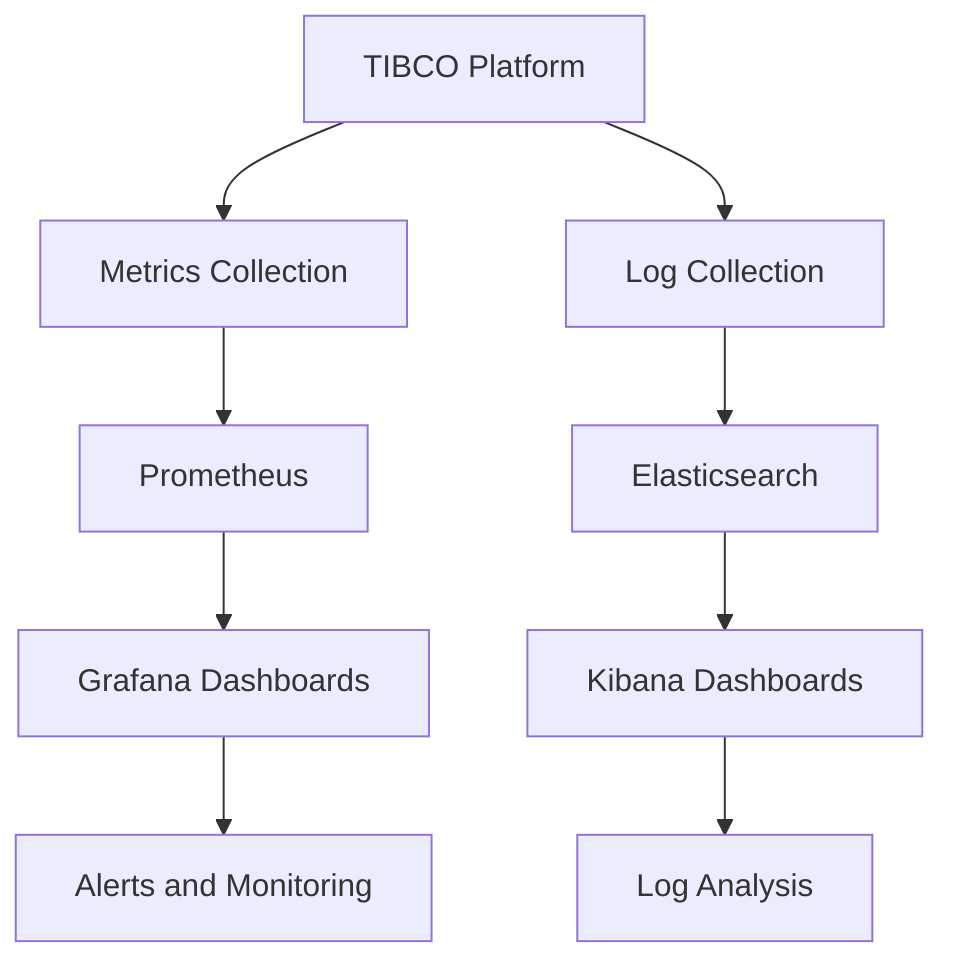

# TIBCO Platform on Amazon Elastic Kubernetes Service (EKS) Workshop

> **Current Release:** [v1.18.0](./releases/v1.18.0) | **TIBCO Platform CP Version:** 1.18.0
> 📋 **Release History:** See `releases` folder for all versions  
> 🔄 **Upgrading from 1.17.0?** See the [1.18.0 Release Notes](./releases/v1.18.0#upgrade-path-from-v1170)

This repository provides comprehensive guides and resources for deploying **TIBCO Platform** on **Amazon Elastic Kubernetes Service (EKS)** clusters. It covers multiple deployment scenarios from basic EKS cluster setup to full Control Plane and Data Plane deployments with observability.

## 🎯 Version Selection

**⚠️ Important:** Choose the appropriate documentation version for your deployment:

### 🌟 Version 1.18.0 (Current - Recommended for New Deployments)
**EKS Deployment Notes:**
- ✅ **Simplified DNS Continues**: Single Route 53 base domain for admin, subscription, and tunnel path — one ACM wildcard certificate
- ✅ **Gateway API Evaluation Path**: Traefik Gateway API support can be evaluated for supported BW5, BW6, and Flogo endpoint exposure
- ✅ **Namespace-Level RBAC**: Application Manager and Application Viewer role assignments can be scoped by Data Plane namespace
- ✅ **Console-Managed Email**: Configure SES, SMTP, or SendGrid from Platform Console after install or upgrade
- ✅ **Aurora PostgreSQL SSL Guidance**: Use `require` or `verify-full` when `rds.force_ssl=1` is enforced

**Control Plane Capability Features:**
- ✅ **Alert Audit Trail**: Review alert health and rule-performance events from the UI
- ✅ **Developer Hub Self-Service Flows**: Build reusable automation flows through templates and platform APIs
- ✅ **Gateway API Controller Support**: Use Gateway API with supported Control Tower data planes

- 📘 [Setup Guide: CP + DP (v1.18)](./howto/v1.18/how-to-cp-and-dp-eks-setup-guide)
- 📘 [Quick Reference (v1.18)](./howto/v1.18/QUICK-REFERENCE)
- 📋 [Release Notes (v1.18.0)](./releases/v1.18.0)
- 📋 [Documentation Summary (v1.18)](./howto/v1.18/DOCUMENTATION-SUMMARY)

### Version 1.17.0 (Previous)
**EKS Deployment Improvements:**
- ✅ **Simplified DNS**: Single base domain for admin, subscription, and tunnel — one ACM cert, simpler setup
- ✅ **Optional Hybrid-Proxy**: Disable hybrid-proxy when not needed to save ~50% CPU/RAM
- ✅ **Enhanced OTEL**: OpenTelemetry Collector 0.140.0 with centralized fluent-bit configuration
- ✅ **BW5CE/BWCE V2 Jobs**: Parallel provisioner job templates for faster capability bootstrapping
- ✅ **Updated Components**: Prometheus v3.5.2, Alertmanager v0.32.0, dp-config-aws 1.17.x

**Control Plane Capability Features:**
- ✅ **Webhook Receiver for Alerts**: Integrate alerts with external systems via JSON webhook (PagerDuty, Slack, Teams)
- ✅ **OpenSearch Observability**: Use OpenSearch for Jaeger traces and service logs (alternative to Elasticsearch)
- ✅ **BW6 Lifecycle Management**: Full Agent, Domain, AppSpace, AppNode, and Application management in UI
- ✅ **Custom Fluentbit**: Configurable log forwarding for BW5/BW6 containers and Flogo via Helm values
- ✅ **Flogo Recipe Customization**: YAML editor for capability recipes; 3 new connectors (GCS, ActiveSpaces, FTL)
- ✅ **BW5 Hawk REST API**: 31 Hawk methods exposed on port 8090 in BW5CE
- ✅ **Capability Management APIs**: Update and upgrade capability instances via REST (CI/CD automation)
- ✅ **BW5 Application History**: Audit trail for deploy/undeploy operations in Application Configuration UI

- 📘 [Setup Guide: CP + DP (v1.17)](./howto/how-to-cp-and-dp-eks-setup-guide)
- 📘 [Quick Reference (v1.17)](./howto/v1.17/QUICK-REFERENCE)
- 📋 [Release Notes (v1.17.0)](./releases/v1.17.0)
- 📋 [Documentation Summary](./howto/v1.17/DOCUMENTATION-SUMMARY)

### Version 1.16.0 (Previous)
- ✅ **License Management**: View details and receive expiration notifications (90/30/7 days)
- ✅ **BW6 AI Plugin 6.0.0**: RAG (Retrieval-Augmented Generation) capabilities (Preview)
- ✅ **Enhanced Monitoring**: Historical logs, audit history, and metrics charts for BW5
- ✅ **Flogo Init/Sidecar**: Support for init and sidecar containers in deployments
- 📋 [Release Notes (v1.16.0)](./releases/v1.16.0)

---

## 🎯 What This Repository Helps You Setup

### 1. **TIBCO Platform Control Plane (CP) + Data Plane (DP) on Same EKS Cluster**
Deploy a complete TIBCO Platform environment with both Control Plane and Data Plane on a single EKS cluster for evaluation and workshop purposes.

### 2. **TIBCO Platform SaaS Control Plane + EKS Data Plane**
Connect an EKS-based Data Plane to an existing TIBCO Platform SaaS Control Plane for hybrid cloud deployments.

### 3. **Observability Setup for CP/DP**
Configure comprehensive monitoring and logging using Prometheus and Elastic Stack (ECK) for both Control Plane and Data Plane deployments.

## 📚 Documentation Structure

### 🏗️ Version-Specific Setup Guides

#### Version 1.18.0 (Current Release)

**[📖 How to Set Up EKS Cluster with Control Plane and Data Plane (v1.18)](./howto/v1.18/how-to-cp-and-dp-eks-setup-guide)**
- 🎯 **Scope**: 1.18.0 overlay for the shared EKS CP+DP setup guide
- 🔧 **New Features**: Gateway API notes, namespace-level RBAC, Console-managed email, simplified DNS continuity

**[📖 Quick Reference Guide (v1.18)](./howto/v1.18/QUICK-REFERENCE)**
- 🎯 **Scope**: Essential commands, new feature snippets, and configuration reference for v1.18.0

**[📖 Documentation Summary (v1.18)](./howto/v1.18/DOCUMENTATION-SUMMARY)**
- 🎯 **Scope**: Summary of all v1.18.0 documentation changes and EKS-specific considerations

**[📖 Release Notes (v1.18.0)](./releases/v1.18.0)**
- 🎯 **Scope**: What's new, upgrade path from 1.17.0, and EKS-specific considerations

#### Version 1.17.0 (Previous Release)

**[📖 How to Set Up EKS Cluster with Control Plane and Data Plane (v1.17)](./howto/how-to-cp-and-dp-eks-setup-guide)**
- 🎯 **Scope**: Complete TIBCO Platform 1.17.0 deployment on EKS including cluster creation
- 🔧 **New Features**: Simplified DNS structure, optional hybrid-proxy, enhanced OTEL, BW5CE V2 job templates
- ⏱️ **Duration**: 3-5 hours (including EKS cluster creation ~30 min)

**[📖 Quick Reference Guide (v1.17)](./howto/v1.17/QUICK-REFERENCE)**
- 🎯 **Scope**: Essential commands, new feature snippets, and configuration reference for v1.17.0

**[📖 Documentation Summary (v1.17)](./howto/v1.17/DOCUMENTATION-SUMMARY)**
- 🎯 **Scope**: Summary of all v1.17.0 documentation changes, EKS-specific considerations, and upgrade checklist

**[📖 Release Notes (v1.17.0)](./releases/v1.17.0)**
- 🎯 **Scope**: What's new, breaking changes, and upgrade path from 1.16.0

### 🔍 Shared Documentation (Compatible with Both Scenarios)

**[📖 How to Set Up EKS Cluster for Data Plane Only](./howto/how-to-dp-eks-setup-guide)**
- 🎯 **Scope**: Data Plane deployment on EKS connecting to SaaS or self-hosted Control Plane
- 🔧 **Features**: EFS storage, ingress controllers (Nginx, Traefik, Kong), observability
- ⏱️ **Duration**: 1-2 hours

#### [📖 How to Install Observability for Data Plane](./howto/how-to-dp-eks-observability)
**Complete observability stack setup for TIBCO Platform**
- 🎯 **Scope**: Elastic ECK + Prometheus + Grafana for monitoring and logging
- 🔧 **Features**:
  - Elastic Cloud on Kubernetes (ECK) operator installation
  - Elasticsearch, Kibana, and APM Server configuration
  - Prometheus and Grafana deployment
  - TIBCO Platform metrics and logs integration
  - Performance monitoring and alerting
- 📋 **Use Case**: Production monitoring, troubleshooting, performance analysis
- ⏱️ **Duration**: 1-2 hours

### 🔧 Post-Deployment Capability Configuration

#### [📖 How to Upload Driver Supplements to BW6 Capability](./howto/how-to-upload-bw6-driver-supplements)
**Supplementing Oracle and EMS drivers for TIBCO BusinessWorks 6 (Containers)**
- 🎯 **Scope**: Upload Oracle Database and EMS client library drivers to BW6 capability
- 🔧 **Features**:
  - Oracle Database driver preparation and packaging
  - EMS client libraries preparation and packaging
  - Step-by-step upload process via Control Plane UI
  - Troubleshooting common upload issues
  - Verification and testing procedures
- 📋 **Use Case**: Oracle database integration, EMS messaging integration, driver supplementation
- ⏱️ **Duration**: 15-30 minutes per driver
- 🎁 **Benefits**: Enables Oracle and EMS connectivity for BW6 applications

### 🌐 DNS and Networking

#### [📖 How to Add DNS Records for EKS in AWS Route 53](./howto/how-to-add-dns-records-eks-aws)
**DNS management for TIBCO Platform services on AWS**
- 🎯 **Scope**: Route 53 configuration for EKS ingress routing
- 🔧 **Features**:
  - Wildcard DNS strategy for TIBCO Platform
  - AWS CLI and Console methods for DNS record creation
  - External DNS automation setup with Route 53
  - AWS Certificate Manager (ACM) integration
  - Certificate and DNS alignment best practices
- 📋 **Use Case**: Custom domain setup, SSL certificate management, service discovery
- ⏱️ **Duration**: 30-60 minutes

### 📋 Prerequisites and Planning

#### [📖 Customer Prerequisites Checklist](./howto/prerequisites-checklist-for-customer)
**Comprehensive pre-installation requirements checklist**
- 🎯 **Scope**: Complete prerequisites for Control Plane and Data Plane installation on EKS
- 🔧 **Features**:
  - EKS cluster requirements and IAM policies
  - Amazon RDS Aurora PostgreSQL 16 specifications
  - AWS storage requirements (EBS gp3 and EFS)
  - Networking and DNS requirements (Route 53, ACM)
  - IAM roles and IRSA configuration
  - Ingress controller compatibility matrix
  - Browser requirements and supported versions
  - Kubernetes secrets requirements
  - Naming conventions and restrictions
- 📋 **Use Case**: Pre-installation planning, customer readiness assessment, infrastructure preparation
- ⏱️ **Preparation Time**: 3-5 business days
- 🎁 **Benefits**: Reduces deployment delays, ensures all requirements met before installation day

#### [📖 Firewall Requirements and Network Connectivity for EKS](./docs/firewall-requirements-eks)
**Complete firewall and network requirements for TIBCO Platform on Amazon EKS**
- 🎯 **Scope**: All external endpoints required for TIBCO Platform on EKS
- 🔧 **Features**:
  - AWS-specific endpoints (EKS, ECR, EC2, STS, IAM)
  - VPC endpoints for cost optimization
  - AWS Security Group configurations
  - Container registry and Helm repository endpoints
  - Proxy configuration for enterprise environments
  - TIBCO Flogo Go Module Proxy requirements
  - Troubleshooting and validation commands
- 📋 **Use Case**: AWS deployments, hybrid cloud setups, VPC-isolated environments
- ⏱️ **Review Time**: 30-60 minutes
- 🎁 **Benefits**: Comprehensive AWS firewall guide, VPC endpoint recommendations

### ⚙️ Configuration and Scripts

#### [📄 Environment Variables Script](./scripts/env.sh)
**Centralized environment configuration**
- 🎯 **Scope**: All required environment variables for TIBCO Platform deployment on EKS
- 🔧 **Features** (18 sections):
  - AWS region and EKS cluster variables
  - TIBCO Platform specific configurations
  - DNS and certificate settings (Route 53, ACM)
  - Container registry and Helm chart configurations
  - Network and storage configurations (EFS, EBS)
  - Database, email, admin user, and proxy settings
- 📋 **Use Case**: Quick environment setup, variable standardization, deployment automation

---

## ⚙️ Azure DevOps Pipelines

The `pipelines/azure-devops/` folder contains ready-to-import Azure DevOps pipeline YAML files that automate the most common operational tasks. All pipelines share a reusable step template for AWS authentication and EKS kubeconfig setup.

### Pipeline Overview

| Pipeline | File | Trigger | Purpose |
|:---------|:-----|:--------|:--------|
| **Test PostgreSQL Connectivity** | [`test-postgres-connectivity.yml`](./pipelines/azure-devops/test-postgres-connectivity.yml) | Manual | Validate Aurora DB is reachable from EKS before deploying CP |
| **Deploy Control Plane** | [`deploy-tibco-control-plane.yml`](./pipelines/azure-devops/deploy-tibco-control-plane.yml) | Manual | Full CP deployment: namespace → secrets → helm install → verify |
| **Namespace Health Check** | [`check-namespace-health.yml`](./pipelines/azure-devops/check-namespace-health.yml) | Manual + every 6 h | Diagnose pod errors, PVC issues, events, and node pressure |

### Pipeline Architecture



### Setup: Azure DevOps Variable Group

All three pipelines require a Variable Group named **`tibco-platform-eks-secrets`** in your Azure DevOps project library. Create it once and link it to Azure Key Vault for production use.

**Project Settings → Pipelines → Library → + Variable group**

| Variable | Type | Description |
|:---------|:-----|:------------|
| `AWS_ACCESS_KEY_ID` | Secret | IAM access key for EKS and AWS API operations |
| `AWS_SECRET_ACCESS_KEY` | Secret | Corresponding IAM secret key |
| `AWS_SESSION_TOKEN` | Secret | Optional — for assumed-role sessions |
| `TP_CONTAINER_REGISTRY_PASSWORD` | Secret | JFrog Artifactory API key / password |
| `TP_DB_PASSWORD` | Secret | Aurora PostgreSQL master password |
| `TP_ADMIN_INITIAL_PASSWORD` | Secret | Initial CP admin password (min 8 chars) |
| `TP_SMTP_PASSWORD` | Secret | Optional — SMTP relay password for post-install Console email setup |
| `TP_SENDGRID_API_KEY` | Secret | Optional — SendGrid API key for post-install Console email setup |
| `TP_LOGSERVER_PASSWORD` | Secret | Optional — Elasticsearch password |

**Azure Key Vault integration (recommended for production):**
```bash
# Create Key Vault
az keyvault create --name tibco-platform-kv --resource-group my-rg --location eastus

# Store secrets
az keyvault secret set --vault-name tibco-platform-kv --name AWS-ACCESS-KEY-ID --value "AKIA..."
az keyvault secret set --vault-name tibco-platform-kv --name TP-DB-PASSWORD --value "your-db-password"
# ... repeat for each secret
```
Then in Azure DevOps Library, create the variable group linked to the Key Vault — Azure DevOps fetches secrets at pipeline runtime without storing them in the repo.

### Pipeline 1: Test PostgreSQL Connectivity

**Run this before deploying the Control Plane.** It launches a Kubernetes Job inside the EKS cluster that exercises the same VPC routing, security groups, and network policies the CP orchestrator will use.

```
Checks performed:
  ✓ pg_isready          — network path + DB process running
  ✓ psql SELECT 1       — credentials accepted, DB login works
  ✓ SHOW ssl            — SSL handshake active (skipped for sslmode=disable)
  ✓ DB version info     — Aurora version, current_user, inet_server_addr()
```

**Import and run:**
1. In Azure DevOps → Pipelines → New pipeline → Azure Repos Git → select this repo
2. Choose **Existing Azure Pipelines YAML file** → `pipelines/azure-devops/test-postgres-connectivity.yml`
3. Set parameters: `dbHost` (Aurora writer endpoint), `dbSslMode`
4. Run — fix any CRITICAL failures before proceeding to pipeline 2

### Pipeline 2: Deploy TIBCO Control Plane

A **4-stage idempotent pipeline** — safe to run for both fresh installs and upgrades.

| Stage | What happens |
|:------|:-------------|
| **Validate** | Cluster access · Helm repo reachability · ingress class · EFS StorageClass |
| **Prerequisites** | Create namespace · service account · `session-keys` · `cporch-encryption-secret` · RDS CA cert (verify-full) |
| **Deploy** | Generate `tibco-cp-base` values.yaml from parameters · `helm upgrade --install --wait` |
| **Verify** | Pod/deployment status · print Admin Portal URL and login flow |

> **Important:** `session-keys` and `cporch-encryption-secret` are **preserved on re-runs** — they are only generated on first deployment. Changing them after initial deployment invalidates all user sessions and breaks Data Plane connectivity respectively. Back them up to Azure Key Vault after the first run.

**CP access flow after deployment:**
1. Log in to Admin Portal: `https://admin.<cpInstanceId>-my.<hostedZoneDomain>/admin/login`
2. Change the initial password, then create a subscription with a `hostPrefix`
3. Use the Subscription Portal `https://<hostPrefix>.<cpInstanceId>-my.<hostedZoneDomain>` for Data Plane registration and capability provisioning (BW6, BWCE, Flogo, EMS, DeveloperHub)

### Pipeline 3: Namespace Health Check

**Runs every 6 hours automatically** and can be triggered manually for on-demand diagnostics. Useful when users report CP or DP unavailability, or before raising a TIBCO support ticket.

```
10 checks per namespace:
  1. Pod status        — CrashLoopBackOff · OOMKilled · ImagePullBackOff · Pending · Error
  2. Deployments       — desired vs ready replica count
  3. StatefulSets      — desired vs ready replica count
  4. DaemonSets        — desired vs ready count
  5. Failed Jobs       — batch jobs in failed state
  6. PVCs              — Pending or Lost PersistentVolumeClaims
  7. Warning Events    — last N minutes (default: 60)
  8. Ingresses         — ALB address not yet assigned
  9. Required Secrets  — session-keys · cporch-encryption-secret (CP only)
 10. Pod logs          — last 100 lines + previous container logs for failing pods

  + Node health: Ready status · MemoryPressure · DiskPressure · PIDPressure · kubectl top
```

**Output format:** Each finding is tagged `[CRITICAL]`, `[WARNING]`, or `[INFO]` with a specific remediation hint. The pipeline fails when CRITICAL issues are found (configurable via `failOnCritical` parameter).

## 🎯 Deployment Scenarios

### Scenario 1: Complete TIBCO Platform on EKS


**Use this for:**
- ✅ Workshop and evaluation environments
- ✅ Complete standalone TIBCO Platform deployments
- ✅ Development and testing environments
- ✅ Proof of concepts and demos

**Follow:** [Complete Setup Guide](./howto/how-to-cp-and-dp-eks-setup-guide)

### Scenario 2: EKS Data Plane Connected to SaaS Control Plane


**Use this for:**
- ✅ Hybrid cloud deployments
- ✅ Edge computing scenarios
- ✅ Regional data plane deployments
- ✅ Connecting to existing SaaS Control Plane

**Follow:** [Data Plane Only Guide](./howto/how-to-dp-eks-setup-guide)

### Scenario 3: Enhanced Observability Setup


**Use this for:**
- ✅ Production monitoring requirements
- ✅ Troubleshooting and debugging
- ✅ Performance optimization
- ✅ Compliance and audit logging

**Follow:** [Observability Setup Guide](./howto/how-to-dp-eks-observability)

## 🚀 Quick Start

### Prerequisites
Before you begin, ensure you have:
- AWS account with appropriate IAM permissions
- AWS CLI installed and configured (aws-cli/2.27.0+)
- eksctl installed (0.210.0+)
- kubectl installed (latest stable)
- helm 3.13.0+ installed
- jq, yq, envsubst installed
- Access to TIBCO container registry

### Step 1: Choose Your Scenario
1. **Full Platform Deployment**: Follow the [Complete Setup Guide](./howto/how-to-cp-and-dp-eks-setup-guide)
2. **Data Plane Only**: Follow the [Data Plane Guide](./howto/how-to-dp-eks-setup-guide)

### Step 2: Review Prerequisites
Review the [Prerequisites Checklist](./howto/prerequisites-checklist-for-customer) to ensure all requirements are met.

### Step 3: Configure Environment
Source [`scripts/env.sh`](./scripts/env.sh) and override values for your environment:
```bash
source scripts/env.sh
export TP_CLUSTER_NAME="my-eks-cluster"
export TP_HOSTED_ZONE_DOMAIN="mycompany.aws.com"
export TP_CONTAINER_REGISTRY_USER="my-jfrog-user"
export TP_CONTAINER_REGISTRY_PASSWORD="my-jfrog-token"
```

### Step 4: (Optional) Automate with Azure DevOps Pipelines
If you are using Azure DevOps, import the pipelines from `pipelines/azure-devops/` to automate the deployment:

1. **Validate DB connectivity first**: run [`test-postgres-connectivity.yml`](./pipelines/azure-devops/test-postgres-connectivity.yml)
2. **Deploy the Control Plane**: run [`deploy-tibco-control-plane.yml`](./pipelines/azure-devops/deploy-tibco-control-plane.yml)
3. **Monitor health on schedule**: import [`check-namespace-health.yml`](./pipelines/azure-devops/check-namespace-health.yml) — it runs every 6 hours automatically

See the [Azure DevOps Pipelines](#️-azure-devops-pipelines) section for full setup instructions.

### Step 5: Deploy Manually
Follow the chosen guide step-by-step for manual deployment.

## 📦 Repository Contents

```
workshop-tp-eks/
├── README.md                                    # This file
├── LICENSE                                      # MIT License
├── howto/                                       # How-to guides
│   ├── how-to-cp-and-dp-eks-setup-guide.md     # CP + DP full setup guide
│   ├── how-to-dp-eks-setup-guide.md            # Data Plane only guide
│   ├── how-to-dp-eks-observability.md          # Observability setup
│   ├── how-to-add-dns-records-eks-aws.md       # Route 53 DNS configuration
│   ├── prerequisites-checklist-for-customer.md # Pre-installation checklist
│   ├── v1.17/                                  # v1.17.0 version-specific guides
│   │   ├── QUICK-REFERENCE.md                  # Quick commands and v1.17 snippets for EKS
│   │   └── DOCUMENTATION-SUMMARY.md            # Summary of v1.17.0 documentation updates
│   └── v1.18/                                  # v1.18.0 version-specific guides
│       ├── how-to-cp-and-dp-eks-setup-guide.md # 1.18 CP + DP setup overlay
│       ├── QUICK-REFERENCE.md                  # Quick commands and v1.18 snippets for EKS
│       └── DOCUMENTATION-SUMMARY.md            # Summary of v1.18.0 documentation updates
├── scripts/                                     # Utility scripts
│   ├── env.sh                                  # All environment variables (18 sections)
│   └── connectivity-test-job.yaml              # Network connectivity test K8s Job
├── pipelines/                                   # CI/CD automation
│   └── azure-devops/
│       ├── test-postgres-connectivity.yml       # Validate Aurora DB before CP deploy
│       ├── deploy-tibco-control-plane.yml       # 4-stage CP deployment pipeline
│       ├── check-namespace-health.yml           # Scheduled CP/DP health check
│       └── templates/
│           └── aws-eks-setup-steps.yml          # Reusable AWS auth + kubeconfig steps
├── docs/                                        # Additional documentation
│   └── firewall-requirements-eks.md            # AWS/EKS firewall requirements
└── releases/                                    # Release notes
    ├── v1.16.0.md                              # v1.16.0 release notes
    ├── v1.17.0.md                              # v1.17.0 release notes
    └── v1.18.0.md                              # v1.18.0 release notes
```

## 🔑 Key Features

### AWS-Specific Optimizations
- **Amazon EBS Storage**: gp3 for EMS workloads
- **Amazon EFS Storage**: For BWCE shared storage and artifact manager
- **Route 53 Integration**: Automated DNS record management via External DNS
- **AWS ALB**: Application Load Balancer with ACM certificate integration
- **IAM Roles for Service Accounts (IRSA)**: Secure AWS resource access from pods
- **Crossplane Support**: Optional infrastructure-as-code for AWS resources

### Ingress Controllers
- **Nginx** (Recommended for Data Plane): Main ingress for capabilities
- **Traefik** (Alternative): Cloud-native ingress controller
- **Kong** (Optional): For user app endpoints (BWCE and Flogo only)
- **AWS ALB**: Main ingress controller integrating with Route 53 and ACM

### Security Features
- TLS/SSL certificate management via AWS Certificate Manager (ACM)
- Kubernetes secrets for sensitive data
- Network policies via VPC CNI with enableNetworkPolicy
- RBAC configurations
- IAM Roles for Service Accounts (IRSA)

## 🛠️ Tools and Technologies

### Required Tools
- **AWS CLI**: aws-cli/2.27.0+
- **eksctl**: 0.210.0+
- **kubectl**: Latest stable version
- **helm**: 3.13.0+
- **jq**: 1.8.0+ (JSON processing)
- **yq**: v4.45.4+ (YAML processing)
- **envsubst**: Part of homebrew gettext (0.24.1+)

### TIBCO Platform Components
- **Control Plane**: v1.18.0
- **Data Plane**: Compatible with CP version
- **PostgreSQL**: v16 (Amazon RDS Aurora PostgreSQL recommended)
- **Capabilities**: BWCE, Flogo, EMS, Developer Hub

## 📊 Platform Requirements

### Minimum EKS Cluster Specifications

#### Control Plane Cluster
- **Node Count**: 3+ worker nodes
- **Instance Type**: m5a.xlarge or higher
- **Kubernetes Version**: 1.33+ (CNCF certified)
- **Storage**: Amazon EFS + Amazon EBS (gp3)
- **Database**: Amazon RDS Aurora PostgreSQL 16

#### Data Plane Cluster
- **Node Count**: 2+ worker nodes (3+ recommended)
- **Instance Type**: m5a.xlarge or higher
- **Kubernetes Version**: 1.33+ (CNCF certified)
- **Storage**: Amazon EFS + Amazon EBS (gp3)

## 🎓 Learning Path

### Beginner Path (Evaluation/Workshop)
1. Review [Prerequisites Checklist](./howto/prerequisites-checklist-for-customer)
2. Follow [Complete Setup Guide](./howto/how-to-cp-and-dp-eks-setup-guide)
3. Deploy sample applications
4. Explore Control Plane UI

### Intermediate Path (Development)
1. Review prerequisites
2. Set up separate EKS clusters for CP and DP
3. Configure [Observability](./howto/how-to-dp-eks-observability)
4. Implement [DNS automation](./howto/how-to-add-dns-records-eks-aws)

### Advanced Path (Production)
1. Design multi-region architecture with Route 53 failover
2. Implement high availability with Multi-AZ RDS Aurora
3. Set up disaster recovery (back up `session-keys` and `cporch-encryption-secret` to Azure Key Vault)
4. Configure advanced monitoring and alerting via [Observability Guide](./howto/how-to-dp-eks-observability)
5. Automate with [Azure DevOps Pipelines](#️-azure-devops-pipelines):
   - Run the health check pipeline on a 6-hour schedule
   - Trigger CP deployment from your release pipeline after infrastructure is ready
   - Use `test-postgres-connectivity.yml` as a gate before every CP upgrade

## 🆘 Troubleshooting

### Common Issues and Solutions

#### EKS Cluster Issues
- **Node not ready**: Check node groups and Auto Scaling settings
- **Insufficient resources**: Scale up node groups or use larger instance types
- **Network connectivity**: Verify VPC configuration and security group rules

#### Storage Issues
- **EFS mount failures**: Check security group allows NFS (port 2049) from node CIDR
- **EBS PVC pending**: Verify EBS CSI driver and IAM role permissions
- **Performance issues**: Use gp3 volumes with tuned IOPS and throughput settings

#### Ingress Issues
- **DNS not resolving**: Verify Route 53 records and External DNS annotations
- **SSL certificate errors**: Check ACM certificate ARN in ALB annotations
- **Load balancer not created**: Verify AWS Load Balancer Controller and IAM role

### Getting Help
1. **Run the health check pipeline first**: [`check-namespace-health.yml`](./pipelines/azure-devops/check-namespace-health.yml) produces a structured diagnostic report with remediation hints for every finding — attach the pipeline log when raising a support ticket
2. Check the [Official TIBCO Documentation](https://docs.tibco.com/pub/platform-cp/1.18.0/doc/html/Default.htm#Installation/setting-up-cluster-for-control-plane.htm)
3. Review the [EKS Workshop in tp-helm-charts](https://github.com/TIBCOSoftware/tp-helm-charts/tree/main/docs/workshop/eks)
4. Review GitHub issues in [tp-helm-charts repository](https://github.com/TIBCOSoftware/tp-helm-charts)
5. Contact TIBCO Support for production issues

## 🤝 Contributing

Contributions are welcome! Please:
1. Fork the repository
2. Create a feature branch
3. Make your changes
4. Submit a pull request

## 🔗 Additional Resources

### Official Documentation
- [TIBCO Platform Control Plane Documentation](https://docs.tibco.com/pub/platform-cp/1.18.0/doc/html/Default.htm#Installation/setting-up-cluster-for-control-plane.htm)
- [TIBCO Helm Charts Repository](https://github.com/TIBCOSoftware/tp-helm-charts)
- [EKS Workshop in tp-helm-charts](https://github.com/TIBCOSoftware/tp-helm-charts/tree/main/docs/workshop/eks)

### AWS Resources
- [Amazon Elastic Kubernetes Service Documentation](https://docs.aws.amazon.com/eks/)
- [Amazon Route 53 Documentation](https://docs.aws.amazon.com/route53/)
- [Amazon EFS Documentation](https://docs.aws.amazon.com/efs/)
- [Amazon RDS Aurora Documentation](https://docs.aws.amazon.com/AmazonRDS/latest/AuroraUserGuide/)
- [AWS Certificate Manager Documentation](https://docs.aws.amazon.com/acm/)
- [eksctl Documentation](https://eksctl.io/)

### Related Workshop Repositories
- [TIBCO Platform on AKS Workshop](https://github.com/tibco-bnl/workshop-tp-aks) - Azure Kubernetes Service deployment guides
  - [AKS Firewall Requirements](https://tibco-bnl.github.io/workshop-tp-aks/docs/firewall-requirements-aks.html)
- [TIBCO Platform on ARO Workshop](https://github.com/tibco-bnl/workshop-tp-aro) - Azure Red Hat OpenShift deployment guides

## 📝 License

This project is licensed under the MIT License - see the [LICENSE](LICENSE) file for details.

## ⚠️ Disclaimer

> **Important**: This workshop is intended for evaluation, development, and workshop purposes only. For production deployments, please contact TIBCO Support, TIBCO SI Partners, or your TIBCO ATS (Account Technical Specialist) for guidance, and follow the official TIBCO Platform deployment guidelines and documentation.

## 📅 Version History

- **v1.1.0** (May 2026): Azure DevOps pipelines
  - [`test-postgres-connectivity.yml`](./pipelines/azure-devops/test-postgres-connectivity.yml) — K8s Job-based Aurora DB connectivity validation
  - [`deploy-tibco-control-plane.yml`](./pipelines/azure-devops/deploy-tibco-control-plane.yml) — 4-stage idempotent CP deployment
  - [`check-namespace-health.yml`](./pipelines/azure-devops/check-namespace-health.yml) — scheduled CP/DP health diagnostics (10 checks + node pressure)
  - Reusable step template: `templates/aws-eks-setup-steps.yml`

- **v1.0.0** (May 2026): Initial release
  - Complete EKS deployment guides based on tp-helm-charts EKS workshop
  - Prerequisites checklist, observability setup, DNS configuration guides
  - `scripts/env.sh` with 18 sections covering all deployment variables
  - Aurora PostgreSQL SSL configuration (disable / require / verify-full)

---

**Maintained by**: TIBCO-BNL Team

**Last Updated**: May 19, 2026
