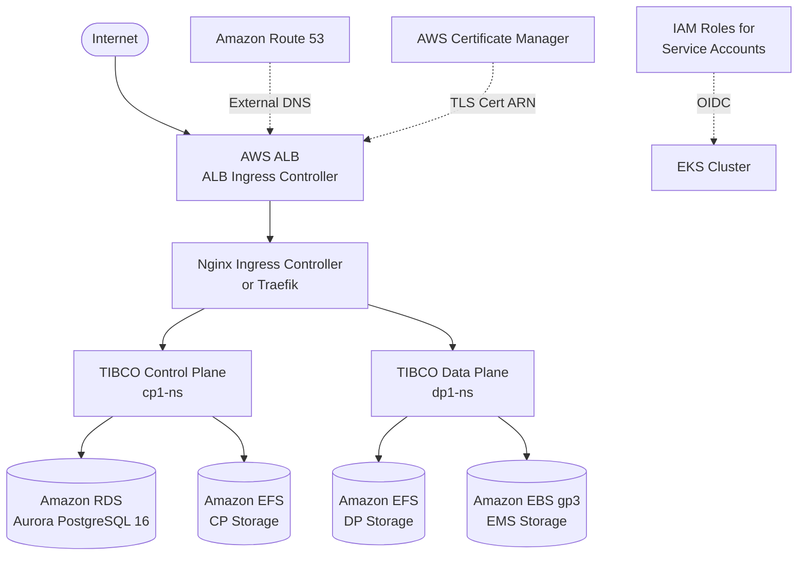

# TIBCO Platform Control Plane and Data Plane Setup on EKS

**Document Purpose**: Complete step-by-step guide for deploying TIBCO Platform Control Plane and Data Plane on Amazon Elastic Kubernetes Service (EKS).

**Target Audience**: DevOps engineers, Platform administrators

**Prerequisites**: Review [prerequisites-checklist-for-customer](prerequisites-checklist-for-customer.md) before starting

**Estimated Time**: 4-6 hours (first-time installation)

**Last Updated**: May 2026 (v1.17.0)

> **Note:** This workshop is NOT meant for production deployment.

> **Version 1.17.0 Update**: This guide is updated for TIBCO Platform 1.17.0. Key changes from 1.16.0:
> - **Simplified DNS Structure** (recommended): Single base domain for admin, subscription, and tunnel — one ACM certificate, fewer DNS records
> - Updated `tibco-cp-base` chart to version 1.17.0
> - Updated `dp-config-aws` chart to version 1.17.x
> - Enhanced OTEL observability configuration
> - BW5CE/BWCE V2 job templates for parallel provisioner execution

---

## Table of Contents

- [Environment Variables](#environment-variables)
- [Architecture](#architecture)
- [Part 1: EKS Cluster Creation](#part-1-eks-cluster-creation)
- [Part 2: Install Third-Party Tools](#part-2-install-third-party-tools)
- [Part 3: Crossplane (Optional)](#part-3-crossplane-optional)
- [Part 4: Install External DNS](#part-4-install-external-dns)
- [Part 5: Create AWS Resources](#part-5-create-aws-resources)
- [Part 6: Storage Class Configuration](#part-6-storage-class-configuration)
- [Part 7: Configure Route53 and Certificates](#part-7-configure-route53-and-certificates)
- [Part 8: Install Ingress Controller](#part-8-install-ingress-controller)
- [Part 9: Control Plane Deployment](#part-9-control-plane-deployment)
- [Part 10: Data Plane Setup](#part-10-data-plane-setup)
- [Part 11: Observability](#part-11-observability)
- [Part 12: Post-Deployment Verification](#part-12-post-deployment-verification)
- [Part 13: Clean-up](#part-13-clean-up)

---

## Environment Variables

All environment variables for this guide are defined in [`scripts/env.sh`](../scripts/env.sh). Source it before running any commands, then override individual values as needed.

```bash
# Source the environment file
source scripts/env.sh

# Override values specific to your environment
export TP_CLUSTER_NAME="my-eks-cluster"
export TP_HOSTED_ZONE_DOMAIN="mycompany.aws.com"
export TP_CONTAINER_REGISTRY_USER="my-jfrog-user"
export TP_CONTAINER_REGISTRY_PASSWORD="my-jfrog-token"
```

The complete list of variables used in this guide, organized by purpose. All are defined in [`scripts/env.sh`](../scripts/env.sh):

**Cluster and Infrastructure**

| Variable | Default | Description |
|:---------|:--------|:------------|
| `AWS_REGION` / `TP_CLUSTER_REGION` | `us-west-2` | AWS region for all resources |
| `TP_CLUSTER_NAME` | `eks-cluster-us-west-2` | EKS cluster name |
| `TP_KUBERNETES_VERSION` | `1.33` | Kubernetes version |
| `TP_NODEGROUP_INSTANCE_TYPE` | `m5a.xlarge` | EC2 instance type per node |
| `TP_NODEGROUP_INITIAL_COUNT` | `3` | Number of worker nodes |
| `TP_VPC_CIDR` | `10.180.0.0/16` | VPC CIDR block |
| `TP_SERVICE_CIDR` | `172.20.0.0/16` | Kubernetes service CIDR |
| `KUBECONFIG` | `$(pwd)/${TP_CLUSTER_NAME}.yaml` | Path to kubeconfig |
| `TP_TIBCO_HELM_CHART_REPO` | `https://tibcosoftware.github.io/tp-helm-charts` | TIBCO Helm chart repo URL |
| `TP_ENABLE_NETWORK_POLICY` | `true` | Enable VPC CNI network policies |
| `CP_RESOURCE_PREFIX` | `platform` | Prefix for Crossplane-managed AWS resources |

**DNS and Certificates**

| Variable | Default | Description |
|:---------|:--------|:------------|
| `TP_HOSTED_ZONE_DOMAIN` | `aws.example.com` | Route 53 hosted zone domain |
| `CP_INSTANCE_ID` | `cp1` | Control Plane instance ID (max 5 chars) |
| `TP_MAIN_INGRESS_CONTROLLER` | `alb` | ALB ingress class (always `alb`) |
| `TP_INGRESS_CONTROLLER` | `nginx` | Kubernetes ingress class for CP |

**Simplified DNS (Recommended — Option 1)**

| Variable | Default | Description |
|:---------|:--------|:------------|
| `TP_BASE_DNS_DOMAIN` | `aws.example.com` | Base domain shared by admin, subscription, and tunnel |
| `CP_ADMIN_HOST_PREFIX` | `admin` | Admin UI hostname prefix → `admin.aws.example.com` |
| `CP_SUBSCRIPTION` | `dev` | Subscription portal prefix → `dev.aws.example.com` |
| `CP_HYBRID_CONNECTIVITY` | `true` | Enable hybrid-proxy tunnel; set `false` to save resources |
| `TP_BASE_DOMAIN_CERT_ARN` | _(empty)_ | Single ACM cert ARN for `*.${TP_BASE_DNS_DOMAIN}` |

**Legacy DNS (Option 2 — backward compatible)**

| Variable | Default | Description |
|:---------|:--------|:------------|
| `TP_MY_DOMAIN` | `cp1-my.aws.example.com` | CP application domain |
| `TP_TUNNEL_DOMAIN` | `cp1-tunnel.aws.example.com` | CP hybrid connectivity domain |
| `TP_MY_DOMAIN_CERT_ARN` | _(empty)_ | ACM cert ARN for `*.${TP_MY_DOMAIN}` |
| `TP_TUNNEL_DOMAIN_CERT_ARN` | _(empty)_ | ACM cert ARN for `*.${TP_TUNNEL_DOMAIN}` |

**Storage**

| Variable | Default | Description |
|:---------|:--------|:------------|
| `TP_STORAGE_CLASS_EFS` | `efs-sc` | EFS storage class name |
| `TP_STORAGE_CLASS` | `ebs-gp3` | EBS storage class name |

**Container Registry**

| Variable | Default | Description |
|:---------|:--------|:------------|
| `TP_CONTAINER_REGISTRY_URL` | `csgprduswrepoedge.jfrog.io` | TIBCO JFrog registry URL |
| `TP_CONTAINER_REGISTRY_USER` | _(empty)_ | JFrog username |
| `TP_CONTAINER_REGISTRY_PASSWORD` | _(empty)_ | JFrog password/API key |

**Database (RDS — set after RDS is created)**

| Variable | Default | Description |
|:---------|:--------|:------------|
| `TP_RDS_AVAILABILITY` | `public` | RDS accessibility: `public` or `private` |
| `TP_RDS_USERNAME` | `TP_rdsadmin` | RDS master username |
| `TP_RDS_MASTER_PASSWORD` | _(placeholder)_ | RDS master password — **change this** |
| `TP_RDS_INSTANCE_CLASS` | `db.t3.medium` | RDS instance class |
| `TP_RDS_PORT` | `5432` | PostgreSQL port |
| `TP_DB_HOST` | _(empty)_ | RDS writer endpoint (set after RDS creation) |
| `TP_DB_NAME` | `postgres` | **Required** — database name passed to the tibco-cp-base chart; must match the name used when creating the RDS cluster |
| `TP_DB_SSL_MODE` | `disable` | SSL mode: `disable` (dev), `require` (SSL on, no cert verify), `verify-full` (SSL + cert verify) |
| `TP_DB_SSL_CERT_SECRET` | `rds-ca-cert` | K8s secret name for the AWS RDS CA bundle (only for `verify-full`) |
| `TP_DB_SSL_CERT_KEY` | `rds-ca-bundle.pem` | Key (filename) inside the SSL cert secret |
| `TP_DB_SSL_ROOT_CERT_PATH` | `/etc/ssl/certs/rds-ca-bundle.pem` | Mount path for the CA cert inside CP pods |

**Email (set before deploying tibco-cp-base)**

| Variable | Default | Description |
|:---------|:--------|:------------|
| `TP_EMAIL_SERVER_TYPE` | _(empty)_ | Email backend: `ses`, `smtp`, or `sendgrid` |
| `TP_FROM_EMAIL` | _(empty)_ | From address for CP notifications |
| `TP_EMAIL_CC_ADDRESSES` | _(empty)_ | Optional CC addresses for platform notifications |
| `TP_REPORTS_EMAIL_ALIAS` | _(empty)_ | Optional email alias for scheduled reports |
| `TP_SES_ARN` | _(empty)_ | AWS SES identity ARN (when `TP_EMAIL_SERVER_TYPE=ses`) |
| `TP_SMTP_SERVER` | _(empty)_ | SMTP relay hostname (when `TP_EMAIL_SERVER_TYPE=smtp`) |
| `TP_SMTP_PORT` | `587` | SMTP port |
| `TP_SMTP_USERNAME` | _(empty)_ | SMTP username |
| `TP_SMTP_PASSWORD` | _(empty)_ | SMTP password |
| `TP_SENDGRID_API_KEY` | _(empty)_ | SendGrid API key (when `TP_EMAIL_SERVER_TYPE=sendgrid`) |

**Admin User (set before deploying tibco-cp-base)**

| Variable | Default | Description |
|:---------|:--------|:------------|
| `TP_ADMIN_EMAIL` | _(empty)_ | Initial admin user email (login username) |
| `TP_ADMIN_FIRSTNAME` | _(empty)_ | Initial admin first name |
| `TP_ADMIN_LASTNAME` | _(empty)_ | Initial admin last name |
| `TP_ADMIN_INITIAL_PASSWORD` | _(empty)_ | Initial admin password |
| `TP_ADMIN_CUSTOMER_ID` | _(empty)_ | Optional customer ID for license association |

**Proxy (optional — only for environments with egress proxy)**

| Variable | Default | Description |
|:---------|:--------|:------------|
| `TP_HTTP_PROXY` | _(empty)_ | HTTP proxy URL |
| `TP_HTTPS_PROXY` | _(empty)_ | HTTPS proxy URL |
| `TP_NO_PROXY` | _(empty)_ | Comma-separated no-proxy list |

**Observability**

| Variable | Default | Description |
|:---------|:--------|:------------|
| `TP_LOGSERVER_ENDPOINT` | _(empty)_ | Log server endpoint (Elasticsearch URL) |
| `TP_LOGSERVER_INDEX` | _(empty)_ | Log index name |
| `TP_LOGSERVER_USERNAME` | _(empty)_ | Log server username |
| `TP_LOGSERVER_PASSWORD` | _(empty)_ | Log server password |
| `TP_ES_RELEASE_NAME` | `dp-config-es` | Helm release name for Elastic stack |

**Data Plane**

| Variable | Default | Description |
|:---------|:--------|:------------|
| `TP_DOMAIN` | `dp1.aws.example.com` | Data Plane domain |
| `DP_NAMESPACE` | `dp1-ns` | Data Plane Kubernetes namespace (set after DP registration) |

**Cleanup**

| Variable | Default | Description |
|:---------|:--------|:------------|
| `TP_DELETE_CLUSTER` | `true` | Whether clean-up deletes the EKS cluster |

---

## Architecture



---

## Part 1: EKS Cluster Creation

> **Source:** [tp-helm-charts/docs/workshop/eks/cluster-setup/README.md](https://github.com/TIBCOSoftware/tp-helm-charts/tree/main/docs/workshop/eks/cluster-setup)

### IAM Requirements

**Why:** The IAM role used for cluster creation must have sufficient permissions to create VPCs, EC2 instances, IAM roles (for IRSA), and EFS resources. Using a role with too few permissions causes failures midway through cluster creation.

Attach these policies to the IAM role you will use:
- [Minimum IAM Policies for eksctl](https://eksctl.io/usage/minimum-iam-policies/) — covers EKS, EC2, CloudFormation, and IAM
- [AmazonElasticFileSystemFullAccess](https://docs.aws.amazon.com/aws-managed-policy/latest/reference/AmazonElasticFileSystemFullAccess.html) — required for EFS creation scripts

### Optional: Docker Container for CLI Tools

**Why:** This ensures a reproducible, version-pinned toolchain regardless of your local OS. Useful when running the workshop from a machine where installing tools directly is restricted.

A [Dockerfile](https://github.com/TIBCOSoftware/tp-helm-charts/blob/main/docs/workshop/eks/Dockerfile) with Alpine 3.22 pre-installs all required tools:

```bash
docker buildx build --platform="linux/amd64" --progress=plain -t workshop-cli-tools:latest --load .
docker run -it --rm -v "$(pwd):/workspace" workshop-cli-tools:latest /bin/bash
```

### Create EKS Cluster with eksctl

**Why:** `eksctl` is the official CLI tool recommended by AWS for creating and managing EKS clusters. A single `eksctl create cluster` command replaces hundreds of AWS CLI commands that would otherwise be needed to create a VPC, subnets, IAM roles, node groups, OIDC provider, and addon configurations. The `ClusterConfig` YAML makes the entire setup reproducible and version-controllable.

The [eksctl-recipe.yaml](https://github.com/TIBCOSoftware/tp-helm-charts/blob/main/docs/workshop/eks/cluster-setup/eksctl-recipe.yaml) configures:

- **OIDC provider** — enables IAM Roles for Service Accounts (IRSA), allowing Kubernetes pods to assume specific AWS IAM roles without long-lived credentials
- **IRSA service accounts** — pre-creates annotated service accounts for ALB controller, External DNS, cert-manager, and CSI drivers so these tools can call AWS APIs without storing access keys in the cluster
- **EKS addons** — `vpc-cni` (with `enableNetworkPolicy`), `kube-proxy`, `coredns`, `aws-efs-csi-driver`, `aws-ebs-csi-driver`
- **Private node networking** — nodes run in private subnets; only the control plane and load balancers are internet-accessible

```bash
# Source environment variables
source scripts/env.sh

# Create the EKS cluster (takes ~30 minutes)
cat eksctl-recipe.yaml | envsubst | eksctl create cluster -f -
```

**eksctl-recipe.yaml structure:**

```yaml
apiVersion: eksctl.io/v1alpha5
kind: ClusterConfig
metadata:
  name: ${TP_CLUSTER_NAME}
  region: ${TP_CLUSTER_REGION}
  version: "${TP_KUBERNETES_VERSION}"
nodeGroups:
  - name: ng-1
    instanceType: ${TP_NODEGROUP_INSTANCE_TYPE}
    desiredCapacity: ${TP_NODEGROUP_INITIAL_COUNT}
    volumeSize: 100
    volumeType: gp3
    privateNetworking: true       # Nodes in private subnets — no direct internet exposure
    iam:
      withAddonPolicies:
        efs: true                 # Grants AmazonElasticFileSystemFullAccess to node IAM role
        ebs: true                 # Grants AmazonEBSCSIDriverPolicy to node IAM role
iam:
  withOIDC: true                  # Creates the OIDC identity provider for IRSA
  serviceAccounts:
    # Each entry creates a Kubernetes SA annotated with an IAM role ARN
    - metadata:
        name: aws-load-balancer-controller
        namespace: kube-system
      wellKnownPolicies:
        awsLoadBalancerController: true   # Policy: create/manage ALBs and NLBs
    - metadata:
        name: external-dns
        namespace: external-dns-system
      wellKnownPolicies:
        externalDNS: true                 # Policy: read/write Route 53 records
    - metadata:
        name: cert-manager
        namespace: cert-manager
      wellKnownPolicies:
        certManager: true                 # Policy: Route 53 DNS-01 challenge
    - metadata:
        name: efs-csi-controller-sa
        namespace: kube-system
      wellKnownPolicies:
        efsCSIController: true            # Policy: manage EFS access points
    - metadata:
        name: ebs-csi-controller-sa
        namespace: kube-system
      wellKnownPolicies:
        ebsCSIController: true            # Policy: manage EBS volumes
vpc:
  cidr: ${TP_VPC_CIDR}
  clusterEndpoints:
    privateAccess: true
    publicAccess: true                    # Allow kubectl from your workstation
addonsConfig:
  disableDefaultAddons: true             # Control which addons are installed
addons:
  - name: vpc-cni
    attachPolicyARNs:
      - arn:aws:iam::aws:policy/AmazonEKS_CNI_Policy
    configurationValues: |-
      enableNetworkPolicy: "${TP_ENABLE_NETWORK_POLICY}"   # Enable K8s NetworkPolicy via VPC CNI
  - name: kube-proxy
    version: latest
  - name: coredns
    version: latest
  - name: aws-efs-csi-driver
    wellKnownPolicies:
      efsCSIController: true
  - name: aws-ebs-csi-driver
    wellKnownPolicies:
      ebsCSIController: true
    configurationValues: |
      {"sidecars": {"snapshotter": {"forceEnable": false}}}
```

### Connect to the Cluster

**Why:** The kubeconfig file stores the cluster endpoint, CA certificate, and authentication token. Saving it under the cluster name (rather than overwriting the default `~/.kube/config`) allows you to manage multiple clusters simultaneously.

```bash
aws eks update-kubeconfig \
  --region ${TP_CLUSTER_REGION} \
  --name ${TP_CLUSTER_NAME} \
  --kubeconfig "${KUBECONFIG}"

kubectl get nodes   # Verify connection
```

---

## Part 2: Install Third-Party Tools

> **Source:** [tp-helm-charts/docs/workshop/eks/cluster-setup/README.md — Install Third Party Tools](https://github.com/TIBCOSoftware/tp-helm-charts/tree/main/docs/workshop/eks/cluster-setup#install-third-party-tools)

> **Note:** Helm labels (`--labels layer=N`) identify installation order. Uninstallation should be done in reverse order (highest layer first). This is supported in Helm v3.13+.

### Install cert-manager

**Why:** cert-manager is the standard Kubernetes certificate management operator. TIBCO Platform requires valid TLS certificates for its ingress endpoints. cert-manager automates certificate provisioning, renewal, and storage as Kubernetes Secrets. It uses the IRSA `cert-manager` service account (created by eksctl) to perform Route 53 DNS-01 ACME challenges for Let's Encrypt — or you can configure it to use ACM certificates already in AWS.

Reference: [cert-manager documentation](https://cert-manager.io/docs/installation/helm/)

```bash
helm upgrade --install --wait --timeout 1h --create-namespace --reuse-values \
  -n cert-manager cert-manager cert-manager \
  --labels layer=0 \
  --repo "https://charts.jetstack.io" --version "v1.17.1" -f - <<EOF
installCRDs: true
serviceAccount:
  create: false
  name: cert-manager   # Uses the IRSA-annotated SA created by eksctl
EOF
```

### Install AWS Load Balancer Controller

**Why:** The AWS Load Balancer Controller watches for Kubernetes `Ingress` objects with `ingressClassName: alb` and creates AWS Application Load Balancers (ALBs) automatically. Without this controller, Kubernetes has no native way to provision AWS load balancers. The ALB becomes the single external entry point for all TIBCO Platform traffic, handling TLS termination (via ACM certificate ARN annotation) before forwarding to Nginx/Traefik.

Reference: [AWS Load Balancer Controller documentation](https://kubernetes-sigs.github.io/aws-load-balancer-controller/)

```bash
helm upgrade --install --wait --timeout 1h --create-namespace --reuse-values \
  -n kube-system aws-load-balancer-controller aws-load-balancer-controller \
  --labels layer=0 \
  --repo "https://aws.github.io/eks-charts" --version "1.6.0" -f - <<EOF
clusterName: ${TP_CLUSTER_NAME}
serviceAccount:
  create: false
  name: aws-load-balancer-controller   # Uses the IRSA-annotated SA created by eksctl
EOF
```

### Install Metrics Server

**Why:** Kubernetes Horizontal Pod Autoscaler (HPA) requires metrics-server to read real-time CPU and memory usage from pods. TIBCO Platform components use HPA to auto-scale under load. Without metrics-server, HPA shows `<unknown>` for metrics and cannot trigger scaling events.

> **Note on eksctl 0.201.0+:** If you remove the `disableDefaultAddons: true` section from the eksctl recipe, metrics-server is installed as an EKS addon automatically. If you keep `disableDefaultAddons: true`, install it here as a Helm chart instead.

Reference: [metrics-server documentation](https://github.com/kubernetes-sigs/metrics-server)

```bash
helm upgrade --install --wait --timeout 1h --create-namespace --reuse-values \
  -n kube-system metrics-server metrics-server \
  --labels layer=0 \
  --repo "https://kubernetes-sigs.github.io/metrics-server" --version "3.11.0" -f - <<EOF
clusterName: ${TP_CLUSTER_NAME}
serviceAccount:
  create: true
  name: metrics-server
EOF
```

---

## Part 3: Crossplane (Optional)

> **Source:** [tp-helm-charts/docs/workshop/eks/cluster-setup/README.md — Install Crossplane](https://github.com/TIBCOSoftware/tp-helm-charts/tree/main/docs/workshop/eks/cluster-setup#install-crossplane-optional)

**Why Crossplane:** Crossplane provides a Kubernetes-native, declarative way to provision AWS infrastructure (EFS, RDS Aurora, IAM roles). Instead of running imperative shell scripts, you declare the desired AWS resources as Kubernetes CRDs (`TibcoEFSSC`, `TibcoAuroraCluster`, `TibcoRoleSA`). This enables GitOps workflows where infrastructure is version-controlled alongside application configuration.

**Skip this section** if you prefer to use the AWS CLI scripts in [Part 5](#part-5-create-aws-resources).

### Pre-requisite: Cluster Details ConfigMap

**Why:** Crossplane's AWS provider needs cluster-specific values (VPC ID, subnet IDs, OIDC provider ARN) to create resources in the correct network context. This script reads these values from the EKS cluster and stores them in a ConfigMap so Crossplane compositions can reference them.

```bash
cd scripts/
./get-cluster-details.sh
# Creates ConfigMap "tibco-platform-infra" in kube-system with:
#   - AWS Account ID, Region, Cluster Name
#   - VPC ID, Private/Public Subnet IDs
#   - OIDC Issuer URL and Provider ARN
```

### Create Crossplane IAM Role

**Why:** Crossplane's AWS provider authenticates to AWS using IRSA. The role needs AdministratorAccess to create EFS, RDS clusters, and IAM roles on your behalf. The trust relationship restricts assumption to Crossplane's service account via OIDC.

```bash
./create-crossplane-role.sh
# Creates role: ${TP_CLUSTER_NAME}-crossplane-${TP_CLUSTER_REGION}
# To use a custom name: export TP_CROSSPLANE_ROLE="my-crossplane-role"
```

### Install Crossplane

```bash
helm upgrade --install --wait --timeout 1h --create-namespace \
  -n crossplane-system crossplane dp-config-aws \
  --labels layer=0 \
  --repo "${TP_TIBCO_HELM_CHART_REPO}" --version "^1.0.0" --set crossplane.enabled=true
```

### Install AWS and Kubernetes Providers

**Why:** Crossplane providers are the plugins that know how to translate Kubernetes CRDs into AWS API calls. `provider-aws` handles EFS, RDS, and IAM. `provider-kubernetes` allows Crossplane to create Kubernetes objects (StorageClass, ServiceAccount) as part of a composition.

```bash
kubectl wait --for condition=established --timeout=300s crd/providers.pkg.crossplane.io

helm upgrade --install --wait --timeout 1h \
  -n crossplane-system crossplane-providers dp-config-aws \
  --render-subchart-notes --labels layer=1 \
  --repo "${TP_TIBCO_HELM_CHART_REPO}" --version "^1.0.0" -f - <<EOF
crossplane-components:
  enabled: true
  providers:
    enabled: true
    iamRoleName: ""   # Add the Crossplane IAM role name from the step above
EOF
```

### Install Provider Configs

**Why:** ProviderConfigs tell Crossplane which AWS account/region to target and which IAM role to assume. Without them, the providers are installed but don't know where to create resources.

```bash
kubectl wait --for condition=established --timeout=300s crd/providerconfigs.aws.crossplane.io
kubectl wait --for condition=established --timeout=300s crd/providerconfigs.kubernetes.crossplane.io

helm upgrade --install --wait --timeout 1h \
  -n crossplane-system crossplane-provider-configs dp-config-aws \
  --render-subchart-notes --labels layer=2 \
  --repo "${TP_TIBCO_HELM_CHART_REPO}" --version "^1.0.0" -f - <<EOF
crossplane-components:
  enabled: true
  configs:
    enabled: true
    iamRoleName: ""   # Add the Crossplane IAM role name
EOF
```

### Install Compositions

**Why:** Crossplane Compositions define reusable infrastructure templates. TIBCO provides compositions for EFS, RDS Aurora, IAM roles, StorageClass, PersistentVolumes, and ServiceAccounts. Composite Resource Definitions (XRDs) define the API surface — the `TibcoAuroraCluster` CRD you create in a claim is backed by these compositions.

```bash
helm upgrade --install --wait --timeout 1h \
  -n crossplane-system crossplane-compositions-aws dp-config-aws \
  --render-subchart-notes --labels layer=3 \
  --repo "${TP_TIBCO_HELM_CHART_REPO}" --version "^1.0.0" -f - <<EOF
crossplane-components:
  enabled: true
  compositions:
    enabled: true
EOF
```

---

## Part 4: Install External DNS

> **Source:** [tp-helm-charts/docs/workshop/eks/control-plane/README.md — Install External DNS](https://github.com/TIBCOSoftware/tp-helm-charts/tree/main/docs/workshop/eks/control-plane#install-external-dns)

**Why:** External DNS watches Kubernetes `Ingress` and `Service` objects and automatically creates or updates Route 53 records when a new load balancer DNS name is assigned. Without it, you must manually update Route 53 every time an ALB is created or changes its DNS name. It uses the IRSA `external-dns` service account (created by eksctl) which has Route 53 write permissions via the `externalDNS` well-known policy.

The `--ingress-class=alb` filter ensures External DNS only processes Ingress objects managed by the ALB controller, not every Ingress in the cluster.

Reference: [External DNS on AWS](https://github.com/kubernetes-sigs/external-dns/blob/master/docs/tutorials/aws.md)

```bash
helm upgrade --install --wait --timeout 1h --create-namespace --reuse-values \
  -n external-dns-system external-dns external-dns \
  --labels layer=0 \
  --repo "https://kubernetes-sigs.github.io/external-dns" --version "1.15.2" -f - <<EOF
serviceAccount:
  create: false
  name: external-dns   # Uses the IRSA-annotated SA created by eksctl
extraArgs:
  - "--ingress-class=${TP_MAIN_INGRESS_CONTROLLER}"   # Filter: only process ALB-class ingresses
sources:
  - ingress
  - service
domainFilters:
  - ${TP_HOSTED_ZONE_DOMAIN}   # Only manage records under your hosted zone
EOF
```

---

## Part 5: Create AWS Resources

> **Source:** [tp-helm-charts/docs/workshop/eks/control-plane/README.md — Create-Configure AWS Resources](https://github.com/TIBCOSoftware/tp-helm-charts/tree/main/docs/workshop/eks/control-plane#create-configure-aws-resources)

Choose **one** method: AWS CLI scripts (Option A) or Crossplane claims (Option B).

### Option A: Using AWS CLI Scripts

```bash
cd scripts/
```

#### Create Amazon EFS (Control Plane storage)

**Why:** TIBCO Control Plane needs persistent shared storage for its orchestration data and artifact uploads. EFS (Elastic File System) is the AWS managed NFS service that supports `ReadWriteMany` access mode — multiple pods can read and write simultaneously, which is required for capabilities like BWCE's artifact manager. EFS also automatically scales capacity and is available across all Availability Zones in the region, making it resilient.

The creation script creates an EFS file system and configures a security group that allows NFS (port 2049) inbound traffic from EKS nodes.

Reference: [EFS CSI driver — EFS creation guide](https://github.com/kubernetes-sigs/aws-efs-csi-driver/blob/master/docs/efs-create-filesystem.md)

```bash
./create-efs-control-plane.sh
# Note the EFS ID from the output, e.g.: fs-052ba079dbc2bffb4
```

#### Create Amazon RDS Aurora PostgreSQL

**Why:** TIBCO Control Plane uses PostgreSQL as its primary metadata database — storing user accounts, subscription data, capability configurations, and audit logs. Amazon Aurora PostgreSQL is the recommended option because it provides automatic multi-AZ failover, automatic minor version upgrades, and read replicas without managing replication yourself. Aurora is API-compatible with standard PostgreSQL, so TIBCO's standard PostgreSQL connectivity works unchanged.

> **Important:** The script-created RDS instance does not enforce SSL by default (development convenience). For production, enforce SSL following the [AWS SSL documentation](https://docs.aws.amazon.com/AmazonRDS/latest/UserGuide/PostgreSQL.Concepts.General.SSL.html#PostgreSQL.Concepts.General.SSL.Requiring). The Crossplane option enforces SSL automatically.

```bash
export TP_WAIT_FOR_RESOURCE_AVAILABLE="false"   # Set "true" to wait for RDS to be fully available before proceeding
./create-rds.sh
```

### Option B: Using Crossplane Claims

**Why use claims over scripts:** Crossplane claims are declarative and idempotent. If you re-apply the same claim, Crossplane reconciles the difference rather than trying to create a duplicate resource. The claim also creates the Aurora cluster with `rds.force_ssl=1` enforced and stores connection details automatically as a Kubernetes Secret.

First, create the CP namespace and service account:

```bash
export CP_INSTANCE_ID="cp1"

kubectl apply -f <(envsubst '${CP_INSTANCE_ID}' <<'EOF'
apiVersion: v1
kind: Namespace
metadata:
  name: ${CP_INSTANCE_ID}-ns
  labels:
    platform.tibco.com/controlplane-instance-id: ${CP_INSTANCE_ID}
EOF
)

kubectl create serviceaccount ${CP_INSTANCE_ID}-sa -n ${CP_INSTANCE_ID}-ns
```

Then install the Crossplane claims (creates EFS + StorageClass + Aurora + IAM role + ServiceAccount):

```bash
export CP_RESOURCE_PREFIX="platform"

helm upgrade --install --wait --timeout 1h \
  -n ${CP_INSTANCE_ID}-ns crossplane-claims-aws dp-config-aws \
  --render-subchart-notes --labels layer=4 \
  --repo "${TP_TIBCO_HELM_CHART_REPO}" --version "^1.0.0" \
  -f <(envsubst '${CP_INSTANCE_ID}, ${CP_RESOURCE_PREFIX}, ${TP_CLUSTER_NAME}, ${TP_STORAGE_CLASS_EFS}' <<'EOF'
crossplane-components:
  enabled: true
  claims:
    enabled: true
    commonResourcePrefix: "${CP_RESOURCE_PREFIX}"
    commonTags:
      cluster-name: ${TP_CLUSTER_NAME}
      owner: crossplane
    efs:
      create: true
      connectionDetailsSecret: "${CP_INSTANCE_ID}-efs-details"
      mandatoryConfigurationParameters:
        performanceMode: "generalPurpose"
        throughputMode: "elastic"   # Elastic throughput auto-scales; no manual provisioning needed
      additionalConfigurationParameters:
        encrypted: true
        kmsKeyId: ""
      storageClass:
        create: true
        name: "${TP_STORAGE_CLASS_EFS}"
    auroraCluster:
      create: true
      connectionDetailsSecret: "${CP_INSTANCE_ID}-aurora-details"
      numberOfInstances: 1
      mandatoryConfigurationParameters:
        autoMinorVersionUpgrade: false
        databaseName: "postgres"
        dbInstanceClass: "db.t3.medium"
        dbParameterGroupFamily: "aurora-postgresql16"
        engine: "aurora-postgresql"
        engineVersion: "16.8"
        engineMode: "provisioned"
        masterUsername: "useradmin"
        port: 5432
        publiclyAccessible: false
      additionalConfigurationParameters:
        applyImmediately: "true"
        groupFamilyParameters:
          - parameterName: rds.force_ssl
            parameterValue: '1'       # Enforce SSL on all connections
            applyMethod: immediate
        storageEncrypted: "true"
        storageType: aurora
    iam:
      create: true
      connectionDetailsSecret: "${CP_INSTANCE_ID}-iam-details"
      mandatoryConfigurationParameters:
        serviceAccount:
          create: true
          name: ${CP_INSTANCE_ID}-sa
          namespace: ${CP_INSTANCE_ID}-ns
        policy:
          arns:
            - arn:aws:iam::aws:policy/AmazonSESFullAccess   # Grants CP permission to send emails via SES
EOF
)
```

### Verify AWS Resources

```bash
# If using Crossplane — check claim status
kubectl get -n ${CP_INSTANCE_ID}-ns TibcoEFSSC
kubectl get -n ${CP_INSTANCE_ID}-ns TibcoAuroraCluster
kubectl get -n ${CP_INSTANCE_ID}-ns TibcoRoleSA

# Get Aurora connection details stored as a Secret
kubectl get secret -n ${CP_INSTANCE_ID}-ns ${CP_INSTANCE_ID}-aurora-details -o yaml

# Check storage class
kubectl get storageclass
```

---

## Part 6: Storage Class Configuration

> **Skip this step** if you used Crossplane claims (the storage class is created automatically by the claim).

**Why:** Kubernetes applications request storage through PersistentVolumeClaims (PVCs) using a `storageClassName`. The EFS StorageClass tells the EFS CSI driver how to dynamically provision EFS Access Points for each PVC. Each Access Point is isolated and has its own directory, POSIX permissions, and optional encryption context.

The `efs-ap` provisioning mode creates a new EFS Access Point per PVC — this is the recommended approach as it provides directory isolation between applications.

```bash
export TP_EFS_ID="fs-052ba079dbc2bffb4"   # Replace with your EFS ID from the creation script

kubectl apply -f <(envsubst '${TP_STORAGE_CLASS_EFS}, ${TP_EFS_ID}' <<'EOF'
kind: StorageClass
apiVersion: storage.k8s.io/v1
metadata:
  name: "${TP_STORAGE_CLASS_EFS}"
  annotations:
    storageclass.kubernetes.io/is-default-class: "false"
provisioner: efs.csi.aws.com
mountOptions:
  - soft          # NFS soft mount: returns errors instead of hanging indefinitely on timeout
  - timeo=300     # Timeout after 30 seconds before retrying (10ths of a second)
  - actimeo=1     # Cache attribute validity: 1 second (keeps directory listings fresh)
parameters:
  provisioningMode: "efs-ap"             # Dynamic Access Point provisioning per PVC
  fileSystemId: "${TP_EFS_ID}"           # The EFS file system to create access points in
  directoryPerms: "700"                  # Root directory permissions on each access point
EOF
)
```

---

## Part 7: Configure Route53 and Certificates

> **Source:** [tp-helm-charts/docs/workshop/eks/control-plane/README.md — Configure Route53 records, Certificates](https://github.com/TIBCOSoftware/tp-helm-charts/tree/main/docs/workshop/eks/control-plane#configure-route53-records-certificates)

Choose **one** DNS approach that matches what you configured in `scripts/env.sh`:

### Step 1: Register a Domain in Route 53

**Why:** External DNS needs a Route 53 hosted zone to create DNS records automatically. The domain must be registered (or delegated) to Route 53 so the nameservers are authoritative.

Follow: [Route 53 domain registration guide](https://docs.aws.amazon.com/Route53/latest/DeveloperGuide/domain-register.html)

See also: [How to Add DNS Records for EKS](how-to-add-dns-records-eks-aws.md)

---

### 🔷 Approach 1: Simplified DNS (Recommended for v1.17.0)

**Results in:**
- Admin UI: `https://admin.${TP_HOSTED_ZONE_DOMAIN}`
- Subscription portal: `https://dev.${TP_HOSTED_ZONE_DOMAIN}`
- Tunnel (if hybrid enabled): `https://tunnel.${TP_HOSTED_ZONE_DOMAIN}`
- **One** wildcard ACM certificate: `*.${TP_HOSTED_ZONE_DOMAIN}`

**Benefits:** Single certificate, simpler DNS records, ~50% fewer AWS resources when hybrid-proxy is disabled.

#### Create One Wildcard Certificate in ACM

**Why:** A single `*.${TP_HOSTED_ZONE_DOMAIN}` certificate covers all Control Plane subdomains (admin, dev/subscription, tunnel). ACM auto-renews it and the ALB references it by ARN — no certificate files needed.

Follow: [ACM certificate request guide](https://docs.aws.amazon.com/acm/latest/userguide/gs-acm-request-public.html)

Request one wildcard certificate for: `*.${TP_HOSTED_ZONE_DOMAIN}`

```bash
# After the certificate is issued and validated, export its ARN
export TP_BASE_DOMAIN_CERT_ARN="arn:aws:acm:us-west-2:123456789012:certificate/xxx"
```

> **Note:** External DNS will create the specific Route 53 A-records automatically (`admin.xxx`, `dev.xxx`, `tunnel.xxx`) when the ingress objects are created in Parts 8–9. No manual DNS record creation is needed.

---

### 🔶 Approach 2: Legacy Multi-Level DNS (Backward Compatible)

**Use when:** Upgrading from v1.14.x, or running multiple CP instances in the same cluster.

**Results in:**
- Admin UI: `https://admin.cp1-my.${TP_HOSTED_ZONE_DOMAIN}`
- Subscription: `https://<sub>.cp1-my.${TP_HOSTED_ZONE_DOMAIN}`
- Tunnel: `https://<sub>.cp1-tunnel.${TP_HOSTED_ZONE_DOMAIN}`
- **Two** wildcard ACM certificates

#### Set Domain Variables

```bash
export TP_MY_DOMAIN="${CP_INSTANCE_ID}-my.${TP_HOSTED_ZONE_DOMAIN}"
export TP_TUNNEL_DOMAIN="${CP_INSTANCE_ID}-tunnel.${TP_HOSTED_ZONE_DOMAIN}"
```

#### Create Two Wildcard Certificates in ACM

Create two wildcard certificates:
- `*.${TP_MY_DOMAIN}` — for Control Plane application traffic
- `*.${TP_TUNNEL_DOMAIN}` — for hybrid connectivity

```bash
# After certificates are issued, export their ARNs
export TP_MY_DOMAIN_CERT_ARN="arn:aws:acm:us-west-2:123456789012:certificate/xxx"
export TP_TUNNEL_DOMAIN_CERT_ARN="arn:aws:acm:us-west-2:123456789012:certificate/yyy"
```

---

## Part 8: Install Ingress Controller

> **Source:** [tp-helm-charts/docs/workshop/eks/control-plane/README.md — Install Additional Ingress Controller](https://github.com/TIBCOSoftware/tp-helm-charts/tree/main/docs/workshop/eks/control-plane#install-additional-ingress-controller-optional)

**Why a two-tier ingress (ALB + Nginx/Traefik):**
The AWS ALB handles TLS termination, SSL policies, and cross-AZ load balancing at the AWS layer. Nginx or Traefik then handles path-based routing, header manipulation, and proxy configuration within the cluster. This two-tier pattern is the AWS-recommended approach because:
1. ALB provides native AWS features (WAF integration, ACM certs, access logging to S3)
2. Nginx/Traefik provides rich Kubernetes-native routing without duplicating those features at the ALB level

The `dp-config-aws` chart creates both: an ALB-backed `Ingress` object (which the ALB controller turns into an AWS ALB) and the Nginx/Traefik deployment.

Reference: [dp-config-aws chart](https://github.com/TIBCOSoftware/tp-helm-charts/tree/main/charts/dp-config-aws)

---

### 🔷 Simplified DNS Ingress (Recommended)

Install Nginx using the base domain. Both the CP UI and the tunnel share the same ALB and the same wildcard certificate.

**Option A: Nginx (Recommended)**

```bash
helm upgrade --install --wait --timeout 1h --create-namespace \
  -n ingress-system dp-config-aws-nginx dp-config-aws \
  --repo "${TP_TIBCO_HELM_CHART_REPO}" --labels layer=1 --version "^1.0.0" -f - <<EOF
dns:
  domain: "${TP_BASE_DNS_DOMAIN}"
httpIngress:
  enabled: true
  name: nginx
  backend:
    serviceName: dp-config-aws-nginx-ingress-nginx-controller
  annotations:
    alb.ingress.kubernetes.io/group.name: "${TP_BASE_DNS_DOMAIN}"
    alb.ingress.kubernetes.io/ssl-policy: "ELBSecurityPolicy-TLS13-1-2-2021-06"
    alb.ingress.kubernetes.io/certificate-arn: "${TP_BASE_DOMAIN_CERT_ARN}"
    external-dns.alpha.kubernetes.io/hostname: "*.${TP_BASE_DNS_DOMAIN}"
    kubernetes.io/ingress.class: alb
ingress-nginx:
  enabled: true
  controller:
    config:
      use-forwarded-headers: "true"
      proxy-body-size: "150m"
      proxy-buffer-size: 16k
EOF
```

> **Note:** The `external-dns.alpha.kubernetes.io/hostname: "*.${TP_BASE_DNS_DOMAIN}"` annotation lets External DNS create a single wildcard Route 53 record, which covers `admin.xxx`, `dev.xxx`, and `tunnel.xxx` without individual per-host records. If your Route 53 zone doesn't support wildcard aliases, create specific A-records for each host manually.

**Option B: Traefik (Simplified DNS)**

```bash
helm upgrade --install --wait --timeout 1h --create-namespace \
  -n ingress-system dp-config-aws-traefik dp-config-aws \
  --repo "${TP_TIBCO_HELM_CHART_REPO}" --labels layer=1 --version "^1.0.0" -f - <<EOF
dns:
  domain: "${TP_BASE_DNS_DOMAIN}"
httpIngress:
  enabled: true
  name: traefik
  backend:
    serviceName: dp-config-aws-traefik
  annotations:
    alb.ingress.kubernetes.io/group.name: "${TP_BASE_DNS_DOMAIN}"
    alb.ingress.kubernetes.io/ssl-policy: "ELBSecurityPolicy-TLS13-1-2-2021-06"
    alb.ingress.kubernetes.io/certificate-arn: "${TP_BASE_DOMAIN_CERT_ARN}"
    external-dns.alpha.kubernetes.io/hostname: "*.${TP_BASE_DNS_DOMAIN}"
    kubernetes.io/ingress.class: alb
traefik:
  enabled: true
  additionalArguments:
    - '--entryPoints.web.forwardedHeaders.insecure'
    - '--serversTransport.insecureSkipVerify=true'
EOF
```

---

### 🔶 Legacy DNS Ingress (Backward Compatible)

Install separate Nginx ingresses for the `my` and `tunnel` domains, each with its own ACM certificate.

**Option A: Nginx (Legacy DNS)**

Install Nginx for Control Plane application traffic (`TP_MY_DOMAIN`):

```bash
helm upgrade --install --wait --timeout 1h --create-namespace \
  -n ingress-system dp-config-aws-nginx dp-config-aws \
  --repo "${TP_TIBCO_HELM_CHART_REPO}" --labels layer=1 --version "^1.0.0" -f - <<EOF
dns:
  domain: "${TP_MY_DOMAIN}"
httpIngress:
  enabled: true
  name: nginx
  backend:
    serviceName: dp-config-aws-nginx-ingress-nginx-controller
  annotations:
    alb.ingress.kubernetes.io/group.name: "${TP_MY_DOMAIN}"
    alb.ingress.kubernetes.io/ssl-policy: "ELBSecurityPolicy-TLS13-1-2-2021-06"
    external-dns.alpha.kubernetes.io/hostname: "*.${TP_MY_DOMAIN}"
    kubernetes.io/ingress.class: alb
ingress-nginx:
  enabled: true
  controller:
    config:
      use-forwarded-headers: "true"
      proxy-body-size: "150m"
      proxy-buffer-size: 16k
EOF
```

Install Nginx for tunnel traffic (`TP_TUNNEL_DOMAIN`):

```bash
# The tunnel uses the same ALB (same group.name) to avoid provisioning a second ALB
helm upgrade --install --wait --timeout 1h --create-namespace \
  -n ingress-system dp-config-aws-tunnel dp-config-aws \
  --repo "${TP_TIBCO_HELM_CHART_REPO}" --labels layer=1 --version "^1.0.0" -f - <<EOF
dns:
  domain: "${TP_TUNNEL_DOMAIN}"
httpIngress:
  enabled: true
  name: nginx-tun
  backend:
    serviceName: dp-config-aws-ingress-nginx-controller
  annotations:
    alb.ingress.kubernetes.io/group.name: "${TP_MY_DOMAIN}"   # Same group = same ALB
    alb.ingress.kubernetes.io/ssl-policy: "ELBSecurityPolicy-TLS13-1-2-2021-06"
    external-dns.alpha.kubernetes.io/hostname: "*.${TP_TUNNEL_DOMAIN}"
    kubernetes.io/ingress.class: alb
ingress-nginx:
  enabled: false   # Nginx is already deployed; only create the Ingress routing rule
EOF
```

**Option B: Traefik (Legacy DNS)**

```bash
helm upgrade --install --wait --timeout 1h --create-namespace \
  -n ingress-system dp-config-aws-traefik dp-config-aws \
  --repo "${TP_TIBCO_HELM_CHART_REPO}" --labels layer=1 --version "^1.0.0" -f - <<EOF
dns:
  domain: "${TP_MY_DOMAIN}"
httpIngress:
  enabled: true
  name: traefik
  backend:
    serviceName: dp-config-aws-traefik
  annotations:
    alb.ingress.kubernetes.io/group.name: "${TP_MY_DOMAIN}"
    alb.ingress.kubernetes.io/ssl-policy: "ELBSecurityPolicy-TLS13-1-2-2021-06"
    external-dns.alpha.kubernetes.io/hostname: "*.${TP_MY_DOMAIN}"
    kubernetes.io/ingress.class: alb
traefik:
  enabled: true
  additionalArguments:
    - '--entryPoints.web.forwardedHeaders.insecure'
    - '--serversTransport.insecureSkipVerify=true'
EOF
```

Tunnel for Traefik (Legacy DNS):

```bash
helm upgrade --install --wait --timeout 1h --create-namespace \
  -n ingress-system dp-config-aws-tunnel-traefik dp-config-aws \
  --repo "${TP_TIBCO_HELM_CHART_REPO}" --labels layer=1 --version "^1.0.0" -f - <<EOF
dns:
  domain: "${TP_TUNNEL_DOMAIN}"
httpIngress:
  enabled: true
  name: traefik-tun
  backend:
    serviceName: dp-config-aws-traefik
  annotations:
    alb.ingress.kubernetes.io/group.name: "${TP_MY_DOMAIN}"
    alb.ingress.kubernetes.io/ssl-policy: "ELBSecurityPolicy-TLS13-1-2-2021-06"
    external-dns.alpha.kubernetes.io/hostname: "*.${TP_TUNNEL_DOMAIN}"
    kubernetes.io/ingress.class: alb
traefik:
  enabled: false
EOF
```

---

### Verify Ingress Classes

```bash
kubectl get ingressclass
# NAME    CONTROLLER                   PARAMETERS   AGE
# alb     ingress.k8s.aws/alb          <none>       7h
# nginx   k8s.io/ingress-nginx         <none>       7h
```

> **Important:** The ingress class name (`nginx` or `traefik`) must be provided to TIBCO Control Plane during initial configuration.

---

## Part 9: Control Plane Deployment

> **Source:** [tp-helm-charts/docs/workshop/eks/control-plane/README.md — TIBCO Control Plane Deployment](https://github.com/TIBCOSoftware/tp-helm-charts/tree/main/docs/workshop/eks/control-plane#tibco-control-plane-deployment)

### Information Required by TIBCO Control Plane

| Name | Sample Value | Notes |
|:-----|:-------------|:------|
| VPC CIDR | `10.180.0.0/16` | From eksctl recipe |
| Ingress class name | `nginx` or `traefik` | Used for CP router ingress |
| EFS storage class | `efs-sc` | Used for CP persistent storage |
| RDS DB instance ARN (CLI) | `arn:aws:rds:<region>:<account>:db:${TP_CLUSTER_NAME}-db` | Connection details |
| RDS details (Crossplane) | Secret `${CP_INSTANCE_ID}-aurora-details` in `${CP_INSTANCE_ID}-ns` | |
| Network Policies | [CP Network Policy Docs](https://docs.tibco.com/pub/platform-cp/latest/doc/html/Default.htm#Installation/control-plane-network-policies.htm) | |

### Create Namespace and Service Account (CLI method only)

**Why:** The Control Plane namespace is where all CP Helm charts and secrets are deployed. The label `platform.tibco.com/controlplane-instance-id` is used by network policies to identify which namespace belongs to which CP instance. If you used Crossplane claims, the namespace and service account were already created.

```bash
kubectl apply -f <(envsubst '${CP_INSTANCE_ID}' <<'EOF'
apiVersion: v1
kind: Namespace
metadata:
  name: ${CP_INSTANCE_ID}-ns
  labels:
    platform.tibco.com/controlplane-instance-id: ${CP_INSTANCE_ID}
EOF
)

kubectl create serviceaccount ${CP_INSTANCE_ID}-sa -n ${CP_INSTANCE_ID}-ns
```

### Create Prerequisite Secrets

#### session-keys (Required)

**Why:** The TIBCO Control Plane router pods use these cryptographic keys to sign and verify user session tokens. `TSC_SESSION_KEY` signs tokens for the TSC (TIBCO Subscription Console) domain. `DOMAIN_SESSION_KEY` signs tokens for custom domain routing. Without this secret, the router pods crash on startup with a missing secret error. The keys must remain stable across upgrades — if they change, all active user sessions are immediately invalidated.

Reference: [TIBCO CP secret requirements](https://docs.tibco.com/pub/platform-cp/latest/doc/html/Default.htm#Installation/deploying-control-plane-in-kubernetes.htm)

```bash
export TSC_SESSION_KEY=$(openssl rand -base64 48 | tr -dc A-Za-z0-9 | head -c32)
export DOMAIN_SESSION_KEY=$(openssl rand -base64 48 | tr -dc A-Za-z0-9 | head -c32)

kubectl create secret generic session-keys -n ${CP_INSTANCE_ID}-ns \
  --from-literal=TSC_SESSION_KEY=${TSC_SESSION_KEY} \
  --from-literal=DOMAIN_SESSION_KEY=${DOMAIN_SESSION_KEY}
```

#### cporch-encryption-secret (Required)

**Why:** The CP Orchestrator service uses this key to encrypt sensitive data written to the database — including Data Plane connection strings, external service credentials, and API keys. This encryption is at the application layer (not just at-rest DB encryption). The key **must not change** after initial deployment: if it changes, the orchestrator cannot decrypt previously stored data and the Control Plane will fail to connect to registered Data Planes.

```bash
export CP_ENCRYPTION_SECRET=$(openssl rand -base64 48 | tr -dc A-Za-z0-9 | head -c44)

kubectl create secret generic cporch-encryption-secret -n ${CP_INSTANCE_ID}-ns \
  --from-literal=CP_ENCRYPTION_SECRET=${CP_ENCRYPTION_SECRET}
```

> **Important:** Store both secrets securely (e.g., in AWS Secrets Manager) — they are needed for disaster recovery and upgrades.

### Set Post-Creation Variables

Before generating the values file, set the variables that are only available after the RDS instance is created:

```bash
# Retrieve the RDS writer endpoint (replace with your cluster identifier)
export TP_DB_HOST=$(aws rds describe-db-clusters \
  --region ${TP_CLUSTER_REGION} \
  --query "DBClusters[?contains(DBClusterIdentifier,'${TP_CLUSTER_NAME}')].Endpoint" \
  --output text)
echo "DB Host: ${TP_DB_HOST}"

# Or if using Crossplane, retrieve from the secret:
# TP_DB_HOST=$(kubectl get secret -n ${CP_INSTANCE_ID}-ns ${CP_INSTANCE_ID}-aurora-details \
#   -o jsonpath='{.data.endpoint}' | base64 --decode)
```

Set email and admin variables (all defined in `scripts/env.sh`):

```bash
# Email configuration — choose one server type
export TP_EMAIL_SERVER_TYPE="ses"                       # "ses", "smtp", or "sendgrid"
export TP_FROM_EMAIL="noreply@${TP_HOSTED_ZONE_DOMAIN}" # From address for CP notifications

# SES — set the SES identity ARN (must be in the same or allowed region)
export TP_SES_ARN="arn:aws:ses:us-east-1:$(aws sts get-caller-identity --query Account --output text):identity/${TP_FROM_EMAIL}"

# SMTP — alternative to SES
# export TP_SMTP_SERVER="smtp.office365.com"
# export TP_SMTP_PORT="587"
# export TP_SMTP_USERNAME="your-smtp-user@company.com"
# export TP_SMTP_PASSWORD="your-smtp-password"

# Admin user — the initial bootstrapped admin for the CP UI
export TP_ADMIN_EMAIL="admin@${TP_HOSTED_ZONE_DOMAIN}"
export TP_ADMIN_FIRSTNAME="Platform"
export TP_ADMIN_LASTNAME="Admin"
export TP_ADMIN_INITIAL_PASSWORD="ChangeMeNow!1"   # Must be changed after first login
```

### Generate tibco-cp-base Values File

**Why:** The `tibco-cp-base` chart (v1.17.0) is the main TIBCO Control Plane Helm chart. It deploys the router, orchestrator, hybrid proxy, and all CP microservices. Generating a file (rather than passing all values inline) keeps the configuration auditable and re-usable across upgrades.

> **Source:** [`tp-helm-charts/charts/tibco-cp-base/values.yaml`](https://github.com/TIBCOSoftware/tp-helm-charts/blob/main/charts/tibco-cp-base/values.yaml)

Choose the approach that matches your DNS choice from Part 7.

---

#### 🔷 Simplified DNS Values (Recommended)

The key differences from legacy DNS:
- `dnsDomain` and `dnsTunnelDomain` are both set to `${TP_BASE_DNS_DOMAIN}` (single base domain)
- `adminHostPrefix` tells the router which subdomain serves the admin UI
- `hybridConnectivity.enabled` controls whether the hybrid-proxy is deployed
- Router ingress lists specific hosts (`admin.xxx`, `dev.xxx`) instead of a wildcard
- Hybrid proxy ingress uses `tunnel.${TP_BASE_DNS_DOMAIN}` on the same ALB

```bash
cat > aws-tibco-cp-base-values.yaml <(envsubst \
  '${TP_ENABLE_NETWORK_POLICY}, ${TP_CONTAINER_REGISTRY_URL}, ${TP_CONTAINER_REGISTRY_USER},
   ${TP_CONTAINER_REGISTRY_PASSWORD}, ${CP_INSTANCE_ID}, ${CP_ADMIN_HOST_PREFIX}, ${CP_SUBSCRIPTION},
   ${CP_HYBRID_CONNECTIVITY}, ${TP_BASE_DNS_DOMAIN},
   ${TP_VPC_CIDR}, ${TP_SERVICE_CIDR}, ${TP_STORAGE_CLASS_EFS}, ${TP_INGRESS_CONTROLLER},
   ${TP_DB_HOST}, ${TP_DB_NAME}, ${TP_DB_PORT}, ${TP_DB_USERNAME}, ${TP_DB_PASSWORD}, ${TP_DB_SSL_MODE},
   ${TP_EMAIL_SERVER_TYPE}, ${TP_FROM_EMAIL}, ${TP_EMAIL_CC_ADDRESSES}, ${TP_REPORTS_EMAIL_ALIAS},
   ${TP_SES_ARN}, ${TP_SMTP_SERVER}, ${TP_SMTP_PORT}, ${TP_SMTP_USERNAME}, ${TP_SMTP_PASSWORD},
   ${TP_SENDGRID_API_KEY}, ${TP_ADMIN_EMAIL}, ${TP_ADMIN_FIRSTNAME}, ${TP_ADMIN_LASTNAME},
   ${TP_ADMIN_INITIAL_PASSWORD}, ${TP_ADMIN_CUSTOMER_ID},
   ${TP_HTTP_PROXY}, ${TP_HTTPS_PROXY}, ${TP_NO_PROXY},
   ${TP_LOGSERVER_ENDPOINT}, ${TP_LOGSERVER_INDEX}, ${TP_LOGSERVER_USERNAME}, ${TP_LOGSERVER_PASSWORD}' \
  << 'EOF'
# =============================================================================
# SIMPLIFIED DNS — SECTION 1: HYBRID PROXY
# Enabled when CP_HYBRID_CONNECTIVITY=true. The tunnel endpoint is a subdomain
# of the same base domain (tunnel.${TP_BASE_DNS_DOMAIN}) — no separate domain needed.
# Set enabled: false to disable hybrid-proxy and save ~50% CPU/RAM.
# =============================================================================
hybrid-proxy:
  enabled: ${CP_HYBRID_CONNECTIVITY}
  ingress:
    enabled: ${CP_HYBRID_CONNECTIVITY}
    ingressClassName: "${TP_INGRESS_CONTROLLER}"
    hosts:
      - host: 'tunnel.${TP_BASE_DNS_DOMAIN}'
        paths:
          - path: /
            pathType: Prefix
            port: 105

# =============================================================================
# SIMPLIFIED DNS — SECTION 2: ROUTER INGRESS
# Specific hosts for admin and subscription — no wildcard needed.
# adminHostPrefix tells the router which host serves the admin portal.
# =============================================================================
router-operator:
  tscSessionKey:
    secretName: session-keys
    key: TSC_SESSION_KEY
  domainSessionKey:
    secretName: session-keys
    key: DOMAIN_SESSION_KEY
  ingress:
    enabled: true
    ingressClassName: "${TP_INGRESS_CONTROLLER}"
    hosts:
      - host: '${CP_ADMIN_HOST_PREFIX}.${TP_BASE_DNS_DOMAIN}'
        paths:
          - path: /
            pathType: Prefix
            port: 100
      - host: '${CP_SUBSCRIPTION}.${TP_BASE_DNS_DOMAIN}'
        paths:
          - path: /
            pathType: Prefix
            port: 100

global:
  tibco:
    controlPlaneInstanceId: "${CP_INSTANCE_ID}"
    serviceAccount: "${CP_INSTANCE_ID}-sa"
    adminHostPrefix: "${CP_ADMIN_HOST_PREFIX}"
    hybridConnectivity:
      enabled: ${CP_HYBRID_CONNECTIVITY}
    containerRegistry:
      url: "${TP_CONTAINER_REGISTRY_URL}"
      username: "${TP_CONTAINER_REGISTRY_USER}"
      password: "${TP_CONTAINER_REGISTRY_PASSWORD}"
      repository: "tibco-platform-docker-prod"
    createNetworkPolicy: ${TP_ENABLE_NETWORK_POLICY}
    networkPolicy:
      database:
        CIDR: ""
        port: "${TP_DB_PORT}"
      logServer:
        CIDR: ""
        port: "9200"
      emailServer:
        CIDR: ""
        port: "${TP_SMTP_PORT}"
      containerRegistry:
        CIDR: ""
        port: "443"
    proxy:
      httpProxy: "${TP_HTTP_PROXY}"
      httpsProxy: "${TP_HTTPS_PROXY}"
      noProxy: "${TP_NO_PROXY}"
    logging:
      fluentbit:
        enabled: false

  external:
    clusterInfo:
      nodeCIDR: "${TP_VPC_CIDR}"
      podCIDR: "${TP_VPC_CIDR}"
      serviceCIDR: "${TP_SERVICE_CIDR}"

    # ==========================================================================
    # SIMPLIFIED DNS: both dnsDomain and dnsTunnelDomain use the same base domain.
    # The platform distinguishes admin/subscription/tunnel by hostname prefix.
    # ==========================================================================
    dnsDomain: "${TP_BASE_DNS_DOMAIN}"
    dnsTunnelDomain: "${TP_BASE_DNS_DOMAIN}"

    db_host: "${TP_DB_HOST}"
    db_master_writer_host: "${TP_DB_HOST}"
    db_local_reader_host: "${TP_DB_HOST}"
    db_name: "${TP_DB_NAME}"
    db_port: "${TP_DB_PORT}"
    db_username: "${TP_DB_USERNAME}"
    db_password: "${TP_DB_PASSWORD}"
    db_secret_name: "provider-cp-database-credentials"
    db_ssl_mode: "${TP_DB_SSL_MODE}"

    emailServerType: "${TP_EMAIL_SERVER_TYPE}"
    fromAndReplyToEmailAddress: "${TP_FROM_EMAIL}"
    platformEmailNotificationCcAddresses: "${TP_EMAIL_CC_ADDRESSES}"
    cronJobReportsEmailAlias: "${TP_REPORTS_EMAIL_ALIAS}"
    emailServer:
      ses:
        arn: "${TP_SES_ARN}"
      smtp:
        server: "${TP_SMTP_SERVER}"
        port: "${TP_SMTP_PORT}"
        username: "${TP_SMTP_USERNAME}"
        password: "${TP_SMTP_PASSWORD}"
      sendgrid:
        apiKey: "${TP_SENDGRID_API_KEY}"

    admin:
      email: "${TP_ADMIN_EMAIL}"
      firstname: "${TP_ADMIN_FIRSTNAME}"
      lastname: "${TP_ADMIN_LASTNAME}"
      customerID: "${TP_ADMIN_CUSTOMER_ID}"
    adminInitialPassword: "${TP_ADMIN_INITIAL_PASSWORD}"

    storage:
      storageClassName: "${TP_STORAGE_CLASS_EFS}"

    logserver:
      endpoint: "${TP_LOGSERVER_ENDPOINT}"
      index: "${TP_LOGSERVER_INDEX}"
      username: "${TP_LOGSERVER_USERNAME}"
      password: "${TP_LOGSERVER_PASSWORD}"
EOF
)
```

---

#### 🔶 Legacy DNS Values (Backward Compatible)

Use this when you chose Option 2 (legacy multi-level DNS) in Part 7. The key differences: wildcard host `*.${TP_MY_DOMAIN}` for the router, separate `dnsDomain` and `dnsTunnelDomain`, and no `adminHostPrefix` / `hybridConnectivity` keys (those were introduced in v1.15).

```bash
cat > aws-tibco-cp-base-values.yaml <(envsubst \
  '${TP_ENABLE_NETWORK_POLICY}, ${TP_CONTAINER_REGISTRY_URL}, ${TP_CONTAINER_REGISTRY_USER},
   ${TP_CONTAINER_REGISTRY_PASSWORD}, ${CP_INSTANCE_ID}, ${TP_TUNNEL_DOMAIN}, ${TP_MY_DOMAIN},
   ${TP_VPC_CIDR}, ${TP_SERVICE_CIDR}, ${TP_STORAGE_CLASS_EFS}, ${TP_INGRESS_CONTROLLER},
   ${TP_DB_HOST}, ${TP_DB_NAME}, ${TP_DB_PORT}, ${TP_DB_USERNAME}, ${TP_DB_PASSWORD}, ${TP_DB_SSL_MODE},
   ${TP_EMAIL_SERVER_TYPE}, ${TP_FROM_EMAIL}, ${TP_EMAIL_CC_ADDRESSES}, ${TP_REPORTS_EMAIL_ALIAS},
   ${TP_SES_ARN}, ${TP_SMTP_SERVER}, ${TP_SMTP_PORT}, ${TP_SMTP_USERNAME}, ${TP_SMTP_PASSWORD},
   ${TP_SENDGRID_API_KEY}, ${TP_ADMIN_EMAIL}, ${TP_ADMIN_FIRSTNAME}, ${TP_ADMIN_LASTNAME},
   ${TP_ADMIN_INITIAL_PASSWORD}, ${TP_ADMIN_CUSTOMER_ID},
   ${TP_HTTP_PROXY}, ${TP_HTTPS_PROXY}, ${TP_NO_PROXY},
   ${TP_LOGSERVER_ENDPOINT}, ${TP_LOGSERVER_INDEX}, ${TP_LOGSERVER_USERNAME}, ${TP_LOGSERVER_PASSWORD}' \
  << 'EOF'
# =============================================================================
# LEGACY DNS — SECTION 1: ROUTER INGRESS
# Wildcard host covers all subdomains of the CP application domain.
# =============================================================================
router-operator:
  tscSessionKey:
    secretName: session-keys
    key: TSC_SESSION_KEY
  domainSessionKey:
    secretName: session-keys
    key: DOMAIN_SESSION_KEY
  ingress:
    enabled: true
    ingressClassName: "${TP_INGRESS_CONTROLLER}"
    hosts:
      - host: '*.${TP_MY_DOMAIN}'
        paths:
          - path: /
            pathType: Prefix
            port: 100

# =============================================================================
# LEGACY DNS — SECTION 2: HYBRID PROXY
# Option A (default): Use existing Nginx/Traefik Ingress + ALB (no extra config needed).
# Option B: Dedicated NLB (uncomment service block below for TCP passthrough).
# =============================================================================
hybrid-proxy:
  enabled: true
  # Option B: Dedicated NLB (uncomment to use NLB instead of Ingress)
  # service:
  #   type: LoadBalancer
  #   loadBalancerClass: "service.k8s.aws/nlb"
  #   allocateLoadBalancerNodePorts: false
  #   annotations:
  #     external-dns.alpha.kubernetes.io/hostname: "*.${TP_TUNNEL_DOMAIN}"
  #     service.beta.kubernetes.io/aws-load-balancer-ssl-cert: "${TP_TUNNEL_DOMAIN_CERT_ARN}"
  #     service.beta.kubernetes.io/aws-load-balancer-attributes: load_balancing.cross_zone.enabled=false
  #     service.beta.kubernetes.io/aws-load-balancer-target-group-attributes: preserve_client_ip.enabled=true
  #     service.beta.kubernetes.io/aws-load-balancer-nlb-target-type: ip
  #     service.beta.kubernetes.io/aws-load-balancer-scheme: internet-facing
  #     service.beta.kubernetes.io/aws-load-balancer-type: external
  #     service.beta.kubernetes.io/aws-load-balancer-ssl-ports: "443"
  #     service.beta.kubernetes.io/aws-load-balancer-ssl-negotiation-policy: "ELBSecurityPolicy-TLS13-1-2-2021-06"

global:
  tibco:
    controlPlaneInstanceId: "${CP_INSTANCE_ID}"
    serviceAccount: "${CP_INSTANCE_ID}-sa"
    containerRegistry:
      url: "${TP_CONTAINER_REGISTRY_URL}"
      username: "${TP_CONTAINER_REGISTRY_USER}"
      password: "${TP_CONTAINER_REGISTRY_PASSWORD}"
      repository: "tibco-platform-docker-prod"
    createNetworkPolicy: ${TP_ENABLE_NETWORK_POLICY}
    networkPolicy:
      database:
        CIDR: ""
        port: "${TP_DB_PORT}"
      logServer:
        CIDR: ""
        port: "9200"
      emailServer:
        CIDR: ""
        port: "${TP_SMTP_PORT}"
      containerRegistry:
        CIDR: ""
        port: "443"
    proxy:
      httpProxy: "${TP_HTTP_PROXY}"
      httpsProxy: "${TP_HTTPS_PROXY}"
      noProxy: "${TP_NO_PROXY}"
    logging:
      fluentbit:
        enabled: false

  external:
    clusterInfo:
      nodeCIDR: "${TP_VPC_CIDR}"
      podCIDR: "${TP_VPC_CIDR}"
      serviceCIDR: "${TP_SERVICE_CIDR}"

    # ==========================================================================
    # LEGACY DNS: separate domains for UI and tunnel traffic.
    # ==========================================================================
    dnsDomain: "${TP_MY_DOMAIN}"
    dnsTunnelDomain: "${TP_TUNNEL_DOMAIN}"

    db_host: "${TP_DB_HOST}"
    db_master_writer_host: "${TP_DB_HOST}"
    db_local_reader_host: "${TP_DB_HOST}"
    db_name: "${TP_DB_NAME}"
    db_port: "${TP_DB_PORT}"
    db_username: "${TP_DB_USERNAME}"
    db_password: "${TP_DB_PASSWORD}"
    db_secret_name: "provider-cp-database-credentials"
    db_ssl_mode: "${TP_DB_SSL_MODE}"

    emailServerType: "${TP_EMAIL_SERVER_TYPE}"
    fromAndReplyToEmailAddress: "${TP_FROM_EMAIL}"
    platformEmailNotificationCcAddresses: "${TP_EMAIL_CC_ADDRESSES}"
    cronJobReportsEmailAlias: "${TP_REPORTS_EMAIL_ALIAS}"
    emailServer:
      ses:
        arn: "${TP_SES_ARN}"
      smtp:
        server: "${TP_SMTP_SERVER}"
        port: "${TP_SMTP_PORT}"
        username: "${TP_SMTP_USERNAME}"
        password: "${TP_SMTP_PASSWORD}"
      sendgrid:
        apiKey: "${TP_SENDGRID_API_KEY}"

    admin:
      email: "${TP_ADMIN_EMAIL}"
      firstname: "${TP_ADMIN_FIRSTNAME}"
      lastname: "${TP_ADMIN_LASTNAME}"
      customerID: "${TP_ADMIN_CUSTOMER_ID}"
    adminInitialPassword: "${TP_ADMIN_INITIAL_PASSWORD}"

    storage:
      storageClassName: "${TP_STORAGE_CLASS_EFS}"

    logserver:
      endpoint: "${TP_LOGSERVER_ENDPOINT}"
      index: "${TP_LOGSERVER_INDEX}"
      username: "${TP_LOGSERVER_USERNAME}"
      password: "${TP_LOGSERVER_PASSWORD}"
EOF
)
```

---

Verify the generated values file before deploying:

```bash
cat aws-tibco-cp-base-values.yaml
```

> **Important:** Review the file for any `${}` placeholders that were not substituted — this indicates an env var that was not set before generating the file.

---

### Optional: Aurora PostgreSQL SSL Configuration

> **Source:** [AWS RDS SSL documentation](https://docs.aws.amazon.com/AmazonRDS/latest/UserGuide/PostgreSQL.Concepts.General.SSL.html)

By default, `TP_DB_SSL_MODE="disable"` is set for workshop convenience when the RDS cluster is in a private subnet with no internet exposure. For production or when SSL is enforced on the Aurora cluster (as Crossplane does with `rds.force_ssl=1`), configure one of the two SSL modes below.

#### SSL Mode Options for Aurora PostgreSQL on AWS

| Mode | When to use | Certificate required |
|:-----|:------------|:--------------------|
| `disable` | Dev/test only; RDS in private subnet, no `rds.force_ssl=1` | No |
| `require` | RDS has SSL enforcement but you trust the private network | No — encrypts the connection but does not verify the server certificate |
| `verify-full` | Production; you want to verify the Aurora server identity via AWS CA | Yes — requires the AWS RDS CA bundle |

**Why `require` is sufficient for most EKS deployments:** Aurora PostgreSQL is in a private VPC subnet, not reachable from the internet. The risk of a man-in-the-middle attack on an internal VPC connection is minimal. `require` still encrypts the data in transit. `verify-full` adds certificate chain verification and is recommended when compliance frameworks (PCI DSS, HIPAA, SOC 2) require it.

#### Step 1: Enable SSL enforcement on the Aurora cluster

**Why:** By default, Aurora PostgreSQL allows both SSL and non-SSL connections. Setting `rds.force_ssl=1` in the parameter group rejects all non-SSL connections at the database level, regardless of what the application requests.

```bash
# Find the DB cluster parameter group name
aws rds describe-db-clusters \
  --region ${TP_CLUSTER_REGION} \
  --query "DBClusters[?contains(DBClusterIdentifier,'${TP_CLUSTER_NAME}')].DBClusterParameterGroup" \
  --output text

# Modify the parameter group to enforce SSL
aws rds modify-db-cluster-parameter-group \
  --region ${TP_CLUSTER_REGION} \
  --db-cluster-parameter-group-name <YOUR_PARAMETER_GROUP_NAME> \
  --parameters "ParameterName=rds.force_ssl,ParameterValue=1,ApplyMethod=immediate"
```

> **Note:** If you used Crossplane to create the Aurora cluster, `rds.force_ssl=1` is already set — you only need Step 2 and beyond for `verify-full` mode, or just set `TP_DB_SSL_MODE="require"` for `require` mode.

#### Step 2: Set SSL mode to `require` (minimum SSL)

Update your environment and regenerate the values file:

```bash
export TP_DB_SSL_MODE="require"
```

Then regenerate the values file (re-run the `cat > aws-tibco-cp-base-values.yaml` command from the previous section). The chart's `db_ssl_mode: "require"` instructs the orchestrator to open a TLS-encrypted connection without verifying the server certificate.

No Kubernetes secret or CA certificate is needed for `require` mode.

#### Step 3 (Optional): Upgrade to `verify-full` with AWS RDS CA bundle

Use `verify-full` when you need to cryptographically verify that the orchestrator is connecting to your Aurora cluster and not an intercepted endpoint.

**Why AWS provides a CA bundle:** AWS Aurora PostgreSQL SSL certificates are signed by AWS's own Certificate Authority, not a public CA (like Let's Encrypt). The AWS RDS CA bundle contains the intermediate and root certificates needed to verify Aurora server certificates. AWS publishes regional bundles at a stable URL.

**Download the AWS RDS CA bundle for your region:**

```bash
# Download the regional CA bundle
curl -o rds-ca-bundle.pem \
  "https://truststore.pki.rds.amazonaws.com/${TP_CLUSTER_REGION}/${TP_CLUSTER_REGION}-bundle.pem"

# Verify the download contains at least one certificate
grep -c "BEGIN CERTIFICATE" rds-ca-bundle.pem
```

**Store the CA bundle as a Kubernetes secret in the CP namespace:**

**Why a Kubernetes Secret:** The tibco-cp-base chart mounts this secret as a volume inside the orchestrator pod, making the CA bundle available at a file path that PostgreSQL's SSL client library (`libpq`) reads at connection time.

```bash
kubectl create secret generic ${TP_DB_SSL_CERT_SECRET} \
  -n ${CP_INSTANCE_ID}-ns \
  --from-file=${TP_DB_SSL_CERT_KEY}=rds-ca-bundle.pem

# Verify the secret was created
kubectl get secret ${TP_DB_SSL_CERT_SECRET} -n ${CP_INSTANCE_ID}-ns
```

**Update environment variables and regenerate the values file:**

```bash
export TP_DB_SSL_MODE="verify-full"
```

Then regenerate the values file and add the following additional values to `aws-tibco-cp-base-values.yaml` (append after the last line, or add to a separate override file):

```yaml
# --- Optional SSL override values file: ssl-override.yaml ---
# Apply with: helm install ... -f aws-tibco-cp-base-values.yaml -f ssl-override.yaml
global:
  external:
    db_ssl_mode: "verify-full"
    db_ssl_root_cert: "/etc/ssl/certs/rds-ca-bundle.pem"    # Must match TP_DB_SSL_ROOT_CERT_PATH

# Mount the CA bundle secret into the orchestrator pod
tp-cp-core:
  orchestrator:
    extraVolumes:
      - name: rds-ca-cert
        secret:
          secretName: rds-ca-cert        # Must match TP_DB_SSL_CERT_SECRET
    extraVolumeMounts:
      - name: rds-ca-cert
        mountPath: /etc/ssl/certs        # Directory where the cert is mounted
        readOnly: true
```

**Why `extraVolumes`/`extraVolumeMounts`:** The orchestrator pod needs the CA bundle accessible at a file path at startup. Without mounting the secret as a volume, the path `/etc/ssl/certs/rds-ca-bundle.pem` would not exist inside the pod and the SSL handshake would fail with a "certificate verify failed" error.

**Verify the SSL connection after deployment:**

```bash
# Check orchestrator logs for successful DB connection
kubectl logs -n ${CP_INSTANCE_ID}-ns \
  deploy/$(kubectl get deploy -n ${CP_INSTANCE_ID}-ns -o name | grep orchestrator | head -1 | cut -d/ -f2) \
  | grep -i "database\|ssl\|connect"

# Alternatively, test the SSL connection from inside the cluster
kubectl run ssl-test --rm -it --restart=Never \
  --image=postgres:16 \
  -- psql "postgresql://${TP_DB_USERNAME}:${TP_DB_PASSWORD}@${TP_DB_HOST}:${TP_DB_PORT}/${TP_DB_NAME}?sslmode=verify-full&sslrootcert=/tmp/bundle.pem"
```

#### SSL Configuration Summary

| Variable | `disable` | `require` | `verify-full` |
|:---------|:----------|:----------|:--------------|
| `TP_DB_SSL_MODE` | `disable` | `require` | `verify-full` |
| `TP_DB_SSL_CERT_SECRET` | — | — | `rds-ca-cert` |
| `db_ssl_root_cert` in values | _(omit)_ | _(omit)_ | `/etc/ssl/certs/rds-ca-bundle.pem` |
| K8s secret required | No | No | Yes |
| CA bundle download required | No | No | Yes |
| Encrypts connection | No | Yes | Yes |
| Verifies server identity | No | No | Yes |

---

### Deploy TIBCO Control Plane

```bash
helm upgrade --install --wait --timeout 2h --create-namespace \
  -n ${CP_INSTANCE_ID}-ns tibco-cp-base tibco-cp-base \
  --labels layer=1 \
  --repo "${TP_TIBCO_HELM_CHART_REPO}" --version "1.17.0" \
  -f aws-tibco-cp-base-values.yaml
```

After deployment, verify all pods are running:

```bash
kubectl get pods -n ${CP_INSTANCE_ID}-ns
```

**First-time access flow:**
1. Navigate to `https://${CP_ADMIN_HOST_PREFIX}.${TP_BASE_DNS_DOMAIN}` (simplified DNS) or `https://admin.${TP_MY_DOMAIN}` (legacy DNS)
2. Log in with `${TP_ADMIN_EMAIL}` and `${TP_ADMIN_INITIAL_PASSWORD}`
3. Change the password on first login
4. Create a subscription with your chosen `hostPrefix` (e.g., `dev`) to access the subscription portal

Reference: [Deploying Control Plane in Kubernetes](https://docs.tibco.com/pub/platform-cp/latest/doc/html/Default.htm#Installation/deploying-control-plane-in-kubernetes.htm)

---

## Part 10: Data Plane Setup

> **Source:** [tp-helm-charts/docs/workshop/eks/data-plane/README.md](https://github.com/TIBCOSoftware/tp-helm-charts/tree/main/docs/workshop/eks/data-plane)

For a dedicated Data Plane cluster, see the [Data Plane Only Setup Guide](how-to-dp-eks-setup-guide.md). For a shared cluster (CP + DP on same EKS cluster), follow the steps below.

### Export Data Plane Variables

```bash
# All variables are already set if you sourced scripts/env.sh
# Override as needed:
export TP_DOMAIN="dp1.${TP_HOSTED_ZONE_DOMAIN}"
export TP_EBS_ENABLED=true
export TP_STORAGE_CLASS="ebs-gp3"
export TP_EFS_ENABLED=true
export TP_INGRESS_CLASS="nginx"
export TP_ES_RELEASE_NAME="dp-config-es"
export DP_NAMESPACE="dp1-ns"
```

### Create Amazon EFS (Data Plane storage)

**Why:** The Data Plane needs its own EFS for BWCE artifact manager and EMS log storage. Even on a shared cluster, use a separate EFS from the CP one to maintain isolation and simplify cost attribution.

```bash
cd scripts/
./create-efs-data-plane.sh
export TP_EFS_ID="fs-0ec1c745c10d523f6"   # Replace with your DP EFS ID
```

### Install Data Plane Storage Classes

**Why:** The `dp-config-aws` chart creates both `ebs-gp3` and `efs-sc` storage classes with the correct provisioner configurations. These storage classes must exist before TIBCO capabilities can be provisioned — when a BWCE capability is registered, TIBCO CP creates PVCs using these class names.

| Storage Class | Use Case |
|:-------------|:---------|
| `ebs-gp3` | EMS capability data storage (ReadWriteOnce, high IOPS) |
| `efs-sc` | BWCE artifact manager, EMS log storage (ReadWriteMany) |

```bash
helm upgrade --install --wait --timeout 1h --create-namespace \
  -n storage-system dp-config-aws-storage dp-config-aws \
  --repo "${TP_TIBCO_HELM_CHART_REPO}" --labels layer=1 --version "^1.0.0" -f - <<EOF
dns:
  domain: "${TP_DOMAIN}"
httpIngress:
  enabled: false   # No ingress needed for storage; only creating StorageClass resources
storageClass:
  ebs:
    enabled: ${TP_EBS_ENABLED}    # Creates ebs-gp3 StorageClass
  efs:
    enabled: ${TP_EFS_ENABLED}    # Creates efs-sc StorageClass
    parameters:
      fileSystemId: "${TP_EFS_ID}"
tigera-operator:
  enabled: false
ingress-nginx:
  enabled: false
EOF
```

### Install Nginx Ingress for Data Plane

**Why:** The Data Plane needs its own ingress controller entry point for capability endpoints (BWCE, Flogo, EMS APIs). While the ALB is shared with the CP, the Nginx ingress class (`nginx`) is the one registered in TIBCO CP when you add a capability — each BWCE deployment creates an Ingress object with `ingressClassName: nginx`.

```bash
helm upgrade --install --wait --timeout 1h --create-namespace \
  -n ingress-system dp-config-aws-nginx dp-config-aws \
  --repo "${TP_TIBCO_HELM_CHART_REPO}" --labels layer=1 --version "^1.0.0" -f - <<EOF
dns:
  domain: "${TP_DOMAIN}"
httpIngress:
  enabled: true
  name: nginx
  backend:
    serviceName: dp-config-aws-nginx-ingress-nginx-controller
  annotations:
    alb.ingress.kubernetes.io/group.name: "${TP_DOMAIN}"
    external-dns.alpha.kubernetes.io/hostname: "*.${TP_DOMAIN}"
    kubernetes.io/ingress.class: alb
ingress-nginx:
  enabled: true
  controller:
    config:
      use-forwarded-headers: "true"
      proxy-body-size: "150m"
      proxy-buffer-size: 16k
EOF
```

### Information Needed for Data Plane Registration

```bash
# Get the base FQDN assigned by AWS to the ALB
kubectl get ingress -n ingress-system nginx | awk 'NR==2 { print $3 }'
```

| Name | Sample Value | Notes |
|:-----|:-------------|:------|
| VPC CIDR | `10.180.0.0/16` | From eksctl recipe |
| Ingress class name | `nginx` | Used for BWCE capability Ingress objects |
| EFS storage class | `efs-sc` | Used for BWCE artifact manager and EMS logs |
| EBS storage class | `ebs-gp3` | Used for EMS capability data |
| Network Policy Details | [DP Network Policy Docs](https://docs.tibco.com/pub/platform-cp/latest/doc/html/Default.htm#UserGuide/controlling-traffic-with-network-policies.htm) | |

---

## Part 11: Observability

> **Source:** [tp-helm-charts/docs/workshop/eks/data-plane/README.md — Install Observability tools](https://github.com/TIBCOSoftware/tp-helm-charts/tree/main/docs/workshop/eks/data-plane#install-observability-tools)

For a detailed observability setup guide, see [Data Plane Observability on EKS](how-to-dp-eks-observability.md).

### Install Elastic Stack (ECK)

**Why:** Elasticsearch stores distributed traces (Jaeger format) and application logs from TIBCO capabilities. Kibana provides a UI for searching and visualizing traces and logs. APM Server receives traces from OpenTelemetry collectors deployed in the Data Plane namespace. The ECK operator manages the Elasticsearch cluster lifecycle (upgrades, scaling, certificate rotation) as Kubernetes CRDs.

The `dp-config-es` chart pre-configures Elasticsearch with TIBCO-specific index templates (Jaeger spans, service logs, user app logs) and lifecycle policies (30-day Jaeger retention, 60-day user app retention).

```bash
# Install ECK operator (manages Elasticsearch, Kibana, APM as Kubernetes CRDs)
helm upgrade --install --wait --timeout 1h --labels layer=1 --create-namespace \
  -n elastic-system eck-operator eck-operator \
  --repo "https://helm.elastic.co" --version "2.16.0"

# Verify operator is running before proceeding
kubectl logs -n elastic-system sts/elastic-operator | tail -5

# Deploy Elasticsearch + Kibana + APM with TIBCO index templates
helm upgrade --install --wait --timeout 1h --create-namespace --reuse-values \
  -n elastic-system ${TP_ES_RELEASE_NAME} dp-config-es \
  --labels layer=2 \
  --repo "${TP_TIBCO_HELM_CHART_REPO}" --version "^1.0.0" -f - <<EOF
domain: ${TP_DOMAIN}
es:
  version: "8.17.3"
  ingress:
    ingressClassName: ${TP_INGRESS_CLASS}
    service: ${TP_ES_RELEASE_NAME}-es-http
  storage:
    name: ${TP_STORAGE_CLASS}   # Uses ebs-gp3 for Elasticsearch data
kibana:
  version: "8.17.3"
  ingress:
    ingressClassName: ${TP_INGRESS_CLASS}
    service: ${TP_ES_RELEASE_NAME}-kb-http
apm:
  enabled: true
  version: "8.17.3"
  ingress:
    ingressClassName: ${TP_INGRESS_CLASS}
    service: ${TP_ES_RELEASE_NAME}-apm-http
EOF
```

### Install Prometheus + Grafana

**Why:** Prometheus scrapes metrics from TIBCO Platform infrastructure components (OTEL collectors, capability pods) and stores them as time series. Grafana visualizes those metrics in dashboards. The scrape config below targets pods with `prometheus.io/scrape: "true"` and `platform.tibco.com/workload-type: "infra"` labels — these are the TIBCO OTEL collector pods that aggregate metrics from capabilities.

```bash
helm upgrade --install --wait --timeout 1h --create-namespace --reuse-values \
  -n prometheus-system kube-prometheus-stack kube-prometheus-stack \
  --labels layer=2 \
  --repo "https://prometheus-community.github.io/helm-charts" --version "48.3.4" \
  -f <(envsubst '${TP_DOMAIN}, ${TP_INGRESS_CLASS}' <<'EOF'
grafana:
  plugins:
    - grafana-piechart-panel
  ingress:
    enabled: true
    ingressClassName: ${TP_INGRESS_CLASS}
    hosts:
    - grafana.${TP_DOMAIN}
prometheus:
  prometheusSpec:
    enableRemoteWriteReceiver: true    # Allows TIBCO OTEL collectors to push metrics via remote_write
    remoteWriteDashboards: true
    additionalScrapeConfigs:
    - job_name: otel-collector
      kubernetes_sd_configs:
      - role: pod
      relabel_configs:
      - action: keep
        regex: "true"
        source_labels:
        - __meta_kubernetes_pod_label_prometheus_io_scrape
      - action: keep
        regex: "infra"
        source_labels:
        - __meta_kubernetes_pod_label_platform_tibco_com_workload_type
      - action: keepequal
        source_labels: [__meta_kubernetes_pod_container_port_number]
        target_label: __meta_kubernetes_pod_label_prometheus_io_port
      - action: replace
        regex: ([^:]+)(?::\d+)?;(\d+)
        replacement: $1:$2
        source_labels:
        - __address__
        - __meta_kubernetes_pod_label_prometheus_io_port
        target_label: __address__
      - source_labels: [__meta_kubernetes_pod_label_prometheus_io_path]
        action: replace
        target_label: __metrics_path__
        regex: (.+)
        replacement: /$1
EOF
)
```

```bash
# Get Grafana URL (default: admin / prom-operator)
kubectl get ingress -n prometheus-system kube-prometheus-stack-grafana -oyaml | yq eval '.spec.rules[0].host'
```

---

## Part 12: Post-Deployment Verification

```bash
# EKS nodes
kubectl get nodes

# Ingress classes and controllers
kubectl get ingressclass
kubectl get pods -n ingress-system

# Storage classes
kubectl get storageclass

# Control Plane pods
kubectl get pods -n ${CP_INSTANCE_ID}-ns

# External DNS — check logs for Route 53 record creation
kubectl logs -n external-dns-system deploy/external-dns | tail -20

# ALBs created in AWS
aws elbv2 describe-load-balancers \
  --region ${AWS_REGION} \
  --query 'LoadBalancers[*].[LoadBalancerName,State.Code,DNSName]' \
  --output table

# Elasticsearch credentials
kubectl get ingress -n elastic-system dp-config-es-kibana -oyaml | yq eval '.spec.rules[0].host'
kubectl get secret dp-config-es-es-elastic-user -n elastic-system \
  -o jsonpath="{.data.elastic}" | base64 --decode; echo

# Grafana URL
kubectl get ingress -n prometheus-system kube-prometheus-stack-grafana \
  -oyaml | yq eval '.spec.rules[0].host'
```

---

## Part 13: Clean-up

> **Source:** [tp-helm-charts/docs/workshop/eks/control-plane/README.md — Clean-up](https://github.com/TIBCOSoftware/tp-helm-charts/tree/main/docs/workshop/eks/control-plane#clean-up)

**Why the order matters:** Data Planes must be deleted from the CP UI first (so TIBCO CP can cleanly remove namespace configuration). Then CP is uninstalled. Then AWS resources (EFS, RDS, security groups) are deleted. Finally, the EKS cluster is deleted. Reversing this order can leave orphaned AWS resources or EKS finalizers that block deletion.

1. **Delete TIBCO Control Plane** — follow [TIBCO CP uninstall guide](https://docs.tibco.com/pub/platform-cp/latest/doc/html/Default.htm#Installation/uninstalling-tibco-control-plane.htm)

2. **Delete TIBCO Data Plane** — delete from CP UI first: [DP deletion guide](https://docs.tibco.com/pub/platform-cp/latest/doc/html/Default.htm#UserGuide/deleting-data-planes.htm)

3. **Run clean-up scripts:**

```bash
cd scripts/

export TP_DELETE_CLUSTER=false       # "false" = keep EKS cluster, delete only charts + AWS resources
export CP_RESOURCE_PREFIX=platform   # Required if you used Crossplane to create AWS resources

./clean-up-control-plane.sh          # Uninstalls CP helm charts, deletes EFS, RDS, security groups
./clean-up-data-plane.sh             # Uninstalls DP helm charts, deletes DP EFS, security groups
```

> **Important:** If CP and DP share a cluster, review the scripts before running to avoid deleting shared resources (EKS cluster, Crossplane role, common security groups).

---

## Additional Resources

- [TIBCO Platform Documentation](https://docs.tibco.com/pub/platform-cp/latest/doc/html/Default.htm)
- [tp-helm-charts EKS Workshop](https://github.com/TIBCOSoftware/tp-helm-charts/tree/main/docs/workshop/eks)
- [eksctl Documentation](https://eksctl.io/)
- [AWS Load Balancer Controller](https://kubernetes-sigs.github.io/aws-load-balancer-controller/)
- [External DNS on AWS](https://github.com/kubernetes-sigs/external-dns/blob/master/docs/tutorials/aws.md)
- [AWS Certificate Manager](https://docs.aws.amazon.com/acm/latest/userguide/acm-overview.html)
- [Data Plane Only Setup Guide](how-to-dp-eks-setup-guide.md)
- [Observability Guide](how-to-dp-eks-observability.md)
- [Route 53 DNS Guide](how-to-add-dns-records-eks-aws.md)
- [Prerequisites Checklist](prerequisites-checklist-for-customer.md)
- [Environment Variables Reference](../scripts/env.sh)
