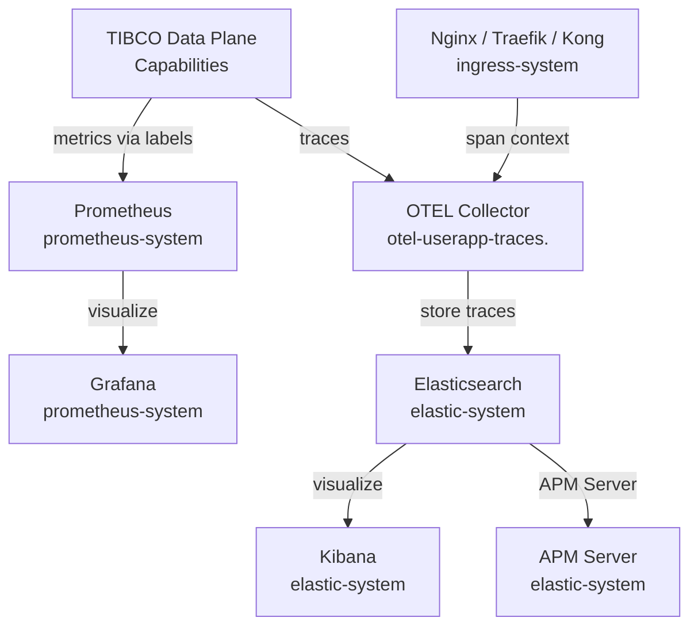

# TIBCO Platform Observability Setup on EKS

**Guide for setting up comprehensive monitoring and observability for TIBCO Platform Data Plane on Amazon Elastic Kubernetes Service**

**Last Updated**: May 2026

---

## Table of Contents

- [Overview](#overview)
- [Architecture](#architecture)
- [Prerequisites](#prerequisites)
- [Environment Variables](#environment-variables)
- [Part 1: Elastic Stack Installation](#part-1-elastic-stack-installation)
  - [Step 1.1: Install ECK Operator](#step-11-install-eck-operator)
  - [Step 1.2: Deploy Elasticsearch, Kibana, and APM](#step-12-deploy-elasticsearch-kibana-and-apm)
  - [Step 1.3: Verify Elastic Stack Installation](#step-13-verify-elastic-stack-installation)
  - [Step 1.4: Access Kibana Dashboard](#step-14-access-kibana-dashboard)
- [Part 2: Prometheus and Grafana Installation](#part-2-prometheus-and-grafana-installation)
  - [Step 2.1: Install Prometheus Stack](#step-21-install-prometheus-stack)
  - [Step 2.2: Verify Prometheus Installation](#step-22-verify-prometheus-installation)
  - [Step 2.3: Access Grafana Dashboard](#step-23-access-grafana-dashboard)
- [Part 3: Configure Ingress for Traces](#part-3-configure-ingress-for-traces)
  - [Step 3.1: Nginx with OpenTelemetry](#step-31-nginx-with-opentelemetry)
  - [Step 3.2: Traefik with OpenTelemetry](#step-32-traefik-with-opentelemetry)
  - [Step 3.3: Kong with OpenTelemetry](#step-33-kong-with-opentelemetry)
- [Part 4: Integration with TIBCO Platform](#part-4-integration-with-tibco-platform)
- [Part 5: Troubleshooting](#part-5-troubleshooting)
- [Summary](#summary)

---

## Overview

This guide provides instructions for setting up the observability stack for TIBCO Platform Data Plane on Amazon EKS. The stack includes:

- **Elastic Stack**:
  - Elasticsearch 8.17.3 (log and trace storage)
  - Kibana 8.17.3 (visualization and analytics)
  - APM Server 8.17.3 (application performance monitoring)

- **Prometheus Stack**:
  - Prometheus (metrics collection and storage)
  - Grafana (metrics visualization and dashboards)

- **OpenTelemetry** (via ingress controllers):
  - Trace collection via Nginx, Traefik, or Kong

TIBCO Platform uses two observability pipelines:
1. **Traces** → ingress controller (Nginx/Traefik/Kong) → OTEL Collector → Elasticsearch → Kibana
2. **Metrics** → OTEL infrastructure pods → Prometheus (scrape) → Grafana

---

## Architecture



---

## Prerequisites

- EKS cluster with Data Plane tools installed (see [Data Plane Setup Guide](how-to-dp-eks-setup-guide))
- Ingress controller installed (Nginx, Traefik, or Kong)
- Storage classes `ebs-gp3` and `efs-sc` available (from `dp-config-aws` chart)

### Resource Requirements

| Component | CPU Request | Memory Request | Storage |
|:----------|:------------|:---------------|:--------|
| Elasticsearch | 100m | 2Gi | 50Gi EBS gp3 |
| Kibana | 150m | 1Gi | — |
| APM Server | 50m | 128Mi | — |
| Prometheus | 200m | 512Mi | 50Gi EBS gp3 |
| Grafana | 100m | 128Mi | — |

---

## Environment Variables

All environment variables for this guide are defined in [`scripts/env.sh`](../scripts/env.sh). Source it before running any commands:

```bash
source scripts/env.sh
```

The following variables are used in this guide:

| Variable | Default in env.sh | Description |
|:---------|:------------------|:------------|
| `TP_TIBCO_HELM_CHART_REPO` | `https://tibcosoftware.github.io/tp-helm-charts` | TIBCO official Helm chart repository |
| `TP_DOMAIN` | `dp1.${TP_HOSTED_ZONE_DOMAIN}` | Primary Data Plane domain |
| `TP_INGRESS_CLASS` | `nginx` | Kubernetes ingress class for DP capabilities |
| `TP_STORAGE_CLASS` | `ebs-gp3` | EBS storage class for Elasticsearch and Prometheus |
| `TP_ES_RELEASE_NAME` | `dp-config-es` | Helm release name for Elastic stack |
| `DP_NAMESPACE` | `dp1-ns` | Data Plane namespace (set after CP registration) |

> **Note:** `DP_NAMESPACE` is only available after the Data Plane is registered in the Control Plane. It is needed for Part 3 (ingress OpenTelemetry configuration) — install Parts 1 and 2 first, then configure tracing after the Data Plane namespace is created.

---

## Part 1: Elastic Stack Installation

> **Source:** [`tp-helm-charts/docs/workshop/eks/data-plane/README.md`](https://github.com/TIBCOSoftware/tp-helm-charts/blob/main/docs/workshop/eks/data-plane/README.md)

**Why Elasticsearch:** TIBCO Platform uses Elasticsearch as its primary store for:
- **Distributed traces**: Jaeger-format trace spans from BWCE, Flogo, and other capabilities are stored in `jaeger-span-*` and `jaeger-service-*` indices
- **Application logs**: Log entries from capability pods are stored in `user-app-*` indices

Elasticsearch is chosen over other log stores because it provides both full-text search (for log analysis) and time-series queries (for trace correlation). The `dp-config-es` chart ships with pre-built TIBCO index templates, lifecycle policies, and APM Server configuration, so no manual Elasticsearch configuration is required.

### Step 1.1: Install ECK Operator

**Why:** The ECK (Elastic Cloud on Kubernetes) Operator manages Elasticsearch, Kibana, and APM Server as Kubernetes Custom Resources (`Elasticsearch`, `Kibana`, `ApmServer`). The operator handles:
- TLS certificate provisioning and rotation between Elasticsearch nodes
- Rolling upgrade coordination (ensuring cluster health throughout upgrades)
- Persistent volume management
- Password secret lifecycle

Without the ECK operator, you would need to manage Elasticsearch cluster formation, certificates, and upgrades manually. The operator must be installed before any ECK custom resources (`Elasticsearch`, `Kibana`) are created.

```bash
helm upgrade --install --wait --timeout 1h \
  --labels layer=1 \
  --create-namespace \
  -n elastic-system eck-operator eck-operator \
  --repo "https://helm.elastic.co" \
  --version "2.16.0"
```

Verify the ECK operator is running:

```bash
kubectl logs -n elastic-system sts/elastic-operator
```

Wait until you see: `"msg":"starting up","version":"2.16.0"` in the logs.

### Step 1.2: Deploy Elasticsearch, Kibana, and APM

**Why:** The `dp-config-es` chart from the TIBCO Helm repository deploys all three Elastic components and automatically creates the Kubernetes Custom Resources required by the ECK operator:
- `Elasticsearch` CR — creates a single-node Elasticsearch cluster on EBS gp3 storage
- `Kibana` CR — deploys Kibana connected to the Elasticsearch instance
- `ApmServer` CR — deploys an APM Server that TIBCO capabilities send performance data to

The chart also deploys:
- **IndexTemplates** (`dp-config-es-jaeger-span-index-template`, `dp-config-es-jaeger-service-index-template`, `dp-config-es-user-apps-index-template`) — These define the field mappings for trace and log data. Without them, Elasticsearch cannot correctly parse and index the data sent by TIBCO capabilities.
- **IndexLifecyclePolicies** — Automatically roll over and delete old indices after 30 days (Jaeger) or 60 days (user apps) to prevent unbounded storage growth.
- **Indices** — Pre-creates the initial `jaeger-span-000001` and `jaeger-service-000001` indices so the first traces are accepted immediately.

```bash
helm upgrade --install --wait --timeout 1h \
  --create-namespace \
  --reuse-values \
  -n elastic-system ${TP_ES_RELEASE_NAME} dp-config-es \
  --labels layer=2 \
  --repo "${TP_TIBCO_HELM_CHART_REPO}" \
  --version "^1.0.0" -f - <<EOF
domain: ${TP_DOMAIN}
es:
  version: "8.17.3"
  ingress:
    ingressClassName: ${TP_INGRESS_CLASS}
    service: ${TP_ES_RELEASE_NAME}-es-http
  storage:
    name: ${TP_STORAGE_CLASS}         # ebs-gp3: block storage, required for Elasticsearch WAL
  # Uncomment to customize resource limits
  # resources:
  #   requests:
  #     cpu: "100m"
  #     memory: "2Gi"
  #   limits:
  #     cpu: "1"
  #     memory: "2Gi"
kibana:
  version: "8.17.3"
  ingress:
    ingressClassName: ${TP_INGRESS_CLASS}
    service: ${TP_ES_RELEASE_NAME}-kb-http
apm:
  enabled: true
  version: "8.17.3"
  ingress:
    ingressClassName: ${TP_INGRESS_CLASS}
    service: ${TP_ES_RELEASE_NAME}-apm-http
EOF
```

### Step 1.3: Verify Elastic Stack Installation

```bash
# Check pods
kubectl get pods -n elastic-system
```

```bash
# Check index templates — all three must be present before registering DP
kubectl get -n elastic-system IndexTemplates
```

Expected index templates:
```
NAME                                         AGE
dp-config-es-jaeger-service-index-template   1d
dp-config-es-jaeger-span-index-template      1d
dp-config-es-user-apps-index-template        1d
```

```bash
# Check indices
kubectl get -n elastic-system Indices
```

Expected:
```
NAME                    AGE
jaeger-service-000001   1d
jaeger-span-000001      1d
```

```bash
# Check index lifecycle policies
kubectl get -n elastic-system IndexLifecyclePolicies
```

Expected:
```
NAME                                             AGE
dp-config-es-jaeger-index-30d-lifecycle-policy   1d
dp-config-es-user-index-60d-lifecycle-policy     1d
```

> **Important:** All IndexTemplates, Indices, and IndexLifecyclePolicies must exist before registering the Data Plane. Missing resources indicate an ECK operator or chart error — check ECK operator logs and re-install `dp-config-es` if needed.

### Step 1.4: Access Kibana Dashboard

```bash
# Get Kibana URL
kubectl get ingress -n elastic-system dp-config-es-kibana -oyaml | yq eval '.spec.rules[0].host'

# Get Elastic password (username: elastic)
kubectl get secret dp-config-es-es-elastic-user -n elastic-system \
  -o jsonpath="{.data.elastic}" | base64 --decode; echo
```

---

## Part 2: Prometheus and Grafana Installation

> **Source:** [`tp-helm-charts/docs/workshop/eks/data-plane/README.md`](https://github.com/TIBCOSoftware/tp-helm-charts/blob/main/docs/workshop/eks/data-plane/README.md)

**Why Prometheus + Grafana:** TIBCO Platform capabilities expose Prometheus-format metrics on `/metrics` endpoints. These metrics include:
- Capability health status (BWCE process states, EMS queue depths)
- JVM metrics (heap usage, GC activity) for Java-based capabilities
- Custom application metrics defined by BWCE applications

The `kube-prometheus-stack` chart deploys a complete monitoring stack: Prometheus (metrics storage and alerting), Grafana (dashboards), Alertmanager (alert routing), and supporting exporters (node-exporter, kube-state-metrics).

The `additionalScrapeConfigs` section configures Prometheus to discover TIBCO OTEL infrastructure pods using Kubernetes Service Discovery (`kubernetes_sd_configs`). The relabeling rules filter pods by labels:
- `prometheus.io/scrape: "true"` — opt-in label; only pods that explicitly declare this are scraped
- `platform.tibco.com/workload-type: "infra"` — limits scraping to TIBCO infrastructure pods, not user application pods
- `prometheus.io/port` — allows each pod to declare its own metrics port

`enableRemoteWriteReceiver: true` allows the TIBCO OTEL collector to push metrics to Prometheus via the remote write API, in addition to Prometheus pulling metrics from pods.

### Step 2.1: Install Prometheus Stack

```bash
helm upgrade --install --wait --timeout 1h \
  --create-namespace \
  --reuse-values \
  -n prometheus-system kube-prometheus-stack kube-prometheus-stack \
  --labels layer=2 \
  --repo "https://prometheus-community.github.io/helm-charts" \
  --version "48.3.4" \
  -f <(envsubst '${TP_DOMAIN}, ${TP_INGRESS_CLASS}' <<'EOF'
grafana:
  plugins:
    - grafana-piechart-panel           # Required for TIBCO Platform pie chart dashboards
  ingress:
    enabled: true
    ingressClassName: ${TP_INGRESS_CLASS}
    hosts:
    - grafana.${TP_DOMAIN}
  # Default credentials: admin / prom-operator
  # Uncomment to change:
  # adminUser: admin
  # adminPassword: prom-operator
prometheus:
  prometheusSpec:
    enableRemoteWriteReceiver: true    # Accept push from TIBCO OTEL collector
    remoteWriteDashboards: true
    additionalScrapeConfigs:
    - job_name: otel-collector
      kubernetes_sd_configs:
      - role: pod
      relabel_configs:
      - action: keep
        regex: "true"
        source_labels:
        - __meta_kubernetes_pod_label_prometheus_io_scrape
      - action: keep
        regex: "infra"
        source_labels:
        - __meta_kubernetes_pod_label_platform_tibco_com_workload_type
      - action: keepequal
        source_labels: [__meta_kubernetes_pod_container_port_number]
        target_label: __meta_kubernetes_pod_label_prometheus_io_port
      - action: replace
        regex: ([^:]+)(?::\d+)?;(\d+)
        replacement: $1:$2
        source_labels:
        - __address__
        - __meta_kubernetes_pod_label_prometheus_io_port
        target_label: __address__
      - source_labels: [__meta_kubernetes_pod_label_prometheus_io_path]
        action: replace
        target_label: __metrics_path__
        regex: (.+)
        replacement: /$1
  # Uncomment to expose Prometheus publicly (not recommended for production)
  # ingress:
  #   enabled: true
  #   ingressClassName: ${TP_INGRESS_CLASS}
  #   hosts:
  #   - prometheus-internal.${TP_DOMAIN}
EOF
)
```

### Step 2.2: Verify Prometheus Installation

```bash
kubectl get pods -n prometheus-system
kubectl get svc -n prometheus-system
```

### Step 2.3: Access Grafana Dashboard

```bash
kubectl get ingress -n prometheus-system kube-prometheus-stack-grafana \
  -oyaml | yq eval '.spec.rules[0].host'
```

Default credentials: **admin** / **prom-operator**

---

## Part 3: Configure Ingress for Traces

> **Source:** [`tp-helm-charts/docs/workshop/eks/data-plane/README.md`](https://github.com/TIBCOSoftware/tp-helm-charts/blob/main/docs/workshop/eks/data-plane/README.md)

**Why:** Ingress controllers sit at the entry point of all HTTP traffic entering the Data Plane. Configuring them to emit OpenTelemetry spans creates trace context that correlates the ingress request with the downstream service calls made by BWCE/Flogo applications. This end-to-end tracing shows the full request lifecycle:

```
Client → [Nginx/Traefik/Kong span] → BWCE pod → [capability span] → database
```

Without ingress-level tracing, you only see spans from inside capability pods, missing the network and routing phases.

The OTEL Collector service (`otel-userapp-traces.${DP_NAMESPACE}.svc`) is provisioned by the TIBCO Control Plane when the Data Plane namespace is created. This is why this step must happen **after** Data Plane registration.

### Step 3.1: Nginx with OpenTelemetry

**Why `otlp-collector-host`:** Nginx uses the OTLP gRPC protocol (port 4317) to send spans to the OTEL collector. The hostname pattern `otel-userapp-traces.${DP_NAMESPACE}.svc` is the Kubernetes internal DNS name of the collector service. `AlwaysOn` sampler with ratio `1.0` means 100% of requests are traced — reduce the ratio in production if trace volume is too high.

Re-run the Nginx ingress installation with the OpenTelemetry section enabled:

```bash
helm upgrade --install --wait --timeout 1h --create-namespace \
  -n ingress-system dp-config-aws-nginx dp-config-aws \
  --repo "${TP_TIBCO_HELM_CHART_REPO}" \
  --labels layer=1 \
  --version "^1.0.0" -f - <<EOF
dns:
  domain: "${TP_DOMAIN}"
httpIngress:
  enabled: true
  name: nginx
  backend:
    serviceName: dp-config-aws-nginx-ingress-nginx-controller
  annotations:
    alb.ingress.kubernetes.io/group.name: "${TP_DOMAIN}"
    external-dns.alpha.kubernetes.io/hostname: "*.${TP_DOMAIN}"
    kubernetes.io/ingress.class: alb
ingress-nginx:
  enabled: true
  controller:
    config:
      use-forwarded-headers: "true"
      proxy-body-size: "150m"
      proxy-buffer-size: 16k
      enable-opentelemetry: "true"
      log-level: warn
      opentelemetry-config: /etc/nginx/opentelemetry.toml
      opentelemetry-operation-name: HTTP $request_method $service_name $uri
      opentelemetry-trust-incoming-span: "true"   # Accept W3C trace context from upstream
      otel-max-export-batch-size: "512"
      otel-max-queuesize: "2048"
      otel-sampler: AlwaysOn
      otel-sampler-parent-based: "false"
      otel-sampler-ratio: "1.0"                   # 100% sampling; reduce for high-traffic prod
      otel-schedule-delay-millis: "5000"
      otel-service-name: nginx-proxy
      otlp-collector-host: otel-userapp-traces.${DP_NAMESPACE}.svc   # OTEL collector in DP namespace
      otlp-collector-port: "4317"                                      # gRPC OTLP port
    opentelemetry:
      enabled: true
EOF
```

### Step 3.2: Traefik with OpenTelemetry

**Why OTLP HTTP vs gRPC:** Traefik uses OTLP over HTTP (port 4318) rather than gRPC. The `/v1/traces` path is the standard OTLP HTTP endpoint for trace data. The OTEL collector service accepts both gRPC (4317) and HTTP (4318) — choose based on your ingress controller's supported protocol.

Re-run the Traefik installation with the tracing section enabled:

```bash
helm upgrade --install --wait --timeout 1h --create-namespace \
  -n ingress-system dp-config-aws-traefik dp-config-aws \
  --repo "${TP_TIBCO_HELM_CHART_REPO}" \
  --labels layer=1 \
  --version "^1.0.0" -f - <<EOF
dns:
  domain: "${TP_DOMAIN}"
httpIngress:
  enabled: true
  name: traefik
  backend:
    serviceName: dp-config-aws-traefik
  annotations:
    alb.ingress.kubernetes.io/group.name: "${TP_DOMAIN}"
    external-dns.alpha.kubernetes.io/hostname: "*.${TP_DOMAIN}"
    kubernetes.io/ingress.class: alb
traefik:
  enabled: true
  additionalArguments:
    - '--entryPoints.web.forwardedHeaders.insecure'
    - '--serversTransport.insecureSkipVerify=true'
  tracing:
    otlp:
      http:
        endpoint: http://otel-userapp-traces.${DP_NAMESPACE}.svc.cluster.local:4318/v1/traces
    serviceName: traefik
EOF
```

### Step 3.3: Kong with OpenTelemetry

**Why `KongClusterPlugin`:** The `global: "true"` label applies this plugin to all Kong routes cluster-wide, without requiring per-route annotation. This is the recommended approach for distributed tracing — you want every request going through Kong to generate a trace span, not just specific routes. The `w3c` header type uses the W3C Trace Context standard, which is compatible with TIBCO Platform's OTEL implementation.

Apply the Kong OpenTelemetry plugin after the Data Plane namespace is available:

```bash
kubectl apply -f - <<EOF
apiVersion: configuration.konghq.com/v1
kind: KongClusterPlugin
metadata:
  name: opentelemetry-example
  annotations:
    kubernetes.io/ingress.class: kong
  labels:
    global: "true"            # Apply to all Kong routes, not just specific ones
plugin: opentelemetry
config:
  endpoint: "http://otel-userapp-traces.${DP_NAMESPACE}.svc.cluster.local:4318/v1/traces"
  resource_attributes:
    service.name: "kong-dev"
  headers:
    X-Auth-Token: secret-token
  header_type: w3c            # W3C Trace Context propagation (compatible with TIBCO OTEL)
EOF
```

To enable BWCE app traces, set the `BW_OTEL_TRACES_ENABLED` environment variable to `true` in your BWCE application.

---

## Part 4: Integration with TIBCO Platform

**Why:** These endpoints are entered during Data Plane registration in the TIBCO Control Plane UI. The Control Plane uses them to:
- Display distributed traces from capability pods in the CP observability UI
- Forward log data from the Data Plane to the log server for unified log viewing
- Show Grafana dashboards embedded in the CP UI

Configure the following settings in the TIBCO Control Plane when registering your Data Plane:

| Setting | Value | Notes |
|:--------|:------|:------|
| Elastic internal endpoint | `https://dp-config-es-es-http.elastic-system.svc.cluster.local:9200` | Internal DNS — use for CP → ES communication within cluster |
| Elastic public endpoint | `https://elastic.${TP_DOMAIN}` | External URL visible from CP UI browser |
| Elastic username | `elastic` | Default ECK-generated user |
| Elastic password | See [Step 1.4](#step-14-access-kibana-dashboard) | From `dp-config-es-es-elastic-user` secret |
| User app logs index | `user-app-1` | Defined by `dp-config-es-user-apps-index-template` |
| Search logs index | `service-1` | Defined by `dp-config-es-jaeger-service-index-template` |
| Tracing server host | `https://dp-config-es-es-http.elastic-system.svc.cluster.local:9200` | Same as Elastic internal — traces stored in Elasticsearch |
| Prometheus internal endpoint | `http://kube-prometheus-stack-prometheus.prometheus-system.svc.cluster.local:9090` | Internal Prometheus API |
| Grafana endpoint | `https://grafana.${TP_DOMAIN}` | Public Grafana URL |

---

## Part 5: Troubleshooting

### Elasticsearch Pods Not Starting

```bash
kubectl describe pod -n elastic-system -l elasticsearch.k8s.elastic.co/cluster-name=dp-config-es
kubectl logs -n elastic-system -l elasticsearch.k8s.elastic.co/cluster-name=dp-config-es
```

Common cause: Insufficient memory. Elasticsearch requires at least 2Gi per pod. Check node capacity:

```bash
kubectl describe nodes | grep -A 5 "Allocatable"
```

### Kibana Cannot Connect to Elasticsearch

```bash
kubectl logs -n elastic-system -l kibana.k8s.elastic.co/name=dp-config-es
```

Verify the Elasticsearch service is reachable from within the cluster:

```bash
kubectl run -it --rm debug --image=curlimages/curl --restart=Never -- \
  curl -k https://dp-config-es-es-http.elastic-system.svc.cluster.local:9200
```

### No Traces Appearing in Kibana

1. Verify the OTEL collector service exists in the DP namespace:
   ```bash
   kubectl get svc -n ${DP_NAMESPACE} otel-userapp-traces
   ```

2. Check Nginx OTEL configuration was applied:
   ```bash
   kubectl exec -n ingress-system -it \
     deploy/dp-config-aws-nginx-ingress-nginx-controller -- \
     cat /etc/nginx/opentelemetry.toml
   ```

3. Verify Jaeger indices exist and are accepting writes:
   ```bash
   kubectl get -n elastic-system Indices
   ```

4. Check Jaeger index template is applied:
   ```bash
   kubectl describe -n elastic-system IndexTemplate dp-config-es-jaeger-span-index-template
   ```

### Prometheus Not Scraping Targets

```bash
# Port-forward Prometheus UI to check scrape targets
kubectl port-forward -n prometheus-system svc/kube-prometheus-stack-prometheus 9090:9090
# Then open: http://localhost:9090/targets
```

Check that TIBCO OTEL pods have the correct opt-in labels:

```bash
kubectl get pods -n ${DP_NAMESPACE} --show-labels | grep prometheus.io/scrape
```

Expected labels on OTEL pods:
- `prometheus.io/scrape: "true"`
- `platform.tibco.com/workload-type: "infra"`

### Grafana Dashboard Shows No Data

1. Verify Prometheus datasource in Grafana (Admin → Data Sources → Prometheus)
2. Ensure the Prometheus URL is: `http://kube-prometheus-stack-prometheus.prometheus-system.svc.cluster.local:9090`
3. Retrieve current Grafana credentials if the default password was changed:
   ```bash
   kubectl get secret -n prometheus-system kube-prometheus-stack-grafana \
     -o jsonpath="{.data.admin-password}" | base64 --decode; echo
   ```

### High Storage Usage

Monitor Elasticsearch index sizes:

```bash
ES_POD=$(kubectl get pods -n elastic-system \
  -l elasticsearch.k8s.elastic.co/cluster-name=dp-config-es \
  -o jsonpath='{.items[0].metadata.name}')
ES_PASS=$(kubectl get secret dp-config-es-es-elastic-user -n elastic-system \
  -o jsonpath="{.data.elastic}" | base64 --decode)

kubectl exec -n elastic-system ${ES_POD} -- \
  curl -sk -u elastic:${ES_PASS} \
  https://localhost:9200/_cat/indices?v
```

Index lifecycle policies automatically delete indices after:
- Jaeger indices: 30 days (`dp-config-es-jaeger-index-30d-lifecycle-policy`)
- User app indices: 60 days (`dp-config-es-user-index-60d-lifecycle-policy`)

---

## Summary

### What You Deployed

| Component | Namespace | Version |
|:----------|:----------|:--------|
| ECK Operator | elastic-system | 2.16.0 |
| Elasticsearch | elastic-system | 8.17.3 |
| Kibana | elastic-system | 8.17.3 |
| APM Server | elastic-system | 8.17.3 |
| Prometheus | prometheus-system | 48.3.4 (chart) |
| Grafana | prometheus-system | bundled with prometheus stack |

### Access Information

```bash
# Kibana URL
kubectl get ingress -n elastic-system dp-config-es-kibana -oyaml | yq eval '.spec.rules[0].host'

# Elastic password (username: elastic)
kubectl get secret dp-config-es-es-elastic-user -n elastic-system \
  -o jsonpath="{.data.elastic}" | base64 --decode; echo

# Grafana URL (username: admin / password: prom-operator)
kubectl get ingress -n prometheus-system kube-prometheus-stack-grafana \
  -oyaml | yq eval '.spec.rules[0].host'
```

### Next Steps

1. Configure the observability settings in TIBCO Control Plane using the endpoints from [Part 4](#part-4-integration-with-tibco-platform)
2. Enable OpenTelemetry in your ingress controller (see [Part 3](#part-3-configure-ingress-for-traces)) after the Data Plane namespace is created
3. Set `BW_OTEL_TRACES_ENABLED=true` in BWCE applications to enable distributed tracing

---

## Additional Resources

- [Elastic Cloud on Kubernetes (ECK)](https://www.elastic.co/guide/en/cloud-on-k8s/current/index.html)
- [kube-prometheus-stack](https://github.com/prometheus-community/helm-charts/tree/main/charts/kube-prometheus-stack)
- [dp-config-es chart](https://github.com/TIBCOSoftware/tp-helm-charts)
- [TIBCO Platform Observability Documentation](https://docs.tibco.com/pub/platform-cp/1.18.0/doc/html/Default.htm#UserGuide/observability.htm)
- [OpenTelemetry Protocol (OTLP)](https://opentelemetry.io/docs/specs/otel/protocol/)
- [Kong OpenTelemetry Plugin](https://docs.konghq.com/hub/kong-inc/opentelemetry/)
- [Data Plane Setup Guide](how-to-dp-eks-setup-guide)
- [CP and DP Setup Guide](how-to-cp-and-dp-eks-setup-guide)
