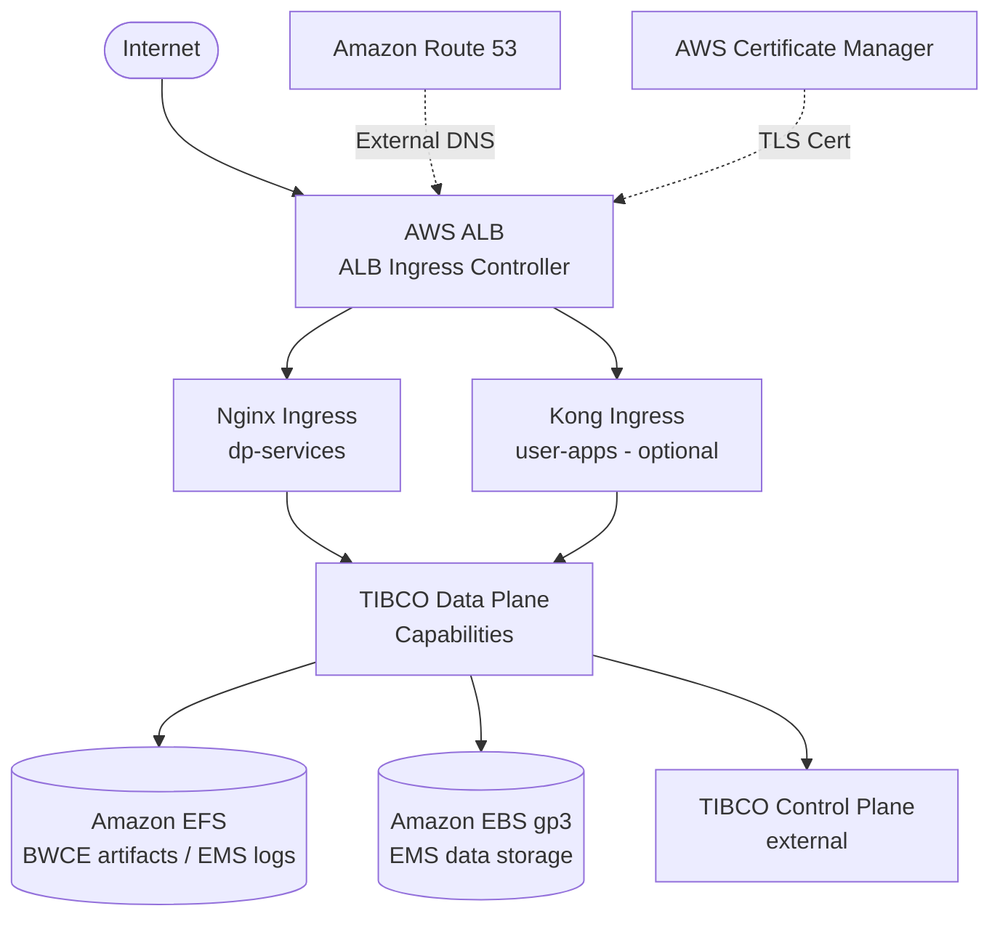

# TIBCO Platform Data Plane Only Setup on EKS

**Document Purpose**: Step-by-step guide for deploying a TIBCO Platform Data Plane on a dedicated Amazon EKS cluster, connected to an existing TIBCO Control Plane.

**Target Audience**: DevOps engineers, Platform administrators

**Prerequisites**: Review [prerequisites-checklist-for-customer](prerequisites-checklist-for-customer) before starting

**Estimated Time**: 2-4 hours (first-time installation)

**Last Updated**: May 2026

> **Note:** This workshop is NOT meant for production deployment.
>
> This guide assumes you already have a running TIBCO Control Plane. For deploying both CP and DP together, see the [CP and DP Setup Guide](how-to-cp-and-dp-eks-setup-guide).

---

## Table of Contents

- [Overview](#overview)
- [Architecture](#architecture)
- [Environment Variables](#environment-variables)
- [Part 1: EKS Cluster Creation](#part-1-eks-cluster-creation)
- [Part 2: Install Third-Party Tools](#part-2-install-third-party-tools)
- [Part 3: Install External DNS](#part-3-install-external-dns)
- [Part 4: Create Amazon EFS](#part-4-create-amazon-efs)
- [Part 5: Storage Class Configuration](#part-5-storage-class-configuration)
- [Part 6: Install Ingress Controller](#part-6-install-ingress-controller)
- [Part 7: Install Kong Ingress (Optional)](#part-7-install-kong-ingress-optional)
- [Part 8: Observability Stack](#part-8-observability-stack)
- [Part 9: Register Data Plane in Control Plane](#part-9-register-data-plane-in-control-plane)
- [Part 10: Clean-up](#part-10-clean-up)

---

## Overview

This guide sets up a dedicated EKS cluster as a TIBCO Platform Data Plane. A Data Plane hosts the capability workloads (BWCE, Flogo, EMS, etc.) and reports to a TIBCO Control Plane.

Key AWS components:
- **Amazon EFS**: Shared file storage for BWCE artifact manager and EMS log storage (`efs-sc`)
- **Amazon EBS gp3**: Block storage for EMS capability data (`ebs-gp3`)
- **AWS ALB**: Main load balancer (created by `aws-load-balancer-controller`)
- **Nginx or Traefik**: Kubernetes ingress class for Data Plane services
- **Kong** (optional): Separate ingress for user app endpoints
- **Amazon Route 53**: DNS automation via External DNS

> **Control Plane email note:** This DP-only guide does not install `tibco-cp-base`. For a connected TIBCO Platform Control Plane 1.18.0 or later, configure SES, SMTP, SendGrid, or Microsoft Graph from Platform Console. Do not add the deprecated `global.external.emailServer*` values to the Control Plane Helm values file; `global.tibco.networkPolicy.emailServer` is only optional egress NetworkPolicy configuration.

---

## Architecture



---

## Environment Variables

All environment variables for this guide are defined in [`scripts/env.sh`](../scripts/env.sh). Source it before running any commands in this guide, then override individual values as needed for your environment.

```bash
source scripts/env.sh
```

> **Note for DP-only deployments:** If you are deploying a Data Plane into a separate cluster from the Control Plane, use a different `TP_CLUSTER_NAME` and `TP_VPC_CIDR` to avoid conflicts. The DP cluster typically uses `TP_CLUSTER_NAME="eks-dp-cluster-${TP_CLUSTER_REGION}"` and a distinct VPC CIDR such as `10.200.0.0/16`.

The following variables are used in this guide. All are defined in `env.sh`:

| Variable | Default in env.sh | Description |
|:---------|:------------------|:------------|
| `AWS_REGION` | `us-west-2` | AWS region for all resources |
| `TP_CLUSTER_REGION` | `${AWS_REGION}` | Alias for AWS region used in scripts |
| `TP_CLUSTER_NAME` | `eks-cluster-${TP_CLUSTER_REGION}` | EKS cluster name (override for DP-only) |
| `TP_KUBERNETES_VERSION` | `1.33` | Kubernetes version for the EKS cluster |
| `TP_NODEGROUP_INSTANCE_TYPE` | `m5a.xlarge` | EC2 instance type (4 vCPU / 16 GB) |
| `TP_NODEGROUP_INITIAL_COUNT` | `3` | Number of nodes across availability zones |
| `TP_VPC_CIDR` | `10.180.0.0/16` | VPC CIDR block (override for DP-only cluster) |
| `TP_SERVICE_CIDR` | `172.20.0.0/16` | Kubernetes service IP range |
| `KUBECONFIG` | `$(pwd)/${TP_CLUSTER_NAME}.yaml` | Path to kubeconfig file |
| `TP_TIBCO_HELM_CHART_REPO` | `https://tibcosoftware.github.io/tp-helm-charts` | TIBCO official Helm chart repository |
| `TP_ENABLE_NETWORK_POLICY` | `true` | Enable VPC CNI network policy enforcement |
| `TP_HOSTED_ZONE_DOMAIN` | `aws.example.com` | Route 53 hosted zone domain |
| `TP_DOMAIN` | `dp1.${TP_HOSTED_ZONE_DOMAIN}` | Primary Data Plane domain |
| `TP_APPS_DOMAIN` | `apps.dp1.${TP_HOSTED_ZONE_DOMAIN}` | Optional separate domain for user app endpoints |
| `TP_MAIN_INGRESS_CONTROLLER` | `alb` | Ingress class used by External DNS annotation filter |
| `TP_INGRESS_CLASS` | `nginx` | Kubernetes ingress class for DP capabilities |
| `TP_EBS_ENABLED` | `true` | Enable EBS gp3 storage class creation |
| `TP_STORAGE_CLASS` | `ebs-gp3` | EBS storage class name |
| `TP_EFS_ENABLED` | `true` | Enable EFS storage class creation |
| `TP_STORAGE_CLASS_EFS` | `efs-sc` | EFS storage class name |
| `TP_ES_RELEASE_NAME` | `dp-config-es` | Helm release name for Elastic stack |
| `DP_NAMESPACE` | `dp1-ns` | Kubernetes namespace for the Data Plane (set after registration) |
| `TP_DELETE_CLUSTER` | `true` | Whether clean-up deletes the EKS cluster |

---

## Part 1: EKS Cluster Creation

> **Source:** [`tp-helm-charts/docs/workshop/eks/cluster-setup/README.md`](https://github.com/TIBCOSoftware/tp-helm-charts/blob/main/docs/workshop/eks/cluster-setup/README.md)

If you already have an EKS cluster with the required addons (EFS CSI, EBS CSI, VPC CNI, OIDC), skip to [Part 2](#part-2-install-third-party-tools).

### IAM Requirements

- [Minimum IAM Policies for eksctl](https://eksctl.io/usage/minimum-iam-policies/)
- [AmazonElasticFileSystemFullAccess](https://docs.aws.amazon.com/aws-managed-policy/latest/reference/AmazonElasticFileSystemFullAccess.html)

### Create Cluster

**Why:** `eksctl` creates the EKS cluster, VPC, node groups, IAM roles, and OIDC provider in a single declarative YAML. The OIDC provider is critical — it enables IAM Roles for Service Accounts (IRSA), which allows Kubernetes pods to assume AWS IAM roles without static credentials. IRSA is required by the EFS CSI driver, EBS CSI driver, ALB controller, and External DNS.

Download [eksctl-recipe.yaml](https://github.com/TIBCOSoftware/tp-helm-charts/blob/main/docs/workshop/eks/cluster-setup/eksctl-recipe.yaml) from the tp-helm-charts repository and use `envsubst` to substitute your environment variables:

```bash
cat eksctl-recipe.yaml | envsubst | eksctl create cluster -f -
```

Cluster creation takes approximately 30 minutes. The recipe creates:
- A VPC with public and private subnets across 3 availability zones
- A managed node group with nodes in **private** subnets (no direct internet exposure)
- An OIDC identity provider for IRSA
- EKS addons: `vpc-cni` (with `enableNetworkPolicy`), `kube-proxy`, `coredns`, `aws-efs-csi-driver`, `aws-ebs-csi-driver`

### Generate kubeconfig

**Why:** `aws eks update-kubeconfig` writes the cluster authentication credentials to the local kubeconfig file. The `--kubeconfig` flag writes to the cluster-specific file defined by `KUBECONFIG`, isolating this cluster from other configurations. This prevents accidental `kubectl` commands running against the wrong cluster.

```bash
aws eks update-kubeconfig \
  --region ${TP_CLUSTER_REGION} \
  --name ${TP_CLUSTER_NAME} \
  --kubeconfig "${KUBECONFIG}"
kubectl get nodes
```

---

## Part 2: Install Third-Party Tools

> **Source:** [`tp-helm-charts/docs/workshop/eks/cluster-setup/README.md`](https://github.com/TIBCOSoftware/tp-helm-charts/blob/main/docs/workshop/eks/cluster-setup/README.md)

### Install cert-manager

**Why:** cert-manager is the standard Kubernetes certificate management controller. TIBCO Platform uses it to issue and renew TLS certificates for internal service-to-service communication (mTLS) and for Ingress resources. The `installCRDs: true` value installs the cert-manager Custom Resource Definitions (CRDs) as part of the Helm release so that certificate resources (`Certificate`, `Issuer`, `ClusterIssuer`) are available immediately. The service account is pre-created by the `eksctl` recipe with the necessary IRSA annotation.

```bash
helm upgrade --install --wait --timeout 1h --create-namespace --reuse-values \
  -n cert-manager cert-manager cert-manager \
  --labels layer=0 \
  --repo "https://charts.jetstack.io" --version "v1.17.1" -f - <<EOF
installCRDs: true
serviceAccount:
  create: false       # Pre-created by eksctl recipe with IRSA annotation
  name: cert-manager
EOF
```

### Install AWS Load Balancer Controller

**Why:** The AWS Load Balancer Controller watches for Kubernetes `Ingress` objects with `ingressClassName: alb` and automatically provisions AWS Application Load Balancers (ALBs). Without this controller, Kubernetes has no native ability to create AWS load balancers. The ALB is the single external entry point for all TIBCO Platform traffic and handles TLS termination via ACM certificate ARN annotations. The service account is pre-created by the `eksctl` recipe with IRSA permissions for `elasticloadbalancing`, `ec2`, `iam`, and `cognito-idp` APIs.

```bash
helm upgrade --install --wait --timeout 1h --create-namespace --reuse-values \
  -n kube-system aws-load-balancer-controller aws-load-balancer-controller \
  --labels layer=0 \
  --repo "https://aws.github.io/eks-charts" --version "1.6.0" -f - <<EOF
clusterName: ${TP_CLUSTER_NAME}
serviceAccount:
  create: false       # Pre-created by eksctl recipe with IRSA annotation
  name: aws-load-balancer-controller
EOF
```

### Install Metrics Server

**Why:** The Kubernetes Metrics Server collects CPU and memory usage data from kubelets and exposes it through the Kubernetes Metrics API. This is required for Horizontal Pod Autoscaler (HPA) to scale TIBCO Platform capability pods based on resource usage. Without Metrics Server, `kubectl top nodes/pods` also fails and HPA configurations in TIBCO Platform will not function.

```bash
helm upgrade --install --wait --timeout 1h --create-namespace --reuse-values \
  -n kube-system metrics-server metrics-server \
  --labels layer=0 \
  --repo "https://kubernetes-sigs.github.io/metrics-server" --version "3.11.0" -f - <<EOF
clusterName: ${TP_CLUSTER_NAME}
serviceAccount:
  create: true
  name: metrics-server
EOF
```

---

## Part 3: Install External DNS

> **Source:** [`tp-helm-charts/docs/workshop/eks/data-plane/README.md`](https://github.com/TIBCOSoftware/tp-helm-charts/blob/main/docs/workshop/eks/data-plane/README.md)

**Why:** External DNS watches Kubernetes `Ingress` and `Service` resources and automatically creates or updates Route 53 DNS records to match. Without External DNS, you would need to manually update Route 53 every time the ALB's DNS name changes (e.g., after cluster recreation). The `annotation-filter` restricts External DNS to only manage records for Ingress objects using the `alb` ingress class — this prevents it from managing records for Nginx or Traefik ingresses that are not directly exposed. The service account is pre-created by the `eksctl` recipe with IRSA permissions for `route53:ChangeResourceRecordSets` and related Route 53 APIs.

```bash
helm upgrade --install --wait --timeout 1h --create-namespace --reuse-values \
  -n external-dns-system external-dns external-dns \
  --labels layer=0 \
  --repo "https://kubernetes-sigs.github.io/external-dns" --version "1.15.2" -f - <<EOF
serviceAccount:
  create: false       # Pre-created by eksctl recipe with IRSA annotation
  name: external-dns
extraArgs:
  - "--annotation-filter=kubernetes.io/ingress.class=${TP_MAIN_INGRESS_CONTROLLER}"
EOF
```

---

## Part 4: Create Amazon EFS

> **Source:** [`tp-helm-charts/docs/workshop/eks/data-plane/README.md`](https://github.com/TIBCOSoftware/tp-helm-charts/blob/main/docs/workshop/eks/data-plane/README.md)

**Why:** Amazon EFS provides `ReadWriteMany` (RWX) persistent storage, which means multiple pods on different nodes can read and write to the same volume simultaneously. This is required for:
- **BWCE artifact manager**: Multiple BWCE pods need concurrent access to the shared artifact repository
- **EMS log storage**: EMS capability requires shared log access across its pods
- **TIBCO Control Plane shared storage** (if CP is co-located)

EBS (`ReadWriteOnce`) cannot satisfy this requirement because it can only be attached to one node at a time.

```bash
cd scripts/
curl -fsSLO https://raw.githubusercontent.com/TIBCOSoftware/tp-helm-charts/main/docs/workshop/eks/scripts/create-efs-data-plane.sh
chmod +x create-efs-data-plane.sh
./create-efs-data-plane.sh
```

Note the EFS file system ID from the output (e.g., `fs-0ec1c745c10d523f6`) — you will need it in the next step.

```bash
export TP_EFS_ID="fs-0ec1c745c10d523f6"   # replace with your actual EFS ID
```

> This variable is not in `env.sh` because it is only available after EFS is created. Set it in your shell session after running the creation script.

**References:**
- [EKS Workshop EFS guide](https://archive.eksworkshop.com/beginner/190_efs/launching-efs/)
- [AWS EFS CSI Driver EFS creation guide](https://github.com/kubernetes-sigs/aws-efs-csi-driver/blob/master/docs/efs-create-filesystem.md)

---

## Part 5: Storage Class Configuration

> **Source:** [`tp-helm-charts/docs/workshop/eks/data-plane/README.md`](https://github.com/TIBCOSoftware/tp-helm-charts/blob/main/docs/workshop/eks/data-plane/README.md)

**Why:** Kubernetes StorageClasses define how persistent volumes are provisioned. TIBCO Platform capabilities require two specific storage classes by name:
- **`efs-sc`**: Used by BWCE artifact manager and EMS log storage. The `efs-ap` (Access Point) provisioner mode creates a separate EFS access point per PVC, providing path isolation between tenants. `Immediate` binding mode is required because EFS supports multi-AZ access and doesn't need to wait for pod scheduling.
- **`ebs-gp3`**: Used by EMS capability for its data storage. The `Retain` reclaim policy preserves EBS volumes when PVCs are deleted, preventing accidental data loss. `WaitForFirstConsumer` binding ensures the volume is created in the same AZ as the pod that needs it.

The `dp-config-aws` Helm chart creates both storage classes in a single install:

```bash
helm upgrade --install --wait --timeout 1h --create-namespace \
  -n storage-system dp-config-aws-storage dp-config-aws \
  --repo "${TP_TIBCO_HELM_CHART_REPO}" \
  --labels layer=1 \
  --version "^1.0.0" -f - <<EOF
dns:
  domain: "${TP_DOMAIN}"
httpIngress:
  enabled: false          # No ingress needed — storage-only install
storageClass:
  ebs:
    enabled: ${TP_EBS_ENABLED}
  efs:
    enabled: ${TP_EFS_ENABLED}
    parameters:
      fileSystemId: "${TP_EFS_ID}"
tigera-operator:
  enabled: false          # Network policy is managed by VPC CNI, not Calico
ingress-nginx:
  enabled: false          # Installed separately in Part 6
EOF
```

### Verify Storage Classes

```bash
kubectl get storageclass
```

Expected output:

```
NAME            PROVISIONER             RECLAIMPOLICY   VOLUMEBINDINGMODE      ALLOWVOLUMEEXPANSION   AGE
ebs-gp3         ebs.csi.aws.com         Retain          WaitForFirstConsumer   true                   7h17m
efs-sc          efs.csi.aws.com         Delete          Immediate              false                  7h17m
gp2 (default)   kubernetes.io/aws-ebs   Delete          WaitForFirstConsumer   false                  7h41m
```

| Storage Class | Provisioner | Access Mode | Use Case |
|:-------------|:------------|:------------|:---------|
| `ebs-gp3` | `ebs.csi.aws.com` | ReadWriteOnce | EMS capability data storage |
| `efs-sc` | `efs.csi.aws.com` | ReadWriteMany | BWCE artifact manager, EMS log storage |
| `gp2` | `kubernetes.io/aws-ebs` | ReadWriteOnce | Default EKS class — not recommended for TIBCO |

> **Important:** Provide these storage class names to TIBCO Control Plane when deploying capabilities.

---

## Part 6: Install Ingress Controller

> **Source:** [`tp-helm-charts/docs/workshop/eks/data-plane/README.md`](https://github.com/TIBCOSoftware/tp-helm-charts/blob/main/docs/workshop/eks/data-plane/README.md)

**Why:** TIBCO Platform uses a two-tier ingress pattern on EKS:
1. **AWS ALB (Tier 1)**: The external load balancer created by `aws-load-balancer-controller`. Handles TLS termination using ACM certificate, provides WAF integration, and routes traffic to the cluster.
2. **Nginx or Traefik (Tier 2)**: A Kubernetes ingress controller running inside the cluster. TIBCO Platform capabilities create `Ingress` resources targeting this controller, which routes traffic to individual capability services.

This separation is necessary because AWS ALB does not support Kubernetes `Ingress` path-based routing in the same way that Nginx/Traefik does — ALB works best as a Layer 7 load balancer, while Nginx/Traefik handles the fine-grained routing rules that TIBCO Platform requires.

The `httpIngress` section in `dp-config-aws` creates an ALB-backed `Ingress` object that points to the Nginx service, acting as the bridge between the two tiers.

### DNS and Certificate Setup

Register your Data Plane domain in Amazon Route 53 and create a wildcard certificate in ACM:

- **Same domain for services and apps**: Use `*.dp1.aws.example.com` (single cert)
- **Separate domain for apps** (optional): Use `*.dp1.aws.example.com` for services and `*.apps.dp1.aws.example.com` for user apps (two certs)

```bash
# Register domain: https://docs.aws.amazon.com/Route53/latest/DeveloperGuide/domain-register.html
# Create wildcard certificate: https://docs.aws.amazon.com/acm/latest/userguide/gs-acm-request-public.html
```

Set the ACM certificate ARN once it is issued (DNS validation must complete first):

```bash
export TP_DOMAIN_CERT_ARN="arn:aws:acm:us-west-2:123456789012:certificate/xxxxxxxx"
```

### Option A: Nginx Ingress Controller (Recommended)

**Why Nginx:** Nginx is the most commonly used Kubernetes ingress controller and has the widest compatibility with TIBCO Platform capabilities. The `use-forwarded-headers: "true"` configuration ensures that the original client IP and protocol (HTTPS) are preserved after passing through the ALB. `proxy-body-size: "150m"` is required for BWCE artifact uploads which can exceed the default 1MB limit.

```bash
helm upgrade --install --wait --timeout 1h --create-namespace \
  -n ingress-system dp-config-aws-nginx dp-config-aws \
  --repo "${TP_TIBCO_HELM_CHART_REPO}" \
  --labels layer=1 \
  --version "^1.0.0" -f - <<EOF
dns:
  domain: "${TP_DOMAIN}"
httpIngress:
  enabled: true
  name: nginx
  backend:
    serviceName: dp-config-aws-nginx-ingress-nginx-controller
  annotations:
    alb.ingress.kubernetes.io/group.name: "${TP_DOMAIN}"         # Groups multiple Ingresses onto one ALB
    alb.ingress.kubernetes.io/certificate-arn: "${TP_DOMAIN_CERT_ARN}"  # ACM cert for TLS termination
    alb.ingress.kubernetes.io/listen-ports: '[{"HTTP": 80}, {"HTTPS": 443}]'
    alb.ingress.kubernetes.io/ssl-redirect: "443"                # Redirect HTTP to HTTPS
    external-dns.alpha.kubernetes.io/hostname: "*.${TP_DOMAIN}"  # Wildcard DNS record for this domain
    kubernetes.io/ingress.class: alb
ingress-nginx:
  enabled: true
  controller:
    config:
      use-forwarded-headers: "true"    # Preserve original client IP from ALB
      proxy-body-size: "150m"          # Allow large BWCE artifact uploads
      proxy-buffer-size: 16k           # Larger buffer for TIBCO Platform headers
## Uncomment to enable OpenTelemetry tracing via Nginx
## (requires DP_NAMESPACE to be set after DP is registered)
#       enable-opentelemetry: "true"
#       opentelemetry-config: /etc/nginx/opentelemetry.toml
#       opentelemetry-operation-name: HTTP $request_method $service_name $uri
#       otel-sampler: AlwaysOn
#       otel-sampler-ratio: "1.0"
#       otel-service-name: nginx-proxy
#       otlp-collector-host: otel-userapp-traces.${DP_NAMESPACE}.svc
#       otlp-collector-port: "4317"
#     opentelemetry:
#       enabled: true
EOF
```

### Option B: Traefik Ingress Controller

**Why Traefik:** Traefik is an alternative ingress controller with a dynamic configuration model and built-in dashboard. It is supported by TIBCO Platform as an alternative to Nginx. `forwardedHeaders.insecure` tells Traefik to trust `X-Forwarded-*` headers from the ALB. `insecureSkipVerify` is needed when Traefik forwards requests to backend services using self-signed certificates.

```bash
helm upgrade --install --wait --timeout 1h --create-namespace \
  -n ingress-system dp-config-aws-traefik dp-config-aws \
  --repo "${TP_TIBCO_HELM_CHART_REPO}" \
  --labels layer=1 \
  --version "^1.0.0" -f - <<EOF
dns:
  domain: "${TP_DOMAIN}"
httpIngress:
  enabled: true
  name: traefik
  backend:
    serviceName: dp-config-aws-traefik
  annotations:
    alb.ingress.kubernetes.io/group.name: "${TP_DOMAIN}"
    alb.ingress.kubernetes.io/certificate-arn: "${TP_DOMAIN_CERT_ARN}"
    alb.ingress.kubernetes.io/listen-ports: '[{"HTTP": 80}, {"HTTPS": 443}]'
    alb.ingress.kubernetes.io/ssl-redirect: "443"
    external-dns.alpha.kubernetes.io/hostname: "*.${TP_DOMAIN}"
    kubernetes.io/ingress.class: alb
traefik:
  enabled: true
  additionalArguments:
    - '--entryPoints.web.forwardedHeaders.insecure'  # Trust X-Forwarded-* from ALB
    - '--serversTransport.insecureSkipVerify=true'   # Allow self-signed backend certs
## Uncomment to enable OpenTelemetry tracing via Traefik
#  tracing:
#    otlp:
#      http:
#        endpoint: http://otel-userapp-traces.${DP_NAMESPACE}.svc.cluster.local:4318/v1/traces
#    serviceName: traefik
EOF
```

### Verify Ingress Classes

```bash
kubectl get ingressclass
```

Expected:
```
NAME      CONTROLLER                      PARAMETERS   AGE
alb       ingress.k8s.aws/alb             <none>       7h12m
nginx     k8s.io/ingress-nginx            <none>       7h11m
```

> **Important:** Provide the ingress class name (`nginx` or `traefik`) to TIBCO Control Plane when registering capabilities. The DP uses this class to route service traffic.

---

## Part 7: Install Kong Ingress (Optional)

> **Source:** [`tp-helm-charts/docs/workshop/eks/data-plane/README.md`](https://github.com/TIBCOSoftware/tp-helm-charts/blob/main/docs/workshop/eks/data-plane/README.md)

**Why:** Kong is an API Gateway that provides advanced traffic management features (rate limiting, authentication plugins, request transformation) that are specifically useful for **user application endpoints** — i.e., the HTTP APIs exposed by your BWCE or Flogo applications. By routing user app traffic through Kong (`TP_APPS_DOMAIN`) while routing Data Plane service traffic through Nginx (`TP_DOMAIN`), you can:
- Apply API Gateway policies to user apps without affecting platform services
- Give developers API management capabilities for their deployed applications
- Separate operational concerns: platform team manages Nginx, app team manages Kong

This is optional — if you only need basic HTTP routing for user apps, Nginx with a separate ingress class is sufficient.

```bash
helm upgrade --install --wait --timeout 1h --create-namespace \
  -n ingress-kong dp-config-aws-kong dp-config-aws \
  --repo "${TP_TIBCO_HELM_CHART_REPO}" \
  --labels layer=1 \
  --version "^1.0.0" -f - <<EOF
dns:
  domain: "${TP_APPS_DOMAIN}"
httpIngress:
  enabled: true
  name: kong
  backend:
    serviceName: dp-config-aws-kong-kong-proxy
  annotations:
    alb.ingress.kubernetes.io/group.name: "${TP_DOMAIN}"          # Share the same ALB as Nginx
    alb.ingress.kubernetes.io/certificate-arn: "${TP_DOMAIN_CERT_ARN}"
    external-dns.alpha.kubernetes.io/hostname: "*.${TP_APPS_DOMAIN}"
    kubernetes.io/ingress.class: alb
ingress-nginx:
  enabled: false
kong:
  enabled: true
## Uncomment to enable distributed tracing for user apps
#  env:
#    tracing_instrumentations: request,all
#    tracing_sampling_rate: 1
EOF
```

### Configure Kong OpenTelemetry Plugin

**Why:** The `KongClusterPlugin` applies an OpenTelemetry plugin cluster-wide (to all Kong routes). This sends distributed trace spans from Kong to the OTEL collector running in the Data Plane namespace (`DP_NAMESPACE`). This is configured after the Data Plane is registered because the OTEL collector service name is derived from `DP_NAMESPACE`.

After the Data Plane namespace (`DP_NAMESPACE`) is available following registration in Part 9:

```bash
kubectl apply -f - <<EOF
apiVersion: configuration.konghq.com/v1
kind: KongClusterPlugin
metadata:
  name: opentelemetry-example
  annotations:
    kubernetes.io/ingress.class: kong
  labels:
    global: "true"           # Apply to all Kong routes
plugin: opentelemetry
config:
  endpoint: "http://otel-userapp-traces.${DP_NAMESPACE}.svc.cluster.local:4318/v1/traces"
  resource_attributes:
    service.name: "kong-dev"
  headers:
    X-Auth-Token: secret-token
  header_type: w3c           # W3C trace context propagation format
EOF
```

> See [Kong OpenTelemetry documentation](https://docs.konghq.com/hub/kong-inc/opentelemetry/how-to/basic-example/) for more examples.

---

## Part 8: Observability Stack

> **Source:** [`tp-helm-charts/docs/workshop/eks/data-plane/README.md`](https://github.com/TIBCOSoftware/tp-helm-charts/blob/main/docs/workshop/eks/data-plane/README.md)

For a detailed guide covering each component, see [Data Plane Observability on EKS](how-to-dp-eks-observability).

### Install ECK Operator

**Why:** The ECK (Elastic Cloud on Kubernetes) Operator manages Elasticsearch, Kibana, and APM Server deployments as Kubernetes Custom Resources. Instead of manually managing Elasticsearch configuration, the operator handles rolling upgrades, certificate rotation, and health monitoring. It is installed first as a cluster-level controller before deploying any Elastic resources.

```bash
helm upgrade --install --wait --timeout 1h --labels layer=1 --create-namespace \
  -n elastic-system eck-operator eck-operator \
  --repo "https://helm.elastic.co" --version "2.16.0"

# Verify ECK operator is running
kubectl logs -n elastic-system sts/elastic-operator
```

### Install Elastic Stack (dp-config-es)

**Why:** The `dp-config-es` chart deploys a pre-configured Elasticsearch + Kibana + APM Server stack with TIBCO-specific index templates. The index templates define the schema for:
- `jaeger-span-*`: Distributed trace spans from BWCE, Flogo, and other capabilities
- `jaeger-service-*`: Service metadata for trace search
- `user-app-*`: Application logs from TIBCO capabilities

These pre-defined index templates ensure that TIBCO Platform can write traces and logs to Elasticsearch immediately after registration, without manual index configuration. The APM Server acts as the intermediary that receives trace data from OTEL collectors.

```bash
helm upgrade --install --wait --timeout 1h --create-namespace --reuse-values \
  -n elastic-system ${TP_ES_RELEASE_NAME} dp-config-es \
  --labels layer=2 \
  --repo "${TP_TIBCO_HELM_CHART_REPO}" --version "^1.0.0" -f - <<EOF
domain: ${TP_DOMAIN}
es:
  version: "8.17.3"
  ingress:
    ingressClassName: ${TP_INGRESS_CLASS}
    service: ${TP_ES_RELEASE_NAME}-es-http
  storage:
    name: ${TP_STORAGE_CLASS}       # ebs-gp3: block storage for Elasticsearch data
kibana:
  version: "8.17.3"
  ingress:
    ingressClassName: ${TP_INGRESS_CLASS}
    service: ${TP_ES_RELEASE_NAME}-kb-http
apm:
  enabled: true
  version: "8.17.3"
  ingress:
    ingressClassName: ${TP_INGRESS_CLASS}
    service: ${TP_ES_RELEASE_NAME}-apm-http
EOF
```

### Verify Elastic Resources

```bash
# Check index templates — these must exist before registering DP
kubectl get -n elastic-system IndexTemplates

# Check index lifecycle policies
kubectl get -n elastic-system IndexLifecyclePolicies
```

Expected index templates:
```
NAME                                         AGE
dp-config-es-jaeger-service-index-template   110d
dp-config-es-jaeger-span-index-template      110d
dp-config-es-user-apps-index-template        110d
```

```bash
# Get Kibana URL
kubectl get ingress -n elastic-system dp-config-es-kibana -oyaml | yq eval '.spec.rules[0].host'

# Get Elastic password (username: elastic)
kubectl get secret dp-config-es-es-elastic-user -n elastic-system \
  -o jsonpath="{.data.elastic}" | base64 --decode; echo
```

### Install Prometheus + Grafana

**Why:** `kube-prometheus-stack` deploys Prometheus (metrics collection and alerting), Grafana (dashboards), and supporting components (Alertmanager, node-exporter, kube-state-metrics). TIBCO Platform's OpenTelemetry (OTEL) infrastructure pods export metrics on a `/metrics` endpoint. The `additionalScrapeConfigs` section configures Prometheus to discover and scrape these OTEL pods using Kubernetes pod label selectors:
- `prometheus.io/scrape: "true"`: Only scrape pods that opt in
- `platform.tibco.com/workload-type: "infra"`: Only scrape TIBCO infrastructure pods (not user apps)
- `prometheus.io/port`: Each pod can declare its own metrics port

This selective scraping ensures Prometheus collects TIBCO Platform infrastructure metrics without scraping every pod in the cluster.

```bash
helm upgrade --install --wait --timeout 1h --create-namespace --reuse-values \
  -n prometheus-system kube-prometheus-stack kube-prometheus-stack \
  --labels layer=2 \
  --repo "https://prometheus-community.github.io/helm-charts" --version "48.3.4" \
  -f <(envsubst '${TP_DOMAIN}, ${TP_INGRESS_CLASS}' <<'EOF'
grafana:
  plugins:
    - grafana-piechart-panel
  ingress:
    enabled: true
    ingressClassName: ${TP_INGRESS_CLASS}
    hosts:
    - grafana.${TP_DOMAIN}
prometheus:
  prometheusSpec:
    enableRemoteWriteReceiver: true    # Allow OTEL collector to push metrics via remote write
    remoteWriteDashboards: true
    additionalScrapeConfigs:
    - job_name: otel-collector
      kubernetes_sd_configs:
      - role: pod
      relabel_configs:
      - action: keep
        regex: "true"
        source_labels:
        - __meta_kubernetes_pod_label_prometheus_io_scrape
      - action: keep
        regex: "infra"
        source_labels:
        - __meta_kubernetes_pod_label_platform_tibco_com_workload_type
      - action: keepequal
        source_labels: [__meta_kubernetes_pod_container_port_number]
        target_label: __meta_kubernetes_pod_label_prometheus_io_port
      - action: replace
        regex: ([^:]+)(?::\d+)?;(\d+)
        replacement: $1:$2
        source_labels:
        - __address__
        - __meta_kubernetes_pod_label_prometheus_io_port
        target_label: __address__
      - source_labels: [__meta_kubernetes_pod_label_prometheus_io_path]
        action: replace
        target_label: __metrics_path__
        regex: (.+)
        replacement: /$1
EOF
)
```

```bash
# Get Grafana URL (default credentials: admin / prom-operator)
kubectl get ingress -n prometheus-system kube-prometheus-stack-grafana \
  -oyaml | yq eval '.spec.rules[0].host'
```

---

## Part 9: Register Data Plane in Control Plane

**Why:** Data Plane registration is the step that connects this EKS cluster to the TIBCO Control Plane. During registration, the Control Plane provisions a namespace (`DP_NAMESPACE`) in the Data Plane cluster, deploys the Data Plane agent, and establishes the secure tunnel connection. All subsequent capability deployments (BWCE, Flogo, EMS) are managed through this registered connection.

### Get Base FQDN

Before registering, retrieve the ALB hostname that Nginx is using. This becomes the base for all capability FQDNs.

```bash
kubectl get ingress -n ingress-system nginx | awk 'NR==2 { print $3 }'
```

### Information Needed for Data Plane Registration

Collect the following values from the resources you have created. You will enter these in the TIBCO Control Plane UI during the Data Plane registration wizard:

| Name | Sample Value | Where to Find |
|:-----|:-------------|:--------------|
| VPC CIDR | `10.200.0.0/16` | `TP_VPC_CIDR` environment variable |
| Ingress class name | `nginx` | `TP_INGRESS_CLASS` environment variable |
| Ingress class name (Kong, optional) | `kong` | If Kong was installed in Part 7 |
| EFS storage class | `efs-sc` | `TP_STORAGE_CLASS_EFS` environment variable |
| EBS storage class | `ebs-gp3` | `TP_STORAGE_CLASS` environment variable |
| BW FQDN | `bwce.<BASE_FQDN>` | Capability FQDN (composed during registration) |
| Elastic user app logs index | `user-app-1` | dp-config-es index template |
| Elastic search logs index | `service-1` | dp-config-es index template |
| Elastic internal endpoint | `https://dp-config-es-es-http.elastic-system.svc.cluster.local:9200` | Internal cluster DNS |
| Elastic public endpoint | `https://elastic.<BASE_FQDN>` | From `kubectl get ingress -n elastic-system` |
| Elastic password | — | `kubectl get secret dp-config-es-es-elastic-user -n elastic-system -o jsonpath="{.data.elastic}" \| base64 --decode` |
| Tracing server host | `https://dp-config-es-es-http.elastic-system.svc.cluster.local:9200` | Same as Elastic internal endpoint |
| Prometheus internal endpoint | `http://kube-prometheus-stack-prometheus.prometheus-system.svc.cluster.local:9090` | Internal cluster DNS |
| Grafana endpoint | `https://grafana.<BASE_FQDN>` | From `kubectl get ingress -n prometheus-system` |

### After Registration

Once the Data Plane is registered, note the `DP_NAMESPACE` that the Control Plane creates (e.g., `dp1-ns`). Update your environment:

```bash
export DP_NAMESPACE="dp1-ns"   # replace with the namespace shown in CP UI
```

This value is needed to configure the OpenTelemetry endpoint in Nginx (Part 6) and Kong (Part 7).

---

## Part 10: Clean-up

**Why:** The clean-up removes all deployed resources in the correct dependency order to avoid orphaned AWS resources (e.g., EFS mount targets blocking VPC deletion, ALBs preventing subnet deletion). Deleting resources in the wrong order can leave you with unreachable AWS resources that must be cleaned up manually through the AWS Console.

Delete the Data Plane from the TIBCO Control Plane UI first to allow the CP to clean up its agent resources:

[Steps to delete Data Plane](https://docs.tibco.com/pub/platform-cp/1.18.0/doc/html/Default.htm#UserGuide/deleting-data-planes.htm)

Then run the clean-up script:

```bash
cd scripts/

# Set to false to keep the EKS cluster, delete only Helm charts and AWS resources
export TP_DELETE_CLUSTER=false

./clean-up-data-plane.sh
```

> **Important:** Ensure RDS DB clusters and EKS nodegroups are in started/scaled-up state before running clean-up. Stopped instances may prevent clean-up scripts from running correctly.

---

## Additional Resources

- [TIBCO Platform Documentation](https://docs.tibco.com/pub/platform-cp/1.18.0/doc/html/Default.htm)
- [tp-helm-charts EKS Workshop](https://github.com/TIBCOSoftware/tp-helm-charts/tree/main/docs/workshop/eks)
- [CP + DP Combined Setup Guide](how-to-cp-and-dp-eks-setup-guide)
- [Observability Guide](how-to-dp-eks-observability)
- [Route 53 DNS Guide](how-to-add-dns-records-eks-aws)
- [Prerequisites Checklist](prerequisites-checklist-for-customer)
- [AWS Load Balancer Controller](https://kubernetes-sigs.github.io/aws-load-balancer-controller/)
- [External DNS on AWS](https://github.com/kubernetes-sigs/external-dns/blob/master/docs/tutorials/aws.md)
- [Kong OpenTelemetry Plugin](https://docs.konghq.com/hub/kong-inc/opentelemetry/)
