# TIBCO Platform Topology Options

TIBCO Platform separates the management plane (Control Plane) from the runtime plane (Data Plane). This separation enables multiple deployment topologies — from fully SaaS-managed setups to entirely self-hosted configurations, and from greenfield cloud-native deployments to hybrid bridges over existing on-premises TIBCO middleware.

---

## Core Components

| Component | Role |
|-----------|------|
| **Control Plane (CP)** | Centralized management: user catalog, subscription management, capability lifecycle, and aggregated monitoring |
| **Data Plane (DP)** | Runtime environment: hosts and executes BW, Flogo, and EMS capabilities; one per environment (staging/prod) |
| **Control Tower** | Specialized Data Plane that bridges the Control Plane to on-premises classic TIBCO middleware (BW5/BW6/EMS domain) |
| **Hybrid Proxy** | Outbound-only HTTPS channel from the Data Plane to the Control Plane — no inbound firewall rules required on the Data Plane side |
| **Observability** | Per-Data Plane stack: Elasticsearch (logs) and Prometheus + Grafana (metrics and dashboards) |

---

## Topology 1: SaaS Control Plane + Customer-Managed Data Planes

**TIBCO hosts and operates the Control Plane. The customer deploys and manages Data Planes in their own clusters.**

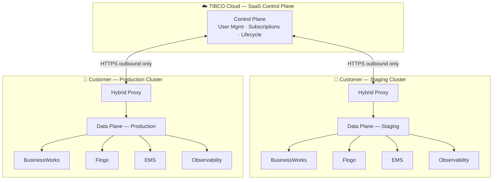

### Characteristics

- Control Plane is immediately available — no infrastructure provisioning required by the customer
- All workload data stays in the customer cluster; only management metadata flows to TIBCO Cloud
- Staging and production run on separate, independently managed customer clusters
- Each Data Plane hosts BW, Flogo, and EMS capabilities alongside its own Observability stack
- Hybrid Proxy establishes an outbound-only HTTPS connection — no inbound rules needed on the cluster

### When to Use

- Teams that want TIBCO to manage Control Plane infrastructure and upgrades
- Strict data residency requirements — workload data never leaves the customer environment
- Fastest time to value — the Control Plane is production-ready immediately
- Mixed cloud, multi-cloud, or on-premises Data Plane footprint managed from one SaaS dashboard

---

## Topology 2: Self-Hosted Control Plane + Co-Located Data Plane

**The customer hosts both Control Plane and Data Plane on the same cluster.**

This topology minimizes infrastructure footprint while preserving the CP/DP separation model. CP and DP share a cluster but remain logically separated — suitable for any environment including production. Staging and production each run on their own independent cluster.

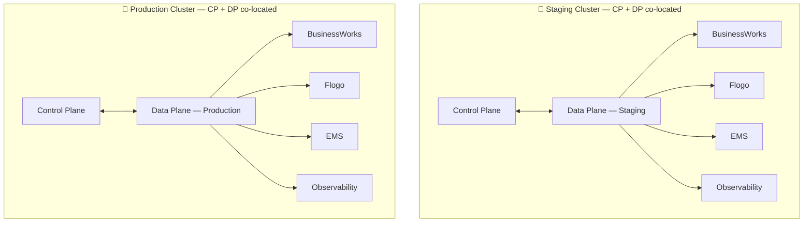

> Staging and production each have their own independent Control Plane + Data Plane on separate clusters. They do not share a Control Plane. This provides blast-radius isolation while keeping each cluster's footprint small.

### Characteristics

- Fewest clusters — one cluster per environment (staging, production)
- CP and DP communicate in-cluster without a Hybrid Proxy tunnel
- Valid for any environment — development, staging, and production
- Upgrading the CP and DP together reduces inter-cluster coordination

### When to Use

- Any environment where cluster consolidation is preferred — development, staging, or production
- Cost-efficient production setups where a dedicated CP cluster is not required
- Air-gapped or restricted-network environments where cross-cluster HTTPS is not available
- Organizations that prefer operational simplicity over strict infrastructure plane separation

---

## Topology 3: Self-Hosted Control Plane + Separate Data Plane Clusters

**A dedicated Control Plane cluster manages separate staging and production Data Plane clusters via Hybrid Proxy.**

This is the recommended enterprise production topology. The CP cluster carries no customer workloads. Each DP cluster scales and fails independently.

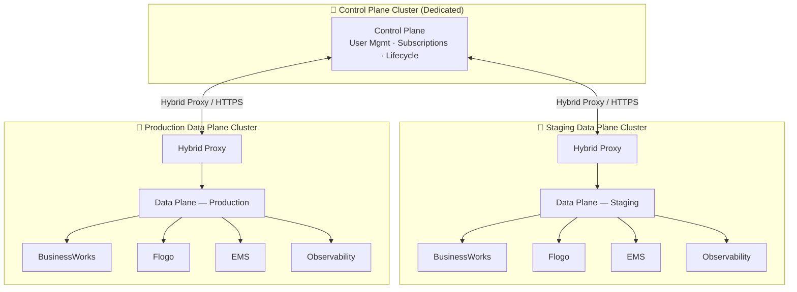

### Characteristics

- Complete isolation between CP, staging DP, and production DP
- CP cluster sized independently of workload clusters
- A single CP manages both staging and production Data Planes from one console
- Each DP cluster scales independently without affecting the Control Plane
- Production incidents are fully isolated from the CP and from staging
- Additional Data Planes (dev, QA, regional) connect to the same CP without adding CP clusters

### When to Use

- Enterprise production deployments requiring strict environment isolation
- Organizations where CP availability must be decoupled from workload cluster incidents
- Multiple teams sharing one Control Plane with per-team Data Plane namespaces
- Regulated industries requiring separate management and runtime planes
- Large-scale deployments with many concurrent BW, Flogo, and EMS applications

---

## Topology 4: Control Tower — On-Premises TIBCO Integration

**Control Tower is a specialized Data Plane that connects the TIBCO Platform Control Plane to existing on-premises classic TIBCO middleware (BW5/BW6/EMS domain).**

### What is Control Tower?

Control Tower is registered in the Control Plane like any other Data Plane. Instead of hosting cloud-native workload containers, it connects to and provides unified management visibility over:

- **BusinessWorks 5** — BW5 Administration Server and domains
- **BusinessWorks 6** — BW6 Administration Server and domains
- **TIBCO EMS** — EMS server installations running on-premises or on VMs

This allows a single TIBCO Platform Control Plane to provide one unified dashboard, lifecycle management, and monitoring view across both cloud-native Data Planes and legacy on-premises middleware.

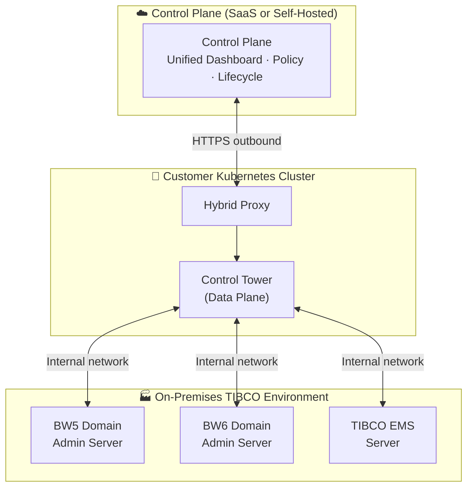

### Hybrid: Control Tower + Cloud Data Plane

During cloud migration, Control Tower and a cloud-native Data Plane coexist under the same Control Plane, giving a single management view across legacy and modern workloads.

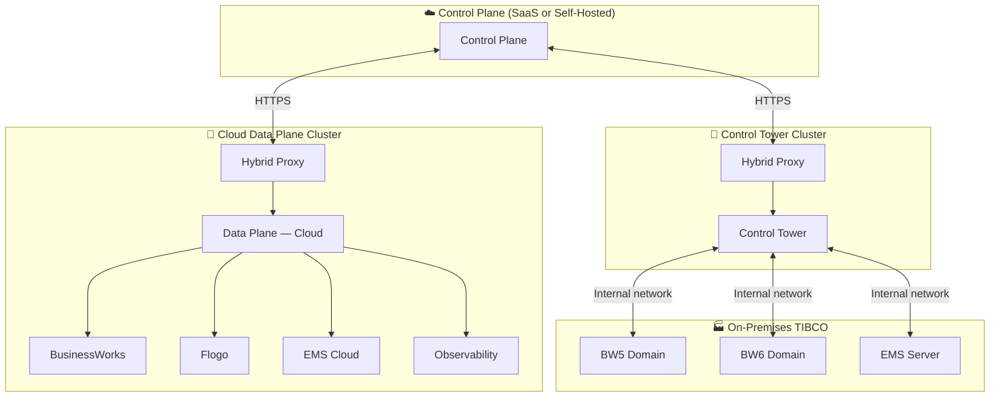

### When to Use Control Tower

- Existing on-premises BW5/BW6/EMS investments that need centralized visibility without migration
- Gradual cloud migration — manage legacy and cloud-native workloads from one Control Plane
- Audit and compliance use cases requiring a single management interface across environments
- Organizations not ready to lift-and-shift existing TIBCO middleware to containers

---

## Subscription Strategies

A **subscription** in TIBCO Platform is an isolated context within the Control Plane — each subscription has its own user access, application catalog, and deployed services. A Control Plane can host one or many subscriptions.

### Single Subscription

All users and capabilities share one subscription. Appropriate for small teams or single-project platforms.

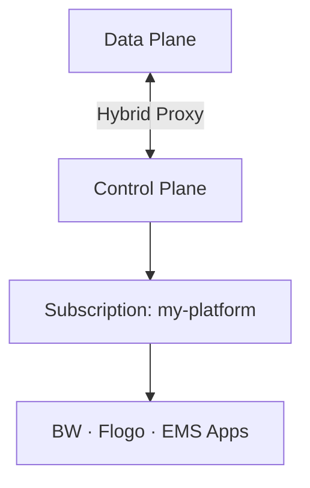

### Multiple Subscriptions — One Control Plane

Multiple isolated subscriptions coexist under a single Control Plane. Each subscription has independent user access, capability catalog, and application lifecycle — teams work in isolation without separate CP infrastructure.

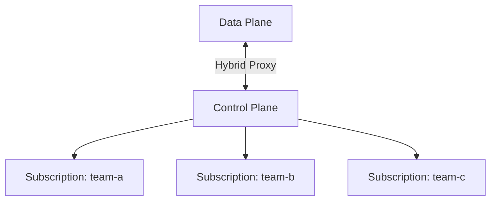

Use this when different teams or projects need isolation without the overhead of managing separate Control Planes.

### Multiple Control Planes

Fully independent Control Plane instances for complete isolation between business units, regions, or organizations. Each CP manages its own subscriptions, users, and Data Planes with no shared state.

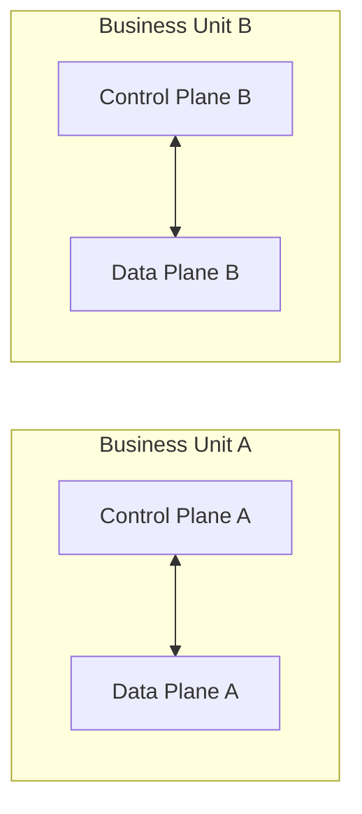

| Strategy | Isolation level | Management overhead | Best for |
|----------|----------------|---------------------|----------|
| **Single subscription** | Shared namespace | Lowest | Small teams, single project |
| **Multiple subscriptions** | Subscription boundary | Low | Multiple teams, one platform |
| **Multiple Control Planes** | Full CP isolation | Highest | BU separation, regulatory isolation, M&A |

---

## Data Plane Organization — DTAP

Data Plane application namespaces map to DTAP (Development, Test, Acceptance, Production) stages. Three isolation options trade off cost against blast-radius containment.

### Option A: DTAP Namespaces on a Single Data Plane

All four DTAP stages run as namespaces within one Data Plane cluster. Lowest infrastructure cost; well-suited for pilots, sandboxes, and workshop environments.

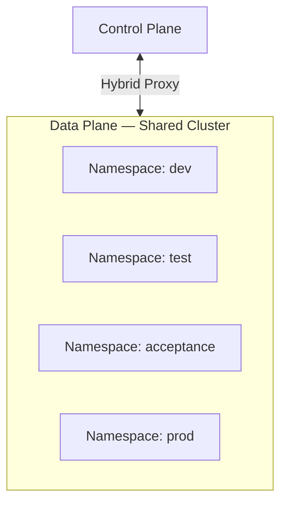

> A cluster-level incident affects all DTAP stages simultaneously. Not recommended for production workloads with availability SLAs.

### Option B: Non-Production + Production Data Planes (Recommended)

Dev, Test, and Acceptance share a Non-Production Data Plane cluster. Production runs on a dedicated Production Data Plane cluster. One Control Plane manages both.

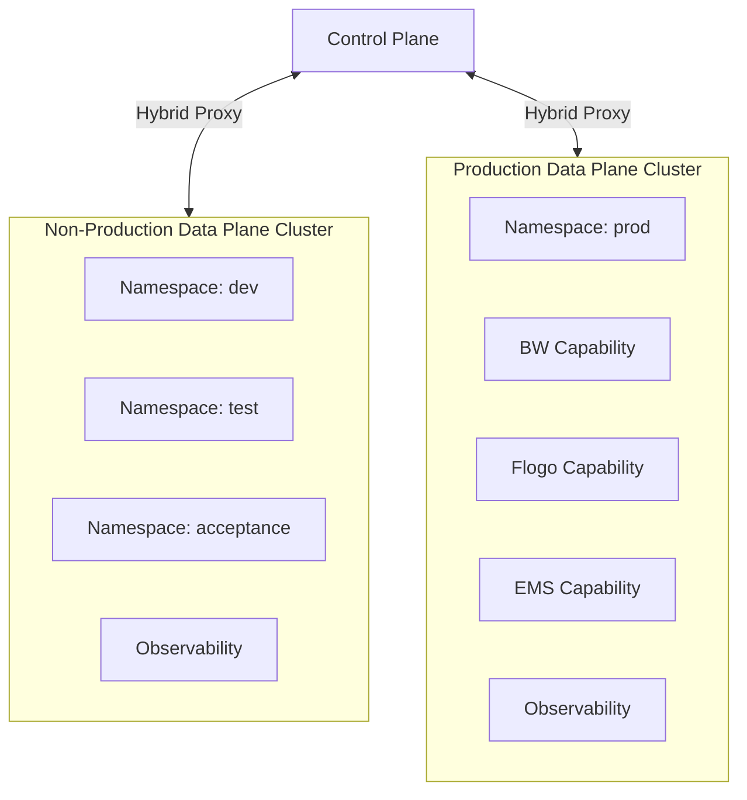

This is the recommended baseline for most enterprise deployments — it balances cost reduction with production isolation.

### Option C: Fully Isolated Data Planes per DTAP Stage

Each DTAP stage has its own independent Data Plane cluster. Maximum isolation and independent scaling, upgrade, and incident containment per stage.

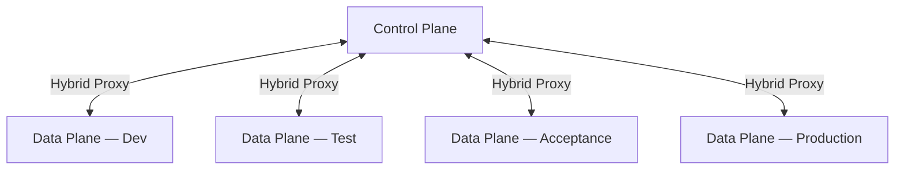

| Option | Clusters | Cost | Blast-radius isolation | Best for |
|--------|----------|------|------------------------|----------|
| **A — DTAP namespaces** | 1 | Lowest | Namespace only | Pilot, sandbox, workshop |
| **B — Non-Prod + Prod** | 2 | Moderate | Cluster (prod separated) | Most enterprise production |
| **C — Fully isolated** | 4+ | Highest | Full per-stage | Regulated, high-SLA production |

---

## API Gateway Integration

Application endpoints deployed on a Data Plane are exposed through the cluster ingress controller. An API Gateway can sit in front of the ingress for API lifecycle management, rate limiting, authentication, and analytics.

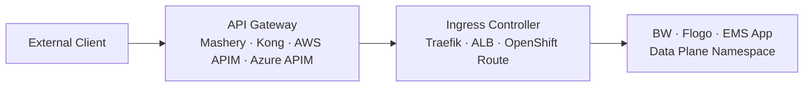

- **TIBCO Mashery** — built-in API management capability deployable as a Data Plane service
- **Third-party gateways** — Kong, AWS API Gateway, Azure API Management, and Apigee route external traffic to the Data Plane ingress
- **TLS termination** — at the ingress controller layer; backends communicate over internal cluster networking
- **Network policy** — egress rules for API Gateway traffic can be configured via `global.tibco.networkPolicy` in `tibco-cp-base` values

---

## Deployment Flavors

TIBCO Platform runs on any CNCF-conformant Kubernetes distribution. Common tested flavors from major cloud providers to local developer setups:

| Flavor | K8s Infrastructure | Ingress | DNS | Storage | Typical use |
|--------|--------------------|---------|-----|---------|-------------|
| **Amazon EKS** | AWS managed K8s | ALB (AWS LBC) | Route 53 | EBS gp3 / EFS | AWS cloud production |
| **Azure AKS** | Azure managed K8s | Traefik / Nginx | Azure DNS | Azure Disk / Files | Azure cloud production |
| **Azure ARO** | OpenShift on Azure | OpenShift Routes | Azure DNS | Azure Disk / Files | Enterprise OpenShift on Azure |
| **Google GKE** | Google managed K8s | GCE Ingress / Nginx | Cloud DNS | Persistent Disk / Filestore | GCP cloud production |
| **OpenShift (on-prem)** | Self-managed OCP | OpenShift Routes | Internal DNS | OCP storage classes | On-premises enterprise |
| **Shared cluster** | Any K8s (multi-tenant) | Shared ingress | Shared DNS zone | Shared storage | Pilot, PoC, sandbox |
| **Local cluster** | kind / k3s / minikube | Local ingress | nip.io or `/etc/hosts` | hostPath / local | Developer laptop, CI |

### Pilot and Sandbox Environments

For proof-of-concept and workshop setups, a **shared cluster** (multiple teams, namespace separation) or **local cluster** (kind/k3s) minimizes cost:

- Use **Topology 2** (co-located CP + DP) on a single shared or local cluster
- Use **DTAP Option A** — all stages as namespaces on one Data Plane
- DNS via `nip.io` or manual `/etc/hosts` — no cloud DNS zone required
- Observability is optional — skip Elasticsearch and Prometheus for minimal resource use
- Email server: use MailDev (a lightweight in-cluster SMTP receiver) configured from the Platform Console

---

## Topology Comparison

| | **SaaS CP** | **Self-Hosted Co-Located** | **Self-Hosted Separate** | **Control Tower** |
|--|:-----------:|:--------------------------:|:------------------------:|:-----------------:|
| **CP managed by** | TIBCO | Customer | Customer | TIBCO or Customer |
| **Clusters needed** | DP cluster(s) only | 1 per environment | 1 CP + 1 per env | 1 CT cluster |
| **CP/DP separation** | Full (across network) | Same cluster | Full (across network) | Full (across network) |
| **Staging/Prod isolation** | Separate DP clusters | Separate clusters | Separate DP clusters | N/A |
| **Hybrid Proxy required** | Yes | No (in-cluster) | Yes | Yes |
| **Connects to** | Cloud workloads | Cloud workloads | Cloud workloads | On-premises TIBCO |
| **Infrastructure cost** | Lowest (no CP cluster) | Low (one cluster/env) | Higher (CP + DP clusters) | Additional K8s cluster |
| **Best for** | Managed simplicity | Any env, cost-efficient | Enterprise, multi-DP | On-premises bridge |

---

## Platform-Specific Notes — Amazon Elastic Kubernetes Service (EKS)

All four topologies are supported on EKS.

### Ingress

EKS uses the AWS Load Balancer Controller for ingress:

- **Application Load Balancer (ALB)** via `IngressClass: alb` for HTTP/HTTPS routing
- **Route 53** hosted zone with wildcard A/CNAME records pointing to the ALB DNS name
- **ACM certificate ARN** referenced in ingress annotations for TLS termination
- For Topology 3 (dedicated CP cluster + separate DP clusters), each EKS cluster has its own ALB and Route 53 wildcard record

### IAM and Access

- **IRSA** (IAM Roles for Service Accounts) is used for AWS service access (S3, SES, ECR, etc.)
- An OIDC provider must be associated with the EKS cluster before deploying TIBCO Platform
- Service accounts in the CP and DP namespaces are annotated with the IAM role ARN

### Container Registry

Use Amazon ECR for private images:

```bash
# Authenticate Docker to ECR (tokens expire every 12 hours — schedule refresh)
aws ecr get-login-password --region ${AWS_REGION} | \
  docker login --username AWS \
  --password-stdin ${AWS_ACCOUNT_ID}.dkr.ecr.${AWS_REGION}.amazonaws.com
```

Alternatively, use JFrog Artifactory with an `imagePullSecret`.

### Control Tower Connectivity

When Control Tower runs on an EKS cluster, it reaches on-premises BW5/BW6/EMS via:

- **AWS Direct Connect** for dedicated private connectivity
- **AWS VPN** (Site-to-Site VPN) for encrypted on-premises connectivity

No inbound firewall rules are needed from the on-premises side — Control Tower initiates all connections outbound.

### Storage Classes

| Use | Storage Class |
|-----|--------------|
| Block (RWO) | `gp3` (Amazon EBS CSI driver) |
| File (RWX) | `efs-sc` (Amazon EFS CSI driver) |

### Database

- **Amazon RDS for PostgreSQL** (PaaS) — recommended for production
- On-cluster PostgreSQL pod — suitable for workshops and staging

---

## Data Plane Capabilities Reference

Each cloud-native Data Plane can host the following capabilities:

| Capability | Description | Key Helm Charts |
|------------|-------------|-----------------|
| **BusinessWorks (BW6/BWCE)** | Container-native BW6 process engine | `tibco-cp-bw`, `bwprovisioner`, `dp-bwce-app` |
| **BusinessWorks 5** | BW5 engine in containers via BWCE compatibility layer | `bw5provisioner`, `dp-bw5ce-app` |
| **Flogo** | Low-code microservices and event-driven applications | `tibco-cp-flogo`, `flogoprovisioner`, `dp-flogo-app` |
| **EMS** | TIBCO Enterprise Message Service | `tibco-cp-ems`, `dp-ems-app` |
| **Observability** | Logs (Elasticsearch via ECK), metrics (Prometheus + Grafana) | `dp-config-aws`, `kube-prometheus-stack` |
| **Developer Hub** | Self-service platform templates and automation flows | `tibco-cp-devhub`, `tibco-developer-hub` |
| **Hawk** | Process monitoring and alerting | `tibco-cp-hawk`, `tp-dp-hawk-console` |

---

## Related Guides

- [CP and DP Setup Guide (EKS)](./how-to-cp-and-dp-eks-setup-guide) — base EKS cluster and platform setup
- [1.18.0 EKS Overlay Guide](./v1.18/how-to-cp-and-dp-eks-setup-guide) — 1.18.0-specific changes and upgrade checklist
- [1.18.0 Quick Reference](./v1.18/QUICK-REFERENCE) — essential commands and chart versions
- [Release Notes v1.18.0](../releases/v1.18.0) — component versions and known issues
- [TIBCO Platform Documentation](https://docs.tibco.com/pub/platform-cp/latest/doc/html/Default.htm)
